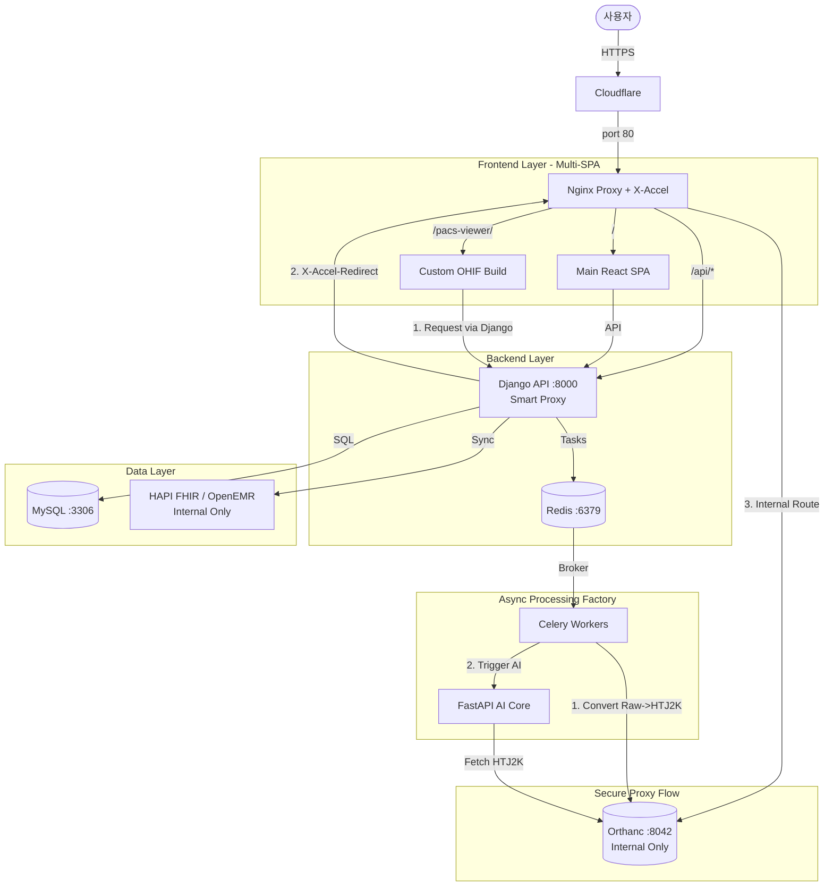

# NeuroNova Microservices Architecture (v2.1)

**최종 수정일**: 2025-12-30
**버전**: v2.1
**핵심 변경**: Secure Proxy (X-Accel-Redirect), Multi-SPA Build Strategy, HTJ2K Integration

---

## 🏗️ 1. System Overview

NeuroNova CDSS(임상의사결정지원시스템)는 대용량 MRI 의료 영상의 초고속 처리와 AI 분석을 위해 **MSA(Microservices Architecture)**를 채택했습니다. 특히 **HTJ2K(High-Throughput JPEG 2000)** 표준을 도입하여 웹 환경에서의 PACS 뷰어 성능을 극대화하고, **Secure Proxy 패턴**을 통해 보안을 강화했습니다.

### Core Stack
*   **Gateway**: Nginx (Reverse Proxy with **X-Accel-Redirect**) behind Cloudflare
*   **Main Backend**: Django REST Framework (**Secure Proxy & Auth Delegate**)
*   **Frontend Strategy**: **Multi-SPA** (Main React App + Custom OHIF Viewer separated builds)
*   **PACS Frontend**: **Custom OHIF Viewer v3** (NeuroNova Extension + WASM Decoder)
*   **AI/Computation**: FastAPI (AI Inference with HTJ2K Decoding), **Celery (Image Processing Factory)**
*   **Data & Standard**: Orthanc (DICOM PACS, **Internal Access Only**), OpenEMR/HAPI FHIR (Medical Data)

---

## 🧩 2. Component Architecture & Network Topology

### 2.1 Ingress Layer (진입 계층)

*   **Cloudflare**:
    *   역할: HTTPS Termination, Web Application Firewall (WAF), DDoS 보호.
    *   타겟: Nginx 포트 80.
*   **Nginx (:80)**:
    *   역할: 통합 리버스 프록시, 정적 파일 서빙, **내부 라우팅 (X-Accel)**.
    *   **라우팅 규칙**:
        *   `/`: **Main React SPA** (Static Files, `/var/www/react-main`)
        *   `/api/*`: Django Backend (:8000)
        *   `/pacs-viewer/`: **Custom OHIF Build** (Static Files, `/var/www/ohif-dist`)
        *   `/internal-orthanc/*`: **Orthanc** (:8042, **Internal Only**, Django 위임 요청 처리)

### 2.2 Application Layer (응용 계층)

*   **React SPA (Main)**:
    *   **형태**: 별도 빌드된 정적 웹 앱 (Main Dashboard).
    *   역할: 메인 사용자 인터페이스 (환자 목록, AI 결과 대시보드).
    *   통신: Django API 호출.
*   **Django REST Framework (:8000)**:
    *   역할: 비즈니스 로직, 인증/인가(JWT), 외부 시스템 오케스트레이션.
    *   **핵심 기능**: **Smart Proxying** (JWT 검증 후 `X-Accel-Redirect` 헤더로 Nginx에 전송 위임).
    *   의존성: MySQL, Redis, Orthanc (Control), HAPI FHIR.
*   **Custom OHIF Viewer (Updated)**:
    *   **형태**: 별도 빌드된 정적 웹 앱 (Specialized DICOM Viewer).
    *   **특징**:
        *   **NeuroNova Extension**: 커스텀 레이아웃 (Viewer + 우측 AI 패널).
        *   **HTJ2K WASM Decoder**: 브라우저 클라이언트에서 고속 압축 해제 수행.
    *   **통신**: Django Proxy를 통해 요청 (`/api/pacs/proxy/...`), **Orthanc 직접 접속 차단**.

### 2.3 Data & Integration Layer (데이터 계층)

*   **Orthanc (:8042)**:
    *   역할: DICOM PACS Server.
    *   **저장 포맷**: **HTJ2K (Primary)**, Raw DICOM (Original).
    *   **보안**: **외부 직접 접속 차단**, Nginx 내부 라우팅(`/internal-orthanc/`)을 통해서만 접근 가능.
*   **MySQL (:3306)**:
    *   역할: 환자 정보, 유저 정보, AI 메타데이터 저장 (RDBMS).
*   **Redis (:6379)**:
    *   역할: 애플리케이션 캐시, **Celery Message Broker**.
*   **OpenEMR / HAPI FHIR (:8080)**:
    *   역할: 의료 데이터 상호운용성 (EMR Source, FHIR R4).
    *   **보안**: **내부 네트워크 전용**, Django를 통해서만 접근.

### 2.4 AI & Async Processing Layer (비동기 처리 계층)

*   **Celery Workers (확장됨)**:
    *   역할: "이미지 처리 공장" 및 비동기 작업 수행.
    *   **주요 태스크**:
        1.  **DICOM Transcoding**: Raw DICOM 업로드 → **HTJ2K 변환** → Orthanc 저장.
        2.  **AI Trigger**: AI 분석 요청 메시지 발행.
        3.  **FHIR Sync**: 의료 데이터 표준 동기화.
    *   브로커: Redis.
*   **FastAPI AI Core**:
    *   역할: 고부하 AI 추론 (Brain Tumor Segmentation/Metastasis).
    *   **입력 처리**: Orthanc에서 HTJ2K 수신 (내부 네트워크) → `pylibjpeg` 디코딩 → 모델 추론.

---

## 🔄 3. Data Flow (핵심 워크플로우)

### 3.1 사용자 요청 흐름 (User Request Flow)

1.  **User Request**: Internet → Cloudflare → Nginx.
2.  **API Logic**: Nginx → Django → MySQL/Redis.

### 3.2 의료 영상 파이프라인 (Medical Image Flow - Secure HTJ2K Pipeline)

#### 3.2.1 업로드 및 최적화 (Upload & Optimize)

1.  사용자가 Raw DICOM을 Django에 업로드.
2.  Django가 **Celery Task** 트리거.
3.  **Celery가 Raw DICOM을 HTJ2K로 변환** (이미지 변환 공장).
4.  Celery가 HTJ2K 파일을 Orthanc에 저장.

#### 3.2.2 뷰잉 (Viewing - Secure & High Performance)

1.  사용자가 OHIF Viewer 접속 (`/pacs-viewer/`).
2.  OHIF가 **Django Proxy**를 통해 이미지 요청 (예: `GET /api/pacs/dicom-web/...`).
3.  Django가 JWT 인증 검증 → `X-Accel-Redirect: /internal-orthanc/...` 헤더 반환 (바디 없음).
4.  Nginx가 헤더를 인터셉트 → Orthanc에서 **HTJ2K** 데이터 조회 (내부) → 클라이언트에 스트리밍.
5.  OHIF가 **WASM**을 사용하여 즉시 디코딩 및 렌더링.

#### 3.2.3 AI 분석 (AI Analysis)

1.  Celery가 AI Task 트리거.
2.  FastAPI가 Orthanc에서 HTJ2K 조회 (내부 네트워크).
3.  FastAPI가 HTJ2K를 Numpy로 디코딩 → 추론 → 마스크 생성.
4.  결과를 DB 및 Orthanc(DICOM SR/SC)에 저장.

### 3.3 EMR 동기화 (EMR Sync)

*   Django/Celery → HAPI FHIR/OpenEMR (동기/주기적 동기화).

---

## 📊 4. System Topology Diagram (v2.1 Updated)

---

## 🔐 5. Security Architecture (보안 아키텍처)

### 5.1 Secure Proxy Pattern (보안 프록시 패턴)

*   **문제**: Orthanc를 외부에 직접 노출하면 인증 우회 위험.
*   **해결**: Django가 인증을 검증하고, Nginx가 내부적으로 Orthanc에 접근하여 데이터 전송.
*   **이점**:
    *   **보안**: 모든 DICOM 데이터 접근이 JWT 인증을 거침.
    *   **성능**: Django는 헤더만 반환하고 Nginx가 실제 파일 전송을 처리 (Zero-Copy).

### 5.2 Network Segmentation (네트워크 분리)

*   **외부 노출 서비스**:
    *   Nginx (React SPA, OHIF, Django API)
*   **내부 전용 서비스**:
    *   Orthanc, MySQL, Redis, HAPI FHIR, OpenEMR

---

## 🚀 6. 주요 변경 사항 요약

### v2.1 (2025-12-30) - Secure Proxy & Multi-SPA

1.  **보안 강화 (Secure Proxy)**:
    *   Orthanc의 외부 직접 접속을 차단하고, **Django가 인증(JWT)을 수행한 후 Nginx에게 전송을 위임(`X-Accel-Redirect`)**하는 구조로 변경하여 보안과 성능을 모두 확보했습니다.

2.  **프론트엔드 빌드 전략 확정 (Multi-SPA)**:
    *   메인 React 앱과 OHIF Viewer를 **별도로 빌드**하여 Nginx에서 경로(`alias`)로 구분해 서비스합니다. 이는 의존성 충돌을 방지하고 유지보수를 용이하게 합니다.

3.  **Nginx 라우팅 구체화**:
    *   `/internal-orthanc/`라는 내부 전용 라우트를 신설하여 Django의 위임 요청을 처리하도록 명시했습니다.

### v2.0 (2025-12-30) - HTJ2K Pipeline

1.  **Celery 역할 확대**:
    *   단순 작업 처리뿐만 아니라 **"이미지 변환 공장(Raw → HTJ2K)"** 역할을 부여하여 서버 부하를 분산하고 뷰어 성능을 보장합니다.

2.  **OHIF 정의 구체화**:
    *   단순 뷰어가 아닌 **NeuroNova Extension이 포함된 커스텀 빌드**로 정의하고, **WASM 디코더**를 통해 HTJ2K를 처리함을 명시했습니다.

3.  **FastAPI 기능 추가**:
    *   AI 모델이 압축된 HTJ2K 데이터를 읽을 수 있는 전처리 로직(Decoding)이 포함됨을 명시했습니다.

---

## 📚 7. 관련 문서

*   **배포 가이드**: [12_GCP_배포_가이드.md](12_GCP_배포_가이드.md)
*   **서비스 구조 요약**: [07_서비스_구조_요약.md](07_서비스_구조_요약.md)
*   **보안 정책**: [12_보안_아키텍처_정책.md](12_보안_아키텍처_정책.md)
*   **빠른 온보딩**: [REF_CLAUDE_ONBOARDING_QUICK.md](REF_CLAUDE_ONBOARDING_QUICK.md)

---

**문서 버전**: v2.1
**최종 수정**: 2025-12-30
**작성자**: NeuroNova Development Team
