# CDSS 데이터베이스 스키마

**작성일**: 2025-12-19
**버전**: 1.0
**DBMS**: MySQL 8.0
**문자셋**: utf8mb4
**Collation**: utf8mb4_unicode_ci

---

## 📋 목차

1. [데이터베이스 개요](#1-데이터베이스-개요)
2. [ERD (Entity Relationship Diagram)](#2-erd-entity-relationship-diagram)
3. [테이블 정의](#3-테이블-정의)
   - [UC1 - ACCT (인증/권한)](#uc1---acct-인증권한)
   - [UC2 - EMR (전자의무기록)](#uc2---emr-전자의무기록)
   - [UC3 - OCS (처방전달)](#uc3---ocs-처방전달)
   - [UC4 - LIS (임상병리)](#uc4---lis-임상병리)
   - [UC5 - RIS (영상의학)](#uc5---ris-영상의학)
   - [UC6 - AI (AI 오케스트레이션)](#uc6---ai-ai-오케스트레이션)
   - [UC7 - ALERT (알림)](#uc7---alert-알림)
   - [UC8 - FHIR (의료정보 교환)](#uc8---fhir-의료정보-교환)
   - [UC9 - AUDIT (감사 로그)](#uc9---audit-감사-로그)
4. [인덱스 전략](#4-인덱스-전략)
5. [외래키 관계](#5-외래키-관계)
6. [초기 데이터 (Fixtures)](#6-초기-데이터-fixtures)

---

## 1. 데이터베이스 개요

### 데이터베이스명
- **CDSS_DB**: 메인 데이터베이스

### 설계 원칙
1. **정규화**: 3NF (제3정규형) 준수
2. **명명 규칙**: Snake Case (`table_name`, `column_name`)
3. **타임스탬프**: 모든 테이블에 `created_at`, `updated_at` 포함
4. **Soft Delete**: 중요 데이터는 `deleted_at` 사용 (물리 삭제 지양)
5. **UUID**: 주요 엔티티는 UUID 기본키 사용 (보안 강화)

### 데이터 타입 규칙
- **ID**: `CHAR(36)` (UUID) 또는 `VARCHAR(20)` (커스텀 ID)
- **날짜/시간**: `DATETIME(6)` (마이크로초 포함)
- **부울**: `TINYINT(1)` (0/1)
- **JSON**: `JSON` (MySQL 8.0+)
- **텍스트**: `VARCHAR(255)` (짧은 텍스트), `TEXT` (긴 텍스트)

---

## 2. ERD (Entity Relationship Diagram)

### 전체 ERD (Mermaid)

```mermaid
erDiagram
    %% UC1 - ACCT (인증/권한)
    ACCT_USERS ||--o{ ACCT_USER_ROLES : has
    ACCT_ROLES ||--o{ ACCT_USER_ROLES : assigned_to
    ACCT_ROLES ||--o{ ACCT_ROLE_PERMS : has
    ACCT_PERMISSIONS ||--o{ ACCT_ROLE_PERMS : granted_to
    ACCT_USERS ||--o{ ACCT_REFRESH_TOKENS : owns
    ACCT_USERS ||--o{ ACCT_MFA_SECRETS : owns

    %% UC2 - EMR (전자의무기록)
    EMR_PATIENT_CACHE ||--o{ EMR_ENCOUNTERS : has
    ACCT_USERS ||--o{ EMR_ENCOUNTERS : performs

    %% UC3 - OCS (처방전달)
    EMR_PATIENT_CACHE ||--o{ OCS_ORDERS : receives
    EMR_ENCOUNTERS ||--o{ OCS_ORDERS : contains
    ACCT_USERS ||--o{ OCS_ORDERS : orders
    OCS_ORDERS ||--o{ OCS_ORDER_ITEMS : contains
    OCS_ORDER_ITEMS }o--|| OCS_MEDICATION_MASTER : references
    OCS_DIAGNOSIS_MASTER ||--o{ EMR_ENCOUNTERS : used_in
    LIS_LAB_TEST_MASTER ||--o{ LIS_TEST_ORDERS : used_in

    %% UC4 - LIS (임상병리)
    EMR_PATIENT_CACHE ||--o{ LIS_TEST_ORDERS : receives
    EMR_ENCOUNTERS ||--o{ LIS_TEST_ORDERS : contains
    ACCT_USERS ||--o{ LIS_TEST_ORDERS : orders
    LIS_TEST_ORDERS ||--o{ LIS_TEST_RESULTS : produces

    %% UC5 - RIS (영상의학)
    EMR_PATIENT_CACHE ||--o{ RADIOLOGY_ORDERS : receives
    EMR_ENCOUNTERS ||--o{ RADIOLOGY_ORDERS : contains
    RADIOLOGY_ORDERS ||--o{ RADIOLOGY_STUDIES : results_in
    RADIOLOGY_STUDIES ||--o{ RADIOLOGY_REPORTS : has
    ACCT_USERS ||--o{ RADIOLOGY_REPORTS : writes

    %% UC6 - AI (AI 오케스트레이션)
    RADIOLOGY_STUDIES ||--o{ AI_JOBS : analyzes
    AI_JOBS ||--o{ AI_RESULTS : produces
    AI_RESULTS ||--o{ AI_ARTIFACTS : contains
    ACCT_USERS ||--o{ AI_RESULTS : approves

    %% UC7 - ALERT (알림)
    ACCT_USERS ||--o{ TIMELINE_EVENTS : receives
    ACCT_USERS ||--o{ TIMELINE_NOTIFICATIONS : receives

    %% UC8 - FHIR (의료정보 교환)
    EMR_PATIENT_CACHE ||--o{ FHIR_RESOURCE_MAP : maps_to
    FHIR_RESOURCE_MAP ||--o{ FHIR_SYNC_QUEUE : queues

    %% UC9 - AUDIT (감사 로그)
    ACCT_USERS ||--o{ AUDIT_LOGS : performs
    ACCT_USERS ||--o{ AUDIT_SECURITY_EVENTS : triggers

    %% 테이블 정의
    ACCT_USERS {
        char(36) user_id PK
        varchar(50) username UK
        varchar(255) password_hash
        varchar(100) email UK
        varchar(50) employee_id UK
        varchar(100) department
        varchar(20) phone
        tinyint(1) is_active
        datetime(6) created_at
        datetime(6) updated_at
        datetime(6) last_login
    }

    ACCT_ROLES {
        varchar(20) role_key PK
        varchar(50) name
        text description
        tinyint(1) enabled
        datetime(6) created_at
    }

    ACCT_PERMISSIONS {
        varchar(50) perm_key PK
        varchar(100) name
        text description
        varchar(50) category
    }

    ACCT_USER_ROLES {
        char(36) mapping_id PK
        char(36) user_id FK
        varchar(20) role_key FK
        datetime(6) assigned_at
        char(36) assigned_by FK
    }

    ACCT_ROLE_PERMS {
        char(36) mapping_id PK
        varchar(20) role_key FK
        varchar(50) perm_key FK
    }

    ACCT_REFRESH_TOKENS {
        char(36) token_id PK
        char(36) user_id FK
        varchar(500) token_hash
        datetime(6) expires_at
        tinyint(1) is_revoked
        datetime(6) created_at
    }

    ACCT_MFA_SECRETS {
        char(36) secret_id PK
        char(36) user_id FK
        varchar(100) secret_encrypted
        tinyint(1) enabled
        datetime(6) created_at
    }

    EMR_PATIENT_CACHE {
        varchar(20) patient_id PK
        varchar(50) family_name
        varchar(50) given_name
        date birth_date
        varchar(10) gender
        varchar(20) phone
        varchar(100) email
        text address
        json emergency_contact
        json allergies
        varchar(5) blood_type
        varchar(100) openemr_patient_id UK
        datetime(6) last_synced_at
        datetime(6) created_at
        datetime(6) updated_at
    }

    EMR_ENCOUNTERS {
        varchar(20) encounter_id PK
        varchar(20) patient_id FK
        char(36) doctor_id FK
        varchar(20) encounter_type
        varchar(100) department
        text chief_complaint
        text diagnosis
        varchar(20) status
        datetime(6) encounter_date
        datetime(6) created_at
        datetime(6) updated_at
    }

    OCS_ORDERS {
        varchar(20) order_id PK
        varchar(20) patient_id FK
        varchar(20) encounter_id FK
        char(36) ordered_by FK
        varchar(50) order_type
        varchar(20) urgency
        varchar(20) status
        text notes
        datetime(6) ordered_at
        datetime(6) executed_at
        char(36) executed_by FK
    }

    OCS_ORDER_ITEMS {
        varchar(20) item_id PK
        varchar(20) order_id FK
        varchar(50) drug_code
        varchar(200) drug_name
        varchar(50) dosage
        varchar(50) frequency
        varchar(20) duration
        varchar(50) route
        text instructions
    }

    LIS_TEST_ORDERS {
        varchar(20) test_order_id PK
        varchar(20) patient_id FK
        varchar(20) encounter_id FK
        char(36) ordered_by FK
        varchar(50) test_type
        varchar(20) urgency
        varchar(20) status
        text notes
        datetime(6) ordered_at
        datetime(6) scheduled_at
    }

    LIS_TEST_RESULTS {
        varchar(20) result_id PK
        varchar(20) test_order_id FK
        varchar(50) test_code
        varchar(100) test_name
        json results_data
        tinyint(1) has_abnormal
        char(36) performed_by FK
        char(36) verified_by FK
        datetime(6) performed_at
        datetime(6) verified_at
    }

    RADIOLOGY_ORDERS {
        varchar(20) order_id PK
        varchar(20) patient_id FK
        varchar(20) encounter_id FK
        char(36) ordered_by FK
        varchar(20) modality_type
        varchar(100) body_part
        text clinical_info
        varchar(20) urgency
        tinyint(1) contrast
        varchar(20) status
        text notes
        datetime(6) ordered_at
        datetime(6) scheduled_at
    }

    RADIOLOGY_STUDIES {
        varchar(20) study_id PK
        varchar(20) order_id FK
        varchar(200) study_instance_uid UK
        varchar(20) patient_id FK
        varchar(20) modality_type
        varchar(100) body_part
        datetime(6) study_date
        int series_count
        int instance_count
        varchar(100) orthanc_study_id
        varchar(500) wado_url
        varchar(20) status
        datetime(6) created_at
    }

    RADIOLOGY_REPORTS {
        varchar(20) report_id PK
        varchar(20) study_id FK
        char(36) reported_by FK
        text findings
        text impression
        text recommendation
        varchar(20) status
        varchar(500) signature
        datetime(6) reported_at
        datetime(6) signed_at
    }

    AI_JOBS {
        varchar(20) job_id PK
        varchar(20) study_id FK
        varchar(50) analysis_type
        json parameters
        varchar(20) priority
        varchar(20) status
        int progress
        text error_message
        char(36) created_by FK
        datetime(6) created_at
        datetime(6) started_at
        datetime(6) completed_at
    }

    AI_RESULTS {
        varchar(20) result_id PK
        varchar(20) job_id FK
        varchar(20) study_id FK
        varchar(50) analysis_type
        json findings
        float confidence_score
        varchar(20) status
        char(36) approved_by FK
        text approval_comments
        datetime(6) completed_at
        datetime(6) approved_at
    }

    AI_ARTIFACTS {
        varchar(20) artifact_id PK
        varchar(20) result_id FK
        varchar(100) artifact_type
        varchar(500) s3_url
        bigint file_size_bytes
        varchar(100) mime_type
        datetime(6) created_at
    }

    TIMELINE_EVENTS {
        varchar(20) event_id PK
        varchar(20) patient_id FK
        varchar(50) event_type
        varchar(200) title
        text description
        json metadata
        datetime(6) event_timestamp
        datetime(6) created_at
    }

    TIMELINE_NOTIFICATIONS {
        varchar(20) notification_id PK
        char(36) user_id FK
        varchar(50) notification_type
        varchar(200) title
        text message
        varchar(20) severity
        tinyint(1) is_read
        json data
        datetime(6) created_at
        datetime(6) read_at
    }

    FHIR_RESOURCE_MAP {
        varchar(20) map_id PK
        varchar(50) resource_type
        varchar(100) cdss_id
        varchar(100) fhir_id
        varchar(500) fhir_server_url
        datetime(6) last_synced_at
        datetime(6) created_at
    }

    FHIR_SYNC_QUEUE {
        varchar(20) sync_job_id PK
        varchar(20) map_id FK
        varchar(50) operation
        varchar(20) status
        text error_message
        int retry_count
        datetime(6) queued_at
        datetime(6) processed_at
    }

    AUDIT_LOGS {
        varchar(20) log_id PK
        char(36) actor_user_id FK
        varchar(50) action
        varchar(50) resource_type
        varchar(100) resource_id
        json details
        varchar(45) ip_address
        text user_agent
        datetime(6) timestamp
    }

    AUDIT_SECURITY_EVENTS {
        varchar(20) event_id PK
        varchar(50) event_type
        varchar(20) severity
        varchar(50) username
        char(36) user_id FK
        varchar(45) ip_address
        text description
        json metadata
        tinyint(1) blocked
        datetime(6) timestamp
    }
```



---

## 3. 테이블 정의

### UC1 - ACCT (인증/권한)

#### ACCT_USERS (사용자)

**설명**: 시스템 사용자 정보

**테이블 생성 SQL**
```sql
CREATE TABLE ACCT_USERS (
    user_id CHAR(36) PRIMARY KEY COMMENT 'UUID',
    username VARCHAR(50) NOT NULL UNIQUE COMMENT '사용자명 (로그인 ID)',
    password_hash VARCHAR(255) NOT NULL COMMENT 'bcrypt 해시',
    email VARCHAR(100) UNIQUE COMMENT '이메일',
    employee_id VARCHAR(50) UNIQUE COMMENT '직원 번호',
    department VARCHAR(100) COMMENT '부서',
    phone VARCHAR(20) COMMENT '전화번호',
    is_active TINYINT(1) DEFAULT 1 COMMENT '활성 상태',
    created_at DATETIME(6) DEFAULT CURRENT_TIMESTAMP(6) COMMENT '생성일시',
    updated_at DATETIME(6) DEFAULT CURRENT_TIMESTAMP(6) ON UPDATE CURRENT_TIMESTAMP(6) COMMENT '수정일시',
    last_login DATETIME(6) COMMENT '마지막 로그인',
    INDEX idx_username (username),
    INDEX idx_employee_id (employee_id),
    INDEX idx_is_active (is_active)
) ENGINE=InnoDB DEFAULT CHARSET=utf8mb4 COLLATE=utf8mb4_unicode_ci COMMENT='사용자';
```

---

#### ACCT_ROLES (역할)

**설명**: 7개 역할 정의 (Admin, Doctor, RIB, Lab, Nurse, Patient, External)

**테이블 생성 SQL**
```sql
CREATE TABLE ACCT_ROLES (
    role_key VARCHAR(20) PRIMARY KEY COMMENT '역할 코드 (ADMIN, DOCTOR, RIB, LAB, NURSE, PATIENT, EXTERNAL)',
    name VARCHAR(50) NOT NULL COMMENT '역할명',
    description TEXT COMMENT '설명',
    enabled TINYINT(1) DEFAULT 1 COMMENT '활성 상태',
    created_at DATETIME(6) DEFAULT CURRENT_TIMESTAMP(6) COMMENT '생성일시'
) ENGINE=InnoDB DEFAULT CHARSET=utf8mb4 COLLATE=utf8mb4_unicode_ci COMMENT='역할';
```

---

#### ACCT_PERMISSIONS (권한)

**설명**: 권한 정의 (patient.view, order.create 등)

**테이블 생성 SQL**
```sql
CREATE TABLE ACCT_PERMISSIONS (
    perm_key VARCHAR(50) PRIMARY KEY COMMENT '권한 코드 (예: patient.view)',
    name VARCHAR(100) NOT NULL COMMENT '권한명',
    description TEXT COMMENT '설명',
    category VARCHAR(50) COMMENT '카테고리 (patient, order, report 등)',
    INDEX idx_category (category)
) ENGINE=InnoDB DEFAULT CHARSET=utf8mb4 COLLATE=utf8mb4_unicode_ci COMMENT='권한';
```

---

#### ACCT_USER_ROLES (사용자-역할 매핑)

**설명**: N:M 관계 (사용자는 여러 역할 가질 수 있음)

**테이블 생성 SQL**
```sql
CREATE TABLE ACCT_USER_ROLES (
    mapping_id CHAR(36) PRIMARY KEY COMMENT 'UUID',
    user_id CHAR(36) NOT NULL COMMENT '사용자 ID',
    role_key VARCHAR(20) NOT NULL COMMENT '역할 코드',
    assigned_at DATETIME(6) DEFAULT CURRENT_TIMESTAMP(6) COMMENT '할당일시',
    assigned_by CHAR(36) COMMENT '할당한 사용자 ID',
    FOREIGN KEY (user_id) REFERENCES ACCT_USERS(user_id) ON DELETE CASCADE,
    FOREIGN KEY (role_key) REFERENCES ACCT_ROLES(role_key) ON DELETE CASCADE,
    FOREIGN KEY (assigned_by) REFERENCES ACCT_USERS(user_id) ON DELETE SET NULL,
    UNIQUE KEY uk_user_role (user_id, role_key),
    INDEX idx_user_id (user_id),
    INDEX idx_role_key (role_key)
) ENGINE=InnoDB DEFAULT CHARSET=utf8mb4 COLLATE=utf8mb4_unicode_ci COMMENT='사용자-역할 매핑';
```

---

#### ACCT_ROLE_PERMS (역할-권한 매핑)

**설명**: N:M 관계 (역할은 여러 권한 가질 수 있음)

**테이블 생성 SQL**
```sql
CREATE TABLE ACCT_ROLE_PERMS (
    mapping_id CHAR(36) PRIMARY KEY COMMENT 'UUID',
    role_key VARCHAR(20) NOT NULL COMMENT '역할 코드',
    perm_key VARCHAR(50) NOT NULL COMMENT '권한 코드',
    FOREIGN KEY (role_key) REFERENCES ACCT_ROLES(role_key) ON DELETE CASCADE,
    FOREIGN KEY (perm_key) REFERENCES ACCT_PERMISSIONS(perm_key) ON DELETE CASCADE,
    UNIQUE KEY uk_role_perm (role_key, perm_key),
    INDEX idx_role_key (role_key),
    INDEX idx_perm_key (perm_key)
) ENGINE=InnoDB DEFAULT CHARSET=utf8mb4 COLLATE=utf8mb4_unicode_ci COMMENT='역할-권한 매핑';
```

---

#### ACCT_REFRESH_TOKENS (리프레시 토큰)

**설명**: JWT Refresh Token 저장

**테이블 생성 SQL**
```sql
CREATE TABLE ACCT_REFRESH_TOKENS (
    token_id CHAR(36) PRIMARY KEY COMMENT 'UUID',
    user_id CHAR(36) NOT NULL COMMENT '사용자 ID',
    token_hash VARCHAR(500) NOT NULL COMMENT 'SHA-256 해시',
    expires_at DATETIME(6) NOT NULL COMMENT '만료일시',
    is_revoked TINYINT(1) DEFAULT 0 COMMENT '무효화 여부',
    created_at DATETIME(6) DEFAULT CURRENT_TIMESTAMP(6) COMMENT '생성일시',
    FOREIGN KEY (user_id) REFERENCES ACCT_USERS(user_id) ON DELETE CASCADE,
    INDEX idx_user_id (user_id),
    INDEX idx_expires_at (expires_at),
    INDEX idx_is_revoked (is_revoked)
) ENGINE=InnoDB DEFAULT CHARSET=utf8mb4 COLLATE=utf8mb4_unicode_ci COMMENT='리프레시 토큰';
```

---

#### ACCT_MFA_SECRETS (MFA 시크릿)

**설명**: TOTP MFA 시크릿 저장

**테이블 생성 SQL**
```sql
CREATE TABLE ACCT_MFA_SECRETS (
    secret_id CHAR(36) PRIMARY KEY COMMENT 'UUID',
    user_id CHAR(36) NOT NULL UNIQUE COMMENT '사용자 ID',
    secret_encrypted VARCHAR(100) NOT NULL COMMENT 'AES-256 암호화된 TOTP 시크릿',
    enabled TINYINT(1) DEFAULT 1 COMMENT 'MFA 활성화 여부',
    created_at DATETIME(6) DEFAULT CURRENT_TIMESTAMP(6) COMMENT '생성일시',
    FOREIGN KEY (user_id) REFERENCES ACCT_USERS(user_id) ON DELETE CASCADE
) ENGINE=InnoDB DEFAULT CHARSET=utf8mb4 COLLATE=utf8mb4_unicode_ci COMMENT='MFA 시크릿';
```

---

### UC2 - EMR (전자의무기록)

#### EMR_PATIENT_CACHE (환자 캐시)

**설명**: OpenEMR에서 동기화한 환자 정보

**테이블 생성 SQL**
```sql
CREATE TABLE EMR_PATIENT_CACHE (
    patient_id VARCHAR(20) PRIMARY KEY COMMENT '환자 ID (P-2024-001234)',
    family_name VARCHAR(50) NOT NULL COMMENT '성',
    given_name VARCHAR(50) NOT NULL COMMENT '이름',
    birth_date DATE NOT NULL COMMENT '생년월일',
    gender VARCHAR(10) NOT NULL COMMENT '성별 (male, female, other)',
    phone VARCHAR(20) COMMENT '전화번호',
    email VARCHAR(100) COMMENT '이메일',
    address TEXT COMMENT '주소',
    emergency_contact JSON COMMENT '비상연락처 {name, relationship, phone}',
    allergies JSON COMMENT '알레르기 목록',
    blood_type VARCHAR(5) COMMENT '혈액형 (A+, B+, AB+, O+, A-, B-, AB-, O-)',
    openemr_patient_id VARCHAR(100) UNIQUE COMMENT 'OpenEMR 환자 ID',
    last_synced_at DATETIME(6) COMMENT 'OpenEMR 마지막 동기화 시간',
    created_at DATETIME(6) DEFAULT CURRENT_TIMESTAMP(6) COMMENT '생성일시',
    updated_at DATETIME(6) DEFAULT CURRENT_TIMESTAMP(6) ON UPDATE CURRENT_TIMESTAMP(6) COMMENT '수정일시',
    INDEX idx_name (family_name, given_name),
    INDEX idx_birth_date (birth_date),
    INDEX idx_openemr_id (openemr_patient_id)
) ENGINE=InnoDB DEFAULT CHARSET=utf8mb4 COLLATE=utf8mb4_unicode_ci COMMENT='환자 캐시';
```

---

#### EMR_ENCOUNTERS (진료 기록)

**설명**: 진료 기록 (타임라인용)

**테이블 생성 SQL**
```sql
CREATE TABLE EMR_ENCOUNTERS (
    encounter_id VARCHAR(20) PRIMARY KEY COMMENT '진료 ID (E-2025-005678)',
    patient_id VARCHAR(20) NOT NULL COMMENT '환자 ID',
    doctor_id CHAR(36) NOT NULL COMMENT '담당의사 ID',
    encounter_type VARCHAR(20) NOT NULL COMMENT '진료 유형 (외래, 입원, 응급)',
    department VARCHAR(100) COMMENT '진료 부서',
    chief_complaint TEXT COMMENT '주 호소',
    diagnosis TEXT COMMENT '진단명',
    status VARCHAR(20) DEFAULT 'active' COMMENT '상태 (active, completed, cancelled)',
    encounter_date DATETIME(6) NOT NULL COMMENT '진료 일시',
    created_at DATETIME(6) DEFAULT CURRENT_TIMESTAMP(6) COMMENT '생성일시',
    updated_at DATETIME(6) DEFAULT CURRENT_TIMESTAMP(6) ON UPDATE CURRENT_TIMESTAMP(6) COMMENT '수정일시',
    FOREIGN KEY (patient_id) REFERENCES EMR_PATIENT_CACHE(patient_id) ON DELETE CASCADE,
    FOREIGN KEY (doctor_id) REFERENCES ACCT_USERS(user_id) ON DELETE RESTRICT,
    INDEX idx_patient_id (patient_id),
    INDEX idx_doctor_id (doctor_id),
    INDEX idx_encounter_date (encounter_date),
    INDEX idx_status (status)
) ENGINE=InnoDB DEFAULT CHARSET=utf8mb4 COLLATE=utf8mb4_unicode_ci COMMENT='진료 기록';
```

---

### UC3 - OCS (처방전달)

#### OCS_ORDERS (처방 오더)

**설명**: 처방 오더 (약물, 검사, 시술 등)

**테이블 생성 SQL**
```sql
CREATE TABLE OCS_ORDERS (
    order_id VARCHAR(20) PRIMARY KEY COMMENT '처방 ID (O-2025-009876)',
    patient_id VARCHAR(20) NOT NULL COMMENT '환자 ID',
    encounter_id VARCHAR(20) COMMENT '진료 ID',
    ordered_by CHAR(36) NOT NULL COMMENT '처방 의사 ID',
    order_type VARCHAR(50) NOT NULL COMMENT '처방 유형 (medication, test, procedure)',
    urgency VARCHAR(20) DEFAULT 'routine' COMMENT '긴급도 (stat, urgent, routine)',
    status VARCHAR(20) DEFAULT 'pending' COMMENT '상태 (pending, executing, completed, cancelled)',
    notes TEXT COMMENT '비고',
    ordered_at DATETIME(6) DEFAULT CURRENT_TIMESTAMP(6) COMMENT '처방 일시',
    executed_at DATETIME(6) COMMENT '실행 일시',
    executed_by CHAR(36) COMMENT '실행자 ID',
    FOREIGN KEY (patient_id) REFERENCES EMR_PATIENT_CACHE(patient_id) ON DELETE CASCADE,
    FOREIGN KEY (encounter_id) REFERENCES EMR_ENCOUNTERS(encounter_id) ON DELETE SET NULL,
    FOREIGN KEY (ordered_by) REFERENCES ACCT_USERS(user_id) ON DELETE RESTRICT,
    FOREIGN KEY (executed_by) REFERENCES ACCT_USERS(user_id) ON DELETE SET NULL,
    INDEX idx_patient_id (patient_id),
    INDEX idx_ordered_by (ordered_by),
    INDEX idx_status (status),
    INDEX idx_ordered_at (ordered_at)
) ENGINE=InnoDB DEFAULT CHARSET=utf8mb4 COLLATE=utf8mb4_unicode_ci COMMENT='처방 오더';
```

---

#### OCS_ORDER_ITEMS (처방 항목)

**설명**: 처방 상세 항목 (약물 정보)

**테이블 생성 SQL**
```sql
CREATE TABLE OCS_ORDER_ITEMS (
    item_id VARCHAR(20) PRIMARY KEY COMMENT '항목 ID (OI-001)',
    order_id VARCHAR(20) NOT NULL COMMENT '처방 ID',
    drug_code VARCHAR(50) COMMENT '약품 코드',
    drug_name VARCHAR(200) NOT NULL COMMENT '약품명',
    dosage VARCHAR(50) COMMENT '용량 (예: 1정)',
    frequency VARCHAR(50) COMMENT '투약 횟수 (예: 1일 1회)',
    duration VARCHAR(20) COMMENT '투약 기간 (예: 7일)',
    route VARCHAR(50) COMMENT '투약 경로 (경구, 정맥주사 등)',
    instructions TEXT COMMENT '복약 지도 (예: 식후 30분)',
    FOREIGN KEY (order_id) REFERENCES OCS_ORDERS(order_id) ON DELETE CASCADE,
    INDEX idx_order_id (order_id)
) ENGINE=InnoDB DEFAULT CHARSET=utf8mb4 COLLATE=utf8mb4_unicode_ci COMMENT='처방 항목';

---

#### OCS_MEDICATION_MASTER (약물 마스터)

**설명**: 표준 약물 코드 정보

**테이블 생성 SQL**
```sql
CREATE TABLE ocs_medication_master (
    drug_code VARCHAR(50) PRIMARY KEY COMMENT '약물 표준 코드',
    drug_name VARCHAR(255) NOT NULL COMMENT '약물명',
    generic_name VARCHAR(255) COMMENT '성분명',
    dosage_form VARCHAR(100) COMMENT '제형',
    strength VARCHAR(100) COMMENT '함량',
    unit VARCHAR(50) COMMENT '단위',
    manufacturer VARCHAR(255) COMMENT '제조사',
    is_active TINYINT(1) DEFAULT 1,
    created_at DATETIME(6),
    updated_at DATETIME(6)
) ENGINE=InnoDB DEFAULT CHARSET=utf8mb4 COMMENT='약물 마스터';
```

---

#### OCS_DIAGNOSIS_MASTER (진단 마스터)

**설명**: 표준 질병 코드 정보 (ICD-10)

**테이블 생성 SQL**
```sql
CREATE TABLE ocs_diagnosis_master (
    diag_code VARCHAR(20) PRIMARY KEY COMMENT '질병 코드',
    name_ko VARCHAR(255) NOT NULL COMMENT '한글명',
    name_en VARCHAR(255) COMMENT '영문명',
    category VARCHAR(100) COMMENT '분류',
    is_active TINYINT(1) DEFAULT 1,
    created_at DATETIME(6),
    updated_at DATETIME(6)
) ENGINE=InnoDB DEFAULT CHARSET=utf8mb4 COMMENT='진단 마스터';
```
```

---

### UC4 - LIS (임상병리)

#### LIS_TEST_ORDERS (검사 오더)

**설명**: 임상병리 검사 오더

**테이블 생성 SQL**
```sql
CREATE TABLE LIS_TEST_ORDERS (
    test_order_id VARCHAR(20) PRIMARY KEY COMMENT '검사 오더 ID (TO-2025-003456)',
    patient_id VARCHAR(20) NOT NULL COMMENT '환자 ID',
    encounter_id VARCHAR(20) COMMENT '진료 ID',
    ordered_by CHAR(36) NOT NULL COMMENT '처방 의사 ID',
    test_type VARCHAR(50) NOT NULL COMMENT '검사 유형 (blood, urine, tissue)',
    urgency VARCHAR(20) DEFAULT 'routine' COMMENT '긴급도',
    status VARCHAR(20) DEFAULT 'pending' COMMENT '상태',
    notes TEXT COMMENT '비고 (예: 금식 상태 확인)',
    ordered_at DATETIME(6) DEFAULT CURRENT_TIMESTAMP(6) COMMENT '처방 일시',
    scheduled_at DATETIME(6) COMMENT '예정 일시',
    FOREIGN KEY (patient_id) REFERENCES EMR_PATIENT_CACHE(patient_id) ON DELETE CASCADE,
    FOREIGN KEY (encounter_id) REFERENCES EMR_ENCOUNTERS(encounter_id) ON DELETE SET NULL,
    FOREIGN KEY (ordered_by) REFERENCES ACCT_USERS(user_id) ON DELETE RESTRICT,
    INDEX idx_patient_id (patient_id),
    INDEX idx_status (status),
    INDEX idx_ordered_at (ordered_at)
) ENGINE=InnoDB DEFAULT CHARSET=utf8mb4 COLLATE=utf8mb4_unicode_ci COMMENT='검사 오더';
```

---

#### LIS_TEST_RESULTS (검사 결과)

**설명**: 검사 결과 데이터

**테이블 생성 SQL**
```sql
CREATE TABLE LIS_TEST_RESULTS (
    result_id VARCHAR(20) PRIMARY KEY COMMENT '결과 ID (TR-2025-001234)',
    test_order_id VARCHAR(20) NOT NULL COMMENT '검사 오더 ID',
    test_code VARCHAR(50) NOT NULL COMMENT '검사 코드 (CBC, LFT 등)',
    test_name VARCHAR(100) NOT NULL COMMENT '검사명',
    results_data JSON NOT NULL COMMENT '결과 데이터 {WBC: {value, unit, referenceRange, flag}}',
    has_abnormal TINYINT(1) DEFAULT 0 COMMENT '이상치 포함 여부',
    performed_by CHAR(36) COMMENT '검사자 ID',
    verified_by CHAR(36) COMMENT '검증자 ID',
    performed_at DATETIME(6) COMMENT '검사 일시',
    verified_at DATETIME(6) COMMENT '검증 일시',
    FOREIGN KEY (test_order_id) REFERENCES LIS_TEST_ORDERS(test_order_id) ON DELETE CASCADE,
    FOREIGN KEY (performed_by) REFERENCES ACCT_USERS(user_id) ON DELETE SET NULL,
    FOREIGN KEY (verified_by) REFERENCES ACCT_USERS(user_id) ON DELETE SET NULL,
    INDEX idx_test_order_id (test_order_id),
    INDEX idx_has_abnormal (has_abnormal),
    INDEX idx_performed_at (performed_at)
) ENGINE=InnoDB DEFAULT CHARSET=utf8mb4 COLLATE=utf8mb4_unicode_ci COMMENT='검사 결과';

---

#### LIS_LAB_TEST_MASTER (검사 마스터)

**설명**: 표준 검사 코드 정보 (LOINC)

**테이블 생성 SQL**
```sql
CREATE TABLE lis_lab_test_master (
    test_code VARCHAR(50) PRIMARY KEY COMMENT '검사 코드',
    test_name VARCHAR(255) NOT NULL COMMENT '검사명',
    sample_type VARCHAR(100) COMMENT '검체 유형',
    method VARCHAR(100) COMMENT '검사 방법',
    unit VARCHAR(50) COMMENT '단위',
    reference_range VARCHAR(255) COMMENT '참고치',
    is_active TINYINT(1) DEFAULT 1,
    created_at DATETIME(6),
    updated_at DATETIME(6)
) ENGINE=InnoDB DEFAULT CHARSET=utf8mb4 COMMENT='검사 마스터';
```
```

---

### UC5 - RIS (영상의학)

#### RADIOLOGY_ORDERS (영상 오더)

**설명**: 영상 검사 오더

**테이블 생성 SQL**
```sql
CREATE TABLE RADIOLOGY_ORDERS (
    order_id VARCHAR(20) PRIMARY KEY COMMENT '오더 ID (RO-2025-007890)',
    patient_id VARCHAR(20) NOT NULL COMMENT '환자 ID',
    encounter_id VARCHAR(20) COMMENT '진료 ID',
    ordered_by CHAR(36) NOT NULL COMMENT '처방 의사 ID',
    modality_type VARCHAR(20) NOT NULL COMMENT '검사 유형 (MRI, CT, X-Ray)',
    body_part VARCHAR(100) NOT NULL COMMENT '촬영 부위 (Brain, Chest 등)',
    clinical_info TEXT COMMENT '임상 정보',
    urgency VARCHAR(20) DEFAULT 'routine' COMMENT '긴급도',
    contrast TINYINT(1) DEFAULT 0 COMMENT '조영제 사용 여부',
    status VARCHAR(20) DEFAULT 'scheduled' COMMENT '상태',
    notes TEXT COMMENT '비고',
    ordered_at DATETIME(6) DEFAULT CURRENT_TIMESTAMP(6) COMMENT '처방 일시',
    scheduled_at DATETIME(6) COMMENT '예정 일시',
    FOREIGN KEY (patient_id) REFERENCES EMR_PATIENT_CACHE(patient_id) ON DELETE CASCADE,
    FOREIGN KEY (encounter_id) REFERENCES EMR_ENCOUNTERS(encounter_id) ON DELETE SET NULL,
    FOREIGN KEY (ordered_by) REFERENCES ACCT_USERS(user_id) ON DELETE RESTRICT,
    INDEX idx_patient_id (patient_id),
    INDEX idx_modality_type (modality_type),
    INDEX idx_status (status),
    INDEX idx_scheduled_at (scheduled_at)
) ENGINE=InnoDB DEFAULT CHARSET=utf8mb4 COLLATE=utf8mb4_unicode_ci COMMENT='영상 오더';
```

---

#### RADIOLOGY_STUDIES (영상 스터디)

**설명**: DICOM 스터디 정보 (Orthanc 연동)

**테이블 생성 SQL**
```sql
CREATE TABLE RADIOLOGY_STUDIES (
    study_id VARCHAR(20) PRIMARY KEY COMMENT '스터디 ID (ST-2025-001234)',
    order_id VARCHAR(20) COMMENT '오더 ID',
    study_instance_uid VARCHAR(200) UNIQUE NOT NULL COMMENT 'DICOM Study Instance UID',
    patient_id VARCHAR(20) NOT NULL COMMENT '환자 ID',
    modality_type VARCHAR(20) NOT NULL COMMENT '검사 유형',
    body_part VARCHAR(100) COMMENT '촬영 부위',
    study_date DATETIME(6) NOT NULL COMMENT '촬영 일시',
    series_count INT DEFAULT 0 COMMENT '시리즈 수',
    instance_count INT DEFAULT 0 COMMENT '인스턴스(이미지) 수',
    orthanc_study_id VARCHAR(100) UNIQUE COMMENT 'Orthanc Study ID (UUID)',
    wado_url VARCHAR(500) COMMENT 'WADO-RS URL',
    status VARCHAR(20) DEFAULT 'pending' COMMENT '상태 (pending, completed, failed)',
    created_at DATETIME(6) DEFAULT CURRENT_TIMESTAMP(6) COMMENT '생성일시',
    FOREIGN KEY (order_id) REFERENCES RADIOLOGY_ORDERS(order_id) ON DELETE SET NULL,
    FOREIGN KEY (patient_id) REFERENCES EMR_PATIENT_CACHE(patient_id) ON DELETE CASCADE,
    INDEX idx_order_id (order_id),
    INDEX idx_patient_id (patient_id),
    INDEX idx_study_date (study_date),
    INDEX idx_study_instance_uid (study_instance_uid)
) ENGINE=InnoDB DEFAULT CHARSET=utf8mb4 COLLATE=utf8mb4_unicode_ci COMMENT='영상 스터디';
```

---

#### RADIOLOGY_REPORTS (판독문)

**설명**: 영상 판독문

**테이블 생성 SQL**
```sql
CREATE TABLE RADIOLOGY_REPORTS (
    report_id VARCHAR(20) PRIMARY KEY COMMENT '판독문 ID (RP-2025-005678)',
    study_id VARCHAR(20) NOT NULL COMMENT '스터디 ID',
    reported_by CHAR(36) NOT NULL COMMENT '판독 의사 ID',
    findings TEXT NOT NULL COMMENT '소견',
    impression TEXT NOT NULL COMMENT '판독 의견',
    recommendation TEXT COMMENT '권고 사항',
    status VARCHAR(20) DEFAULT 'preliminary' COMMENT '상태 (preliminary, final)',
    signature VARCHAR(500) COMMENT '전자서명',
    reported_at DATETIME(6) DEFAULT CURRENT_TIMESTAMP(6) COMMENT '판독 일시',
    signed_at DATETIME(6) COMMENT '서명 일시',
    FOREIGN KEY (study_id) REFERENCES RADIOLOGY_STUDIES(study_id) ON DELETE CASCADE,
    FOREIGN KEY (reported_by) REFERENCES ACCT_USERS(user_id) ON DELETE RESTRICT,
    INDEX idx_study_id (study_id),
    INDEX idx_reported_by (reported_by),
    INDEX idx_status (status),
    INDEX idx_reported_at (reported_at)
) ENGINE=InnoDB DEFAULT CHARSET=utf8mb4 COLLATE=utf8mb4_unicode_ci COMMENT='판독문';
```

---

### UC6 - AI (AI 오케스트레이션)

#### AI_JOBS (AI 작업)

**설명**: AI 분석 작업 큐

**테이블 생성 SQL**
```sql
CREATE TABLE AI_JOBS (
    job_id VARCHAR(20) PRIMARY KEY COMMENT 'AI 작업 ID (AI-2025-001234)',
    study_id VARCHAR(20) NOT NULL COMMENT '스터디 ID',
    analysis_type VARCHAR(50) NOT NULL COMMENT '분석 유형 (mri_tumor_detection, omics_analysis)',
    parameters JSON COMMENT '분석 파라미터 {model, confidence_threshold}',
    priority VARCHAR(20) DEFAULT 'normal' COMMENT '우선순위 (low, normal, high)',
    status VARCHAR(20) DEFAULT 'queued' COMMENT '상태 (queued, processing, completed, failed)',
    progress INT DEFAULT 0 COMMENT '진행률 (0-100)',
    error_message TEXT COMMENT '에러 메시지',
    created_by CHAR(36) COMMENT '요청자 ID',
    created_at DATETIME(6) DEFAULT CURRENT_TIMESTAMP(6) COMMENT '생성일시',
    started_at DATETIME(6) COMMENT '시작 일시',
    completed_at DATETIME(6) COMMENT '완료 일시',
    FOREIGN KEY (study_id) REFERENCES RADIOLOGY_STUDIES(study_id) ON DELETE CASCADE,
    FOREIGN KEY (created_by) REFERENCES ACCT_USERS(user_id) ON DELETE SET NULL,
    INDEX idx_study_id (study_id),
    INDEX idx_status (status),
    INDEX idx_priority (priority),
    INDEX idx_created_at (created_at)
) ENGINE=InnoDB DEFAULT CHARSET=utf8mb4 COLLATE=utf8mb4_unicode_ci COMMENT='AI 작업';
```

---

#### AI_RESULTS (AI 결과)

**설명**: AI 분석 결과

**테이블 생성 SQL**
```sql
CREATE TABLE AI_RESULTS (
    result_id VARCHAR(20) PRIMARY KEY COMMENT '결과 ID (AR-2025-001234)',
    job_id VARCHAR(20) NOT NULL COMMENT 'AI 작업 ID',
    study_id VARCHAR(20) NOT NULL COMMENT '스터디 ID',
    analysis_type VARCHAR(50) NOT NULL COMMENT '분석 유형',
    findings JSON NOT NULL COMMENT '분석 결과 {tumor_detected, location, volume, confidence}',
    confidence_score FLOAT COMMENT '전체 신뢰도 (0.0-1.0)',
    status VARCHAR(20) DEFAULT 'pending_review' COMMENT '상태 (pending_review, approved, rejected)',
    approved_by CHAR(36) COMMENT '승인자 ID',
    approval_comments TEXT COMMENT '승인 코멘트',
    completed_at DATETIME(6) DEFAULT CURRENT_TIMESTAMP(6) COMMENT '완료 일시',
    approved_at DATETIME(6) COMMENT '승인 일시',
    FOREIGN KEY (job_id) REFERENCES AI_JOBS(job_id) ON DELETE CASCADE,
    FOREIGN KEY (study_id) REFERENCES RADIOLOGY_STUDIES(study_id) ON DELETE CASCADE,
    FOREIGN KEY (approved_by) REFERENCES ACCT_USERS(user_id) ON DELETE SET NULL,
    INDEX idx_job_id (job_id),
    INDEX idx_study_id (study_id),
    INDEX idx_status (status),
    INDEX idx_completed_at (completed_at)
) ENGINE=InnoDB DEFAULT CHARSET=utf8mb4 COLLATE=utf8mb4_unicode_ci COMMENT='AI 결과';
```

---

#### AI_ARTIFACTS (AI 산출물)

**설명**: AI 분석 산출물 (세그멘테이션 마스크, 히트맵 등)

**테이블 생성 SQL**
```sql
CREATE TABLE AI_ARTIFACTS (
    artifact_id VARCHAR(20) PRIMARY KEY COMMENT '산출물 ID (AA-001)',
    result_id VARCHAR(20) NOT NULL COMMENT 'AI 결과 ID',
    artifact_type VARCHAR(100) NOT NULL COMMENT '산출물 유형 (segmentation_mask, heatmap, report_pdf)',
    s3_url VARCHAR(500) NOT NULL COMMENT 'MinIO S3 URL',
    file_size_bytes BIGINT COMMENT '파일 크기 (바이트)',
    mime_type VARCHAR(100) COMMENT 'MIME 타입',
    created_at DATETIME(6) DEFAULT CURRENT_TIMESTAMP(6) COMMENT '생성일시',
    FOREIGN KEY (result_id) REFERENCES AI_RESULTS(result_id) ON DELETE CASCADE,
    INDEX idx_result_id (result_id),
    INDEX idx_artifact_type (artifact_type)
) ENGINE=InnoDB DEFAULT CHARSET=utf8mb4 COLLATE=utf8mb4_unicode_ci COMMENT='AI 산출물';
```

---

### UC7 - ALERT (알림)

#### TIMELINE_EVENTS (타임라인 이벤트)

**설명**: 환자별 타임라인 이벤트

**테이블 생성 SQL**
```sql
CREATE TABLE TIMELINE_EVENTS (
    event_id VARCHAR(20) PRIMARY KEY COMMENT '이벤트 ID (TE-2025-001234)',
    patient_id VARCHAR(20) NOT NULL COMMENT '환자 ID',
    event_type VARCHAR(50) NOT NULL COMMENT '이벤트 유형 (encounter, order, test, imaging, ai)',
    title VARCHAR(200) NOT NULL COMMENT '제목',
    description TEXT COMMENT '설명',
    metadata JSON COMMENT '메타데이터 {orderId, reportId 등}',
    event_timestamp DATETIME(6) NOT NULL COMMENT '이벤트 발생 일시',
    created_at DATETIME(6) DEFAULT CURRENT_TIMESTAMP(6) COMMENT '생성일시',
    FOREIGN KEY (patient_id) REFERENCES EMR_PATIENT_CACHE(patient_id) ON DELETE CASCADE,
    INDEX idx_patient_id (patient_id),
    INDEX idx_event_type (event_type),
    INDEX idx_event_timestamp (event_timestamp)
) ENGINE=InnoDB DEFAULT CHARSET=utf8mb4 COLLATE=utf8mb4_unicode_ci COMMENT='타임라인 이벤트';
```

---

#### TIMELINE_NOTIFICATIONS (사용자 알림)

**설명**: 사용자별 알림

**테이블 생성 SQL**
```sql
CREATE TABLE TIMELINE_NOTIFICATIONS (
    notification_id VARCHAR(20) PRIMARY KEY COMMENT '알림 ID (AL-2025-001234)',
    user_id CHAR(36) NOT NULL COMMENT '사용자 ID',
    notification_type VARCHAR(50) NOT NULL COMMENT '알림 유형 (order, result, ai, system)',
    title VARCHAR(200) NOT NULL COMMENT '제목',
    message TEXT NOT NULL COMMENT '메시지',
    severity VARCHAR(20) DEFAULT 'info' COMMENT '심각도 (info, warning, error, critical)',
    is_read TINYINT(1) DEFAULT 0 COMMENT '읽음 여부',
    data JSON COMMENT '관련 데이터 {resultId, patientId 등}',
    created_at DATETIME(6) DEFAULT CURRENT_TIMESTAMP(6) COMMENT '생성일시',
    read_at DATETIME(6) COMMENT '읽은 일시',
    FOREIGN KEY (user_id) REFERENCES ACCT_USERS(user_id) ON DELETE CASCADE,
    INDEX idx_user_id (user_id),
    INDEX idx_is_read (is_read),
    INDEX idx_severity (severity),
    INDEX idx_created_at (created_at)
) ENGINE=InnoDB DEFAULT CHARSET=utf8mb4 COLLATE=utf8mb4_unicode_ci COMMENT='사용자 알림';
```

---

### UC8 - FHIR (의료정보 교환)

#### FHIR_RESOURCE_MAP (FHIR 리소스 매핑)

**설명**: CDSS ID ↔ FHIR ID 매핑

**테이블 생성 SQL**
```sql
CREATE TABLE FHIR_RESOURCE_MAP (
    map_id VARCHAR(20) PRIMARY KEY COMMENT '매핑 ID (FM-001)',
    resource_type VARCHAR(50) NOT NULL COMMENT 'FHIR 리소스 타입 (Patient, Observation 등)',
    cdss_id VARCHAR(100) NOT NULL COMMENT 'CDSS 리소스 ID',
    fhir_id VARCHAR(100) NOT NULL COMMENT 'FHIR 리소스 ID',
    fhir_server_url VARCHAR(500) COMMENT 'HAPI FHIR 서버 URL',
    last_synced_at DATETIME(6) COMMENT '마지막 동기화 시간',
    created_at DATETIME(6) DEFAULT CURRENT_TIMESTAMP(6) COMMENT '생성일시',
    UNIQUE KEY uk_cdss_resource (resource_type, cdss_id),
    INDEX idx_resource_type (resource_type),
    INDEX idx_cdss_id (cdss_id),
    INDEX idx_fhir_id (fhir_id)
) ENGINE=InnoDB DEFAULT CHARSET=utf8mb4 COLLATE=utf8mb4_unicode_ci COMMENT='FHIR 리소스 매핑';
```

---

#### FHIR_SYNC_QUEUE (FHIR 동기화 큐)

**설명**: FHIR 동기화 작업 큐

**테이블 생성 SQL**
```sql
CREATE TABLE FHIR_SYNC_QUEUE (
    sync_job_id VARCHAR(20) PRIMARY KEY COMMENT '동기화 작업 ID (FS-2025-001234)',
    map_id VARCHAR(20) NOT NULL COMMENT '매핑 ID',
    operation VARCHAR(20) NOT NULL COMMENT '작업 유형 (create, update, delete)',
    status VARCHAR(20) DEFAULT 'queued' COMMENT '상태 (queued, processing, completed, failed)',
    error_message TEXT COMMENT '에러 메시지',
    retry_count INT DEFAULT 0 COMMENT '재시도 횟수',
    queued_at DATETIME(6) DEFAULT CURRENT_TIMESTAMP(6) COMMENT '큐 등록 일시',
    processed_at DATETIME(6) COMMENT '처리 완료 일시',
    FOREIGN KEY (map_id) REFERENCES FHIR_RESOURCE_MAP(map_id) ON DELETE CASCADE,
    INDEX idx_map_id (map_id),
    INDEX idx_status (status),
    INDEX idx_queued_at (queued_at)
) ENGINE=InnoDB DEFAULT CHARSET=utf8mb4 COLLATE=utf8mb4_unicode_ci COMMENT='FHIR 동기화 큐';
```

---

### UC9 - AUDIT (감사 로그)

#### AUDIT_LOGS (감사 로그)

**설명**: 사용자 활동 감사 로그

**테이블 생성 SQL**
```sql
CREATE TABLE AUDIT_LOGS (
    log_id VARCHAR(20) PRIMARY KEY COMMENT '로그 ID (AUDIT-2025-001234)',
    actor_user_id CHAR(36) COMMENT '행위자 사용자 ID',
    action VARCHAR(50) NOT NULL COMMENT '액션 (login, create, update, delete, view)',
    resource_type VARCHAR(50) COMMENT '리소스 타입 (patient, order, report)',
    resource_id VARCHAR(100) COMMENT '리소스 ID',
    details JSON COMMENT '상세 정보 {field, oldValue, newValue}',
    ip_address VARCHAR(45) COMMENT 'IP 주소 (IPv6 지원)',
    user_agent TEXT COMMENT 'User Agent',
    timestamp DATETIME(6) DEFAULT CURRENT_TIMESTAMP(6) COMMENT '일시',
    FOREIGN KEY (actor_user_id) REFERENCES ACCT_USERS(user_id) ON DELETE SET NULL,
    INDEX idx_actor_user_id (actor_user_id),
    INDEX idx_action (action),
    INDEX idx_resource_type (resource_type),
    INDEX idx_timestamp (timestamp)
) ENGINE=InnoDB DEFAULT CHARSET=utf8mb4 COLLATE=utf8mb4_unicode_ci COMMENT='감사 로그';
```

---

#### AUDIT_SECURITY_EVENTS (보안 이벤트)

**설명**: 보안 관련 이벤트 로그

**테이블 생성 SQL**
```sql
CREATE TABLE AUDIT_SECURITY_EVENTS (
    event_id VARCHAR(20) PRIMARY KEY COMMENT '이벤트 ID (SE-2025-001234)',
    event_type VARCHAR(50) NOT NULL COMMENT '이벤트 유형 (failed_login, unauthorized_access, data_breach)',
    severity VARCHAR(20) NOT NULL COMMENT '심각도 (low, medium, high, critical)',
    username VARCHAR(50) COMMENT '사용자명 (시도한 사용자)',
    user_id CHAR(36) COMMENT '사용자 ID (존재하는 경우)',
    ip_address VARCHAR(45) NOT NULL COMMENT 'IP 주소',
    description TEXT COMMENT '설명',
    metadata JSON COMMENT '메타데이터 {failedAttempts, resource 등}',
    blocked TINYINT(1) DEFAULT 0 COMMENT '차단 여부',
    timestamp DATETIME(6) DEFAULT CURRENT_TIMESTAMP(6) COMMENT '일시',
    FOREIGN KEY (user_id) REFERENCES ACCT_USERS(user_id) ON DELETE SET NULL,
    INDEX idx_event_type (event_type),
    INDEX idx_severity (severity),
    INDEX idx_ip_address (ip_address),
    INDEX idx_timestamp (timestamp)
) ENGINE=InnoDB DEFAULT CHARSET=utf8mb4 COLLATE=utf8mb4_unicode_ci COMMENT='보안 이벤트';
```

---

## 4. 인덱스 전략

### 인덱싱 원칙
1. **WHERE 절에 자주 사용되는 컬럼**: 인덱스 필수
2. **JOIN 키**: 외래키에는 자동 인덱스
3. **ORDER BY, GROUP BY 컬럼**: 인덱스 고려
4. **복합 인덱스**: 선택도 높은 컬럼을 앞에 배치

### 주요 인덱스 목록

```sql
-- 환자 검색 성능 향상
CREATE INDEX idx_patient_name ON EMR_PATIENT_CACHE(family_name, given_name);

-- 진료 기록 조회 성능 향상
CREATE INDEX idx_encounter_patient_date ON EMR_ENCOUNTERS(patient_id, encounter_date DESC);

-- 처방 조회 성능 향상
CREATE INDEX idx_order_status_date ON OCS_ORDERS(status, ordered_at DESC);

-- AI 작업 큐 성능 향상
CREATE INDEX idx_ai_job_status_priority ON AI_JOBS(status, priority DESC, created_at);

-- 감사 로그 검색 성능 향상
CREATE INDEX idx_audit_user_action_time ON AUDIT_LOGS(actor_user_id, action, timestamp DESC);
```

---

## 5. 외래키 관계

### 주요 관계 정의

1. **ACCT_USERS → ACCT_USER_ROLES → ACCT_ROLES**
   - 사용자는 여러 역할 가질 수 있음 (N:M)

2. **ACCT_ROLES → ACCT_ROLE_PERMS → ACCT_PERMISSIONS**
   - 역할은 여러 권한 가질 수 있음 (N:M)

3. **EMR_PATIENT_CACHE → EMR_ENCOUNTERS**
   - 환자는 여러 진료 기록 가짐 (1:N)

4. **EMR_ENCOUNTERS → OCS_ORDERS, LIS_TEST_ORDERS, RADIOLOGY_ORDERS**
   - 진료는 여러 처방/검사 오더 포함 (1:N)

5. **RADIOLOGY_STUDIES → AI_JOBS → AI_RESULTS**
   - 영상 스터디는 여러 AI 분석 작업 가짐 (1:N)

### CASCADE 정책

| 관계 | ON DELETE | ON UPDATE |
|---|---|---|
| ACCT_USERS → ACCT_USER_ROLES | CASCADE | CASCADE |
| EMR_PATIENT_CACHE → EMR_ENCOUNTERS | CASCADE | CASCADE |
| OCS_ORDERS → OCS_ORDER_ITEMS | CASCADE | CASCADE |
| RADIOLOGY_STUDIES → AI_JOBS | CASCADE | CASCADE |
| ACCT_USERS → AUDIT_LOGS | SET NULL | CASCADE |

---

## 6. 초기 데이터 (Fixtures)

### 6.1 역할 초기 데이터

**SQL**
```sql
INSERT INTO ACCT_ROLES (role_key, name, description, enabled) VALUES
('ADMIN', '시스템 관리자', '시스템 전체 관리 및 설정', 1),
('DOCTOR', '신경외과 의사', '환자 진료 및 AI 분석 결과 확정', 1),
('RIB', '방사선과', '의료 영상 업로드 및 관리', 1),
('LAB', '검사실', '검사 데이터 입력 및 관리', 1),
('NURSE', '간호사', '바이탈 측정 및 간호 기록', 1),
('PATIENT', '일반 환자', '본인 진료 내역 조회 및 예약', 1),
('EXTERNAL', '외부 기관', 'FHIR API 연동용 M2M 계정', 1);
```

### 6.2 권한 초기 데이터

**SQL**
```sql
INSERT INTO ACCT_PERMISSIONS (perm_key, name, description, category) VALUES
('patient.view', '환자 조회', '환자 정보 조회', 'patient'),
('patient.edit', '환자 수정', '환자 정보 수정', 'patient'),
('patient.view_self', '본인 조회', '본인 정보만 조회 (Patient 역할)', 'patient'),
('order.create', '처방 생성', '처방 오더 생성', 'order'),
('order.view', '처방 조회', '처방 오더 조회', 'order'),
('order.edit', '처방 수정', '처방 오더 수정', 'order'),
('report.sign', '판독문 서명', '판독문 전자서명', 'report'),
('ai_result.view', 'AI 결과 조회', 'AI 분석 결과 조회', 'ai'),
('ai_result.approve', 'AI 결과 승인', 'AI 분석 결과 승인', 'ai'),
('dicom.upload', 'DICOM 업로드', 'DICOM 영상 업로드', 'dicom'),
('dicom.view', 'DICOM 조회', 'DICOM 영상 조회', 'dicom'),
('fhir.read', 'FHIR 읽기', 'FHIR 리소스 읽기', 'fhir'),
('fhir.write', 'FHIR 쓰기', 'FHIR 리소스 쓰기', 'fhir');
```

### 6.3 역할-권한 매핑 초기 데이터

**SQL**
```sql
-- Doctor 역할 권한
INSERT INTO ACCT_ROLE_PERMS (mapping_id, role_key, perm_key) VALUES
(UUID(), 'DOCTOR', 'patient.view'),
(UUID(), 'DOCTOR', 'patient.edit'),
(UUID(), 'DOCTOR', 'order.create'),
(UUID(), 'DOCTOR', 'order.view'),
(UUID(), 'DOCTOR', 'order.edit'),
(UUID(), 'DOCTOR', 'report.sign'),
(UUID(), 'DOCTOR', 'ai_result.view'),
(UUID(), 'DOCTOR', 'ai_result.approve');

-- RIB 역할 권한
INSERT INTO ACCT_ROLE_PERMS (mapping_id, role_key, perm_key) VALUES
(UUID(), 'RIB', 'dicom.upload'),
(UUID(), 'RIB', 'dicom.view');

-- Patient 역할 권한
INSERT INTO ACCT_ROLE_PERMS (mapping_id, role_key, perm_key) VALUES
(UUID(), 'PATIENT', 'patient.view_self');

-- External 역할 권한
INSERT INTO ACCT_ROLE_PERMS (mapping_id, role_key, perm_key) VALUES
(UUID(), 'EXTERNAL', 'fhir.read'),
(UUID(), 'EXTERNAL', 'fhir.write');
```

---

**Last Updated**: 2025-12-19
**Version**: 1.0
**Author**: Claude AI
