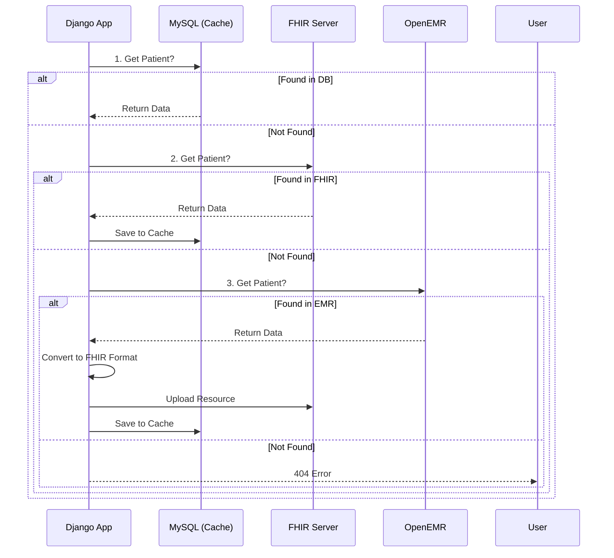

AI 에이전트가 `NeuroNova` 프로젝트의 전체 아키텍처, 네트워크 흐름, 데이터 전략, 배포 구성을 명확히 이해할 수 있도록 정리한 기술 문서(`MD`)입니다.

이 내용을 프로젝트 루트 디렉토리에 **`SYSTEM_ARCHITECTURE.md`** 라는 이름으로 저장해두면, 향후 AI에게 코딩을 맡길 때 **"SYSTEM_ARCHITECTURE.md를 참고해"**라고만 해도 문맥을 완벽히 파악할 수 있습니다.

---

```markdown
# NeuroNova System Architecture Documentation

## 1. Project Overview
**Project Name:** NeuroNova (Brain Tumor CDSS)
**Description:** A multi-modal AI Clinical Decision Support System for brain tumor segmentation and metastasis prediction.
**Core Stack:** Django (Backend), React/OHIF (Frontend), Orthanc (PACS), RabbitMQ/Celery (Async Tasks), Docker (Deployment).

---

## 2. System Component Architecture

The system follows a standard PACS/Web architecture where Nginx acts as the unified entry point (Reverse Proxy) to handle routing, security, and CORS issues.

### 2.1 Component Roles
| Component | Type | Role & Responsibility |
|:---:|:---:|:---|
| **Nginx** | Web Server | **Entry Point.** Reverse proxy, SSL termination, static file serving, and request routing based on URL paths. |
| **Django** | Backend | **Controller.** User authentication (JWT), business logic, patient data management, and AI inference triggering. |
| **OHIF** | Frontend | **Viewer.** React-based DICOM viewer running in the client browser. Fetches images directly from Orthanc via Nginx proxy. |
| **Orthanc** | PACS Server | **Storage.** Stores DICOM files. Provides DICOMWeb API for the OHIF viewer. **Must be protected.** |
| **Celery** | Async Worker | **Worker.** Handles heavy background tasks (AI inference, external API sync). Uses the same codebase as Django. |
| **Redis/RabbitMQ** | Broker | **Message Queue.** Mediates tasks between Django and Celery. |

### 2.2 Traffic Flow Diagram
```mermaid
graph TD
    User((User/Browser))
    
    subgraph "Docker Network"
        Nginx[Nginx (Gateway)]
        Django[Django API Server]
        Orthanc[Orthanc PACS]
        Celery[Celery Worker]
        Broker[RabbitMQ/Redis]
    end

    User -- "1. Load Viewer (Static)" --> Nginx
    User -- "2. API / Login (REST)" --> Nginx
    User -- "3. Image Req (DICOMWeb)" --> Nginx

    Nginx -- "/ (Static)" --> OHIF_Files[OHIF Build Files]
    Nginx -- "/api/" --> Django
    Nginx -- "/orthanc/" --> Orthanc

    %% Security Flow
    Nginx -.->|Auth Check (Internal)| Django

    %% Async Flow
    Django -- "Task" --> Broker
    Broker -- "Task" --> Celery
    Celery -.->|DB Access| Django

```

---

## 3. Network & Security Strategy (Nginx)

To prevent CORS errors and secure the Orthanc server, **Nginx** manages all traffic.

### 3.1 Routing Rules

1. **`/` (Root):** Serves OHIF Viewer static files (React build).
2. **`/api/`:** Proxies to **Django (Port 8000)**.
3. **`/orthanc/`:** Proxies to **Orthanc (Port 8042)** via DICOMWeb protocol.

### 3.2 Security Implementation (`auth_request`)

Orthanc must not be publicly accessible. Nginx delegates authentication to Django for every image request.

* **Logic:**
1. Client requests `/orthanc/...` with `Authorization: Bearer <token>`.
2. Nginx pauses and calls internal endpoint `/auth_check`.
3. Nginx passes the `Authorization` header to Django.
4. Django verifies the JWT.
* **Valid:** Returns `200 OK` → Nginx proxies request to Orthanc.
* **Invalid:** Returns `401 Unauthorized` → Nginx blocks request.


---

## 4. Asynchronous Task Processing (Celery)

Heavy computations (AI models) and external data synchronization are handled asynchronously.

### 4.1 Docker Configuration Strategy

* **Image Reuse:** The Celery worker container uses the **same Docker image** as the Django backend.
* **Reasoning:** Celery requires access to the Django ORM, project settings (`settings.py`), and AI libraries (PyTorch/TensorFlow) installed in the backend environment.
* **Command Difference:**
* **Backend Container:** `gunicorn config.wsgi:application ...`
* **Celery Container:** `celery -A config worker ...`


---

## 5. Data Retrieval & Caching Strategy

Patient information is retrieved from three sources with a fallback mechanism to ensure speed, standardization, and data integrity.

### 5.1 Retrieval Priority (Fallback Logic)

**Order:** `MySQL (Local)` → `FHIR Server (Interop)` → `OpenEMR (Source)`

### 5.2 Logic Flow

1. **Search MySQL (Cache Layer):**
* Fastest access. Checks local Django DB.
* *If found:* Return data.
* *If missing:* Proceed to Step 2.


2. **Search FHIR Server (Standard Layer):**
* Checks the interoperability server.
* *If found:* **Write-Back** to MySQL for future speed, then return data.
* *If missing:* Proceed to Step 3.


3. **Search OpenEMR (Source of Truth):**
* Queries the external EMR system.
* *If found:*
1. Convert EMR JSON format to **FHIR Resource**.
2. Upload to **FHIR Server**.
3. Save to **MySQL**.
4. Return data.


* *If missing:* Return `404 Patient Not Found`.




---

## 6. Docker Compose Service Structure

Summary of the `docker-compose.yml` services.

* `nginx`: Gateway, Static file serving.
* `backend`: Django application (API).
* `celery_worker`: Background task worker (Copies `backend` image).
* `orthanc`: DICOM server (with DICOMWeb plugin enabled).
* `fhir_server`: HAPI FHIR or equivalent.
* `db`: MySQL/MariaDB (Shared by Django and OpenEMR if needed, or separate instances).
* `redis`: Message Broker for Celery.

```

```