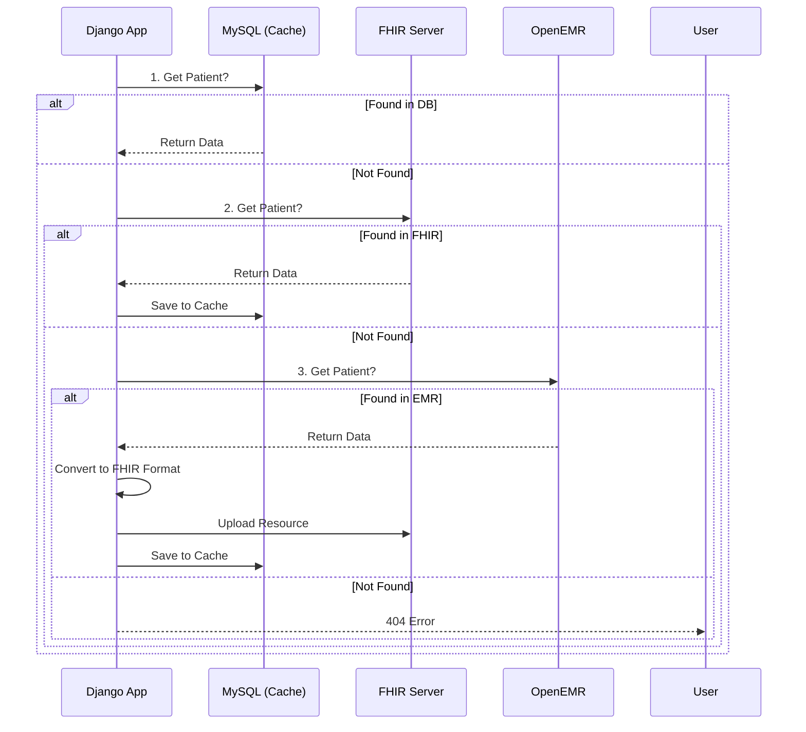

```markdown
# NeuroNova System Architecture Documentation

## 1. Project Overview
**Core Stack:** Django (Backend), React/OHIF (Frontend), Orthanc (PACS), RabbitMQ/Celery (Async Tasks), Docker (Deployment).
**Standard Image Format:** HTJ2K (High Throughput JPEG 2000) Lossless Compression.

---

## 2. System Component Architecture

The system follows a standard PACS/Web architecture where Nginx acts as the unified entry point (Reverse Proxy) to handle routing, security, and CORS issues.

### 2.1 Component Roles
| Component | Type | Role & Responsibility |
|:---:|:---:|:---|
| **Nginx** | Web Server | **Gateway.** Unified Entry Point. Performs reverse proxy, SSL termination, and **X-Accel-Redirect** for secure image serving. |
| **Django** | Backend | **Controller.** Handles JWT Auth, Business Logic, and **Signed URL generation** for PACS security. |
| **OHIF** | Frontend | **Viewer.** HTJ2K compatible DICOM viewer. Decodes images via WASM-based multi-threading. |
| **Orthanc** | PACS Server | **Storage.** Stores DICOM in **HTJ2K** format. Isolated from external networks. Served via Django/Nginx proxy. |
| **Celery** | Async Worker | **Worker.** AI inference (decoding HTJ2K to Numpy) and external API sync. |
| **Redis/RabbitMQ** | Broker | **Message Queue.** Task mediation and Channel Layer for real-time alerts. |

### 2.2 Traffic Flow Diagram
```mermaid
graph TD
    User((User/Browser))
    
    subgraph "Public Zone"
        Nginx[Nginx Unified Gateway]
    end

    subgraph "Secure Zone"
        Django[Django Controller]
        Orthanc[Orthanc PACS (Isolated)]
        Celery[Celery Worker]
        Broker[RabbitMQ/Redis]
    end

    User -- "1. Load Viewer & API" --> Nginx
    Nginx -- "/api/auth/" --> Django
    
    %% Secure Image Flow
    User -- "2. Req Image w/ Signed URL" --> Nginx
    Nginx -- "3. Verify Signature" --> Django
    Django -- "4. X-Accel-Redirect (Internal)" --> Nginx
    Nginx -- "5. Serve Image (HTJ2K)" --> Orthanc
    Orthanc -- "DICOM Stream" --> Nginx
    Nginx -- "Protected Traffic" --> User

    %% Async Flow
    Django -- "Task" --> Broker
    Broker -- "Task" --> Celery
    Celery -- "HTJ2K to Numpy" --> AI_Model[AI Inference]
```

---

## 3. Network & Security Strategy (Nginx-Django-Orthanc Proxy)

Orthanc is completely isolated. All image requests must be validated by Django.

### 3.1 Secure Image Serving Flow
1. **Request:** OHIF requests an image using a **Signed URL** (containing JWT/Signature).
2. **Gateway:** Nginx receives the request and forwards it to Django for signature/permission validation.
3. **Controller:** Django verifies the signature. If valid, it returns a response with the `X-Accel-Redirect` header pointing to an internal Nginx location.
4. **Final Proxy:** Nginx intercepts the `X-Accel-Redirect` and proxies the request to the isolated **Orthanc** server.
5. **Streaming:** The DICOM file (HTJ2K) is streamed to the user via Nginx.

### 3.2 Security Headers (COOP/COEP)
To enable high-performance HTJ2K decoding (via `SharedArrayBuffer`), Nginx enforces the following headers:
* `Cross-Origin-Opener-Policy: same-origin`
* `Cross-Origin-Embedder-Policy: require-corp`


---

## 4. Asynchronous Task Processing (Celery)

Heavy computations (AI models) and external data synchronization are handled asynchronously.

### 4.1 Docker Configuration Strategy

* **Image Reuse:** The Celery worker container uses the **same Docker image** as the Django backend.
* **Reasoning:** Celery requires access to the Django ORM, project settings (`settings.py`), and AI libraries (PyTorch/TensorFlow) installed in the backend environment.
* **Command Difference:**
* **Backend Container:** `gunicorn config.wsgi:application ...`
* **Celery Container:** `celery -A config worker ...`


---

## 5. Data Retrieval & Caching Strategy

Patient information is retrieved from three sources with a fallback mechanism to ensure speed, standardization, and data integrity.

### 5.1 Retrieval Priority (Fallback Logic)

**Order:** `MySQL (Local)` → `FHIR Server (Interop)` → `OpenEMR (Source)`

### 5.2 Logic Flow

1. **Search MySQL (Cache Layer):**
* Fastest access. Checks local Django DB.
* *If found:* Return data.
* *If missing:* Proceed to Step 2.


2. **Search FHIR Server (Standard Layer):**
* Checks the interoperability server.
* *If found:* **Write-Back** to MySQL for future speed, then return data.
* *If missing:* Proceed to Step 3.


3. **Search OpenEMR (Source of Truth):**
* Queries the external EMR system.
* *If found:*
1. Convert EMR JSON format to **FHIR Resource**.
2. Upload to **FHIR Server**.
3. Save to **MySQL**.
4. Return data.


* *If missing:* Return `404 Patient Not Found`.




---

## 6. Docker Compose Service Structure

Summary of the `docker-compose.yml` services integrated into the unified network.

| Service | Container Name | Image/Build | Port Mapping | Key Dependencies |
|:---|:---|:---|:---|:---|
| **nginx** | `cdss-nginx` | custom | 80:80, 443:443 | `backend`, `ohif`, `orthanc` |
| **backend** | `cdss-django-backend` | `./NeuroNova_02_back_end/01_django_server` | 8000:8000 | `db`, `redis`, `rabbitmq` |
| **ohif** | `cdss-ohif-viewer` | `./NeuroNova_03_front_end_react` | 3000:3000 | N/A (Static) |
| **orthanc** | `cdss-orthanc` | `jodogne/orthanc-plugins` | 8042:8042, 4242:4242 | `db` |
| **celery_worker** | `cdss-celery` | (same as backend) | N/A | `backend`, `redis` |
| **db** | `cdss-mysql` | `mysql:8.0` | 3306:3306 | N/A |
| **redis** | `cdss-redis` | `redis:7.0-alpine` | 6379:6379 | N/A |
| **rabbitmq** | `cdss-rabbitmq` | `rabbitmq:3-management` | 5672, 15672 | N/A |
| **hapi_fhir** | `cdss-hapi-fhir` | `hapiproject/hapi-fhir-jpaserver` | 8080:8080 | `db` |
| **ai_server** | `cdss-ai-server` | `./00_ai_core` | 5000:5000 | GPU |

---

## 7. HTJ2K Optimization Strategy

To maximize performance, the system standardizes on HTJ2K (High Throughput JPEG 2000).

### 7.1 Orthanc Configuration
* **Ingest Transcoding:** Orthanc is configured to automatically transcode incoming DICOMs to HTJ2K Lossless format (`1.2.840.10008.1.2.4.201`).
* **Storage Efficiency:** Reduces storage footprint while maintaining zero information loss.

### 7.2 OHIF Decoding
* **WASM Decoder:** OHIF utilizes a WebAssembly (WASM) based HTJ2K decoder.
* **Multi-threading:** Enabled via `SharedArrayBuffer`, allowing the browser to utilize multiple CPU cores for real-time decoding and 3D rendering.

### 7.3 AI Pipeline Integration
* **HTJ2K to Numpy:** The AI inference pipeline includes a dedicated pre-processing step to decode HTJ2K DICOM streams directly into Numpy arrays for model input.


```

```