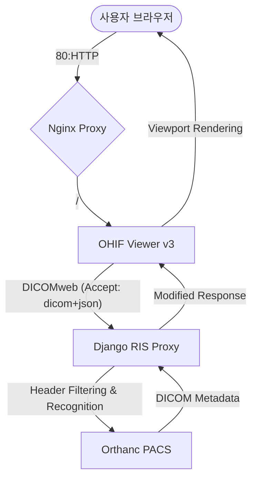

# OHIF Viewer v3 아키텍처 및 설정 가이드

본 문서는 NeuroNova 프로젝트에서 OHIF Viewer를 v2에서 v3로 업그레이드하며 발생한 기술적 문제와 해결 방법, 그리고 최종 아키텍처를 상세히 설명합니다.

## 1. 개요 (왜 설정이 복잡했는가?)

단순한 웹 뷰어를 띄우는 것이 아니라, 의료 영상 표준(DICOM)을 준수하며 보안과 성능을 모두 잡기 위해 4개의 핵심 계층(Nginx, OHIF, Django, Orthanc)이 정교하게 맞물려 돌아가야 했기 때문입니다.

---

## 2. 계층별 상세 역할 및 설정 포인트

### 2.1. Nginx (Entry Point)
- **역할**: 외부에서 들어오는 모든 HTTP 요청(80번 포트)을 받아 적절한 서비스로 라우팅합니다.
- **주요 설정**:
    - `/`: 서비스 메인 페이지
    - `/api/`: Django 백엔드
    - `/orthanc/`: Orthanc PACS UI 및 API
- **해결된 이슈**: 기존에 OpenEMR이 80번 포트를 점유하고 있어 충돌이 발생했습니다. OpenEMR을 8081번으로 이동시키고 Nginx를 주 게이트웨이로 설정했습니다.

### 2.2. OHIF Viewer v3.9.2 (Frontend)
- **역할**: 브라우저에서 DICOM 영상을 렌더링하고 사용자에게 보여줍니다.
- **v3 업그레이드 포인트**:
    - **스키마 변경**: v2의 `servers` 구조에서 v3의 `dataSources` 구조로 `ohif-config.js`를 재작성했습니다.
    - **통신 규격**: 최신 표준인 `application/dicom+json` 헤더를 통해 데이터를 요청합니다.
- **설정 파일**: `NeuroNova_02_back_end/03_orthanc_pacs/ohif-config.js`

### 2.3. Django REST Framework (DICOMweb Proxy)
- **역할**: OHIF와 Orthanc 사이에서 요청을 전달(Proxy)하며 보안 필터링을 수행합니다.
- **핵심 해결 기술**:
    - **DicomJsonRenderer**: DRF는 기본적으로 `application/dicom+json` 헤더를 인식하지 못해 406 Error를 발생시킵니다. 이를 해결하기 위해 전용 Renderer를 구현하여 Django가 이 규격을 허용하도록 만들었습니다.
    - **Header Management**: Orthanc와의 호환성을 위해 요청 헤더에서 모호한 Accept 항목을 정제하여 전달합니다.
- **코드 위치**: `ris/views.py` 내 `dicom_web_proxy` 및 `DicomJsonRenderer`

### 2.4. Orthanc (PACS Storage)
- **역할**: 실제 DICOM 파일이 저장되고 DICOMweb API를 제공하는 엔진입니다.
- **네트워크 구조**: 외부로 직접 노출되지 않고 Django 프록시를 통해서만 통신하도록 설계하여 보안을 강화했습니다.

---

## 3. 최종 연동 흐름 (The Pipeline)

## 4. 트러블슈팅 요약

| 문제점 | 원인 | 해결 방법 |
| :--- | :--- | :--- |
| **Study List가 빈 화면임** | OHIF v2 프로그램에 v3 설정을 적용함 | OHIF v3(v3.9.2)로 전체 업그레이드 및 설정 최신화 |
| **406 Not Acceptable 에러** | DRF가 `dicom+json` 헤더를 거부함 | `DicomJsonRenderer` 추가 및 프록시 헤더 처리 로직 구현 |
| **포트 충돌 (80번)** | Nginx와 OpenEMR이 동일 포트 사용 | OpenEMR을 8081로 이동, Nginx를 주 관문으로 설정 |
| **네트워크 단절** | 컨테이너별로 네트워크가 파편화됨 | `neuronova_network`로 모든 컨테이너망을 통합 |

---

## 5. 유지보수 가이드
- **이미지 버전**: `ohif/app:v3.9.2` (명시적 버전 사용 권장)
- **네트워크**: 신규 서비스 추가 시 반드시 Docker의 `neuronova_network`에 연결해야 합니다.
- **데이터 유실**: 컨테이너 재생성 시 Orthanc 데이터가 초기화될 수 있으므로 운영 환경에서는 볼륨 마운트 관리에 유의하십시오.
