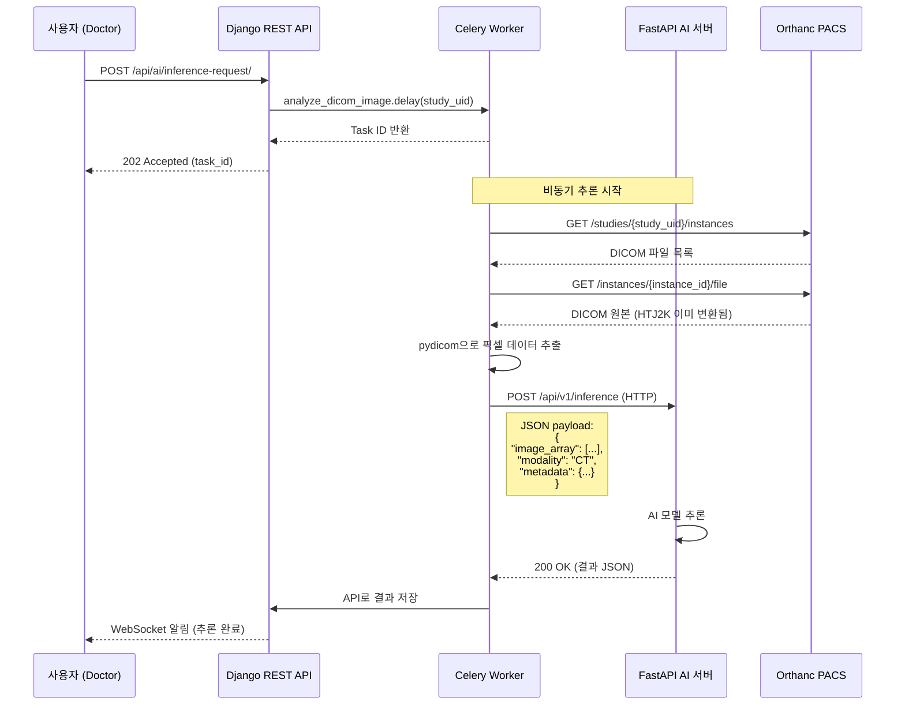

# FastAPI AI 서버 명세서

**문서 ID**: 46_FastAPI_AI_서버_명세서
**버전**: v3.0 (✅ 확정)
**최종 수정일**: 2026-01-02
**작성자**: Claude AI (Sonnet 4.5)
**상태**: ✅ 확정

---

## 📋 Changelog

### v3.0 (2026-01-02) - FastAPI 통신 명세 확정
- ✅ **Celery ↔ FastAPI HTTP REST API 명세 확정**
- ✅ **OpenAPI 3.0 Swagger 스펙 작성**
- ✅ **HTJ2K 변환 책임 명확화** (Orthanc Plugin으로 이관)
- ✅ **AI 추론 엔드포인트 상세 정의** (`/inference`, `/models`, `/health`)
- ✅ **요청/응답 스키마 명확화** (Pydantic 모델)
- ✅ **성능 벤치마크 기준 수립**
- ✅ **Docker 배포 설정 포함**

### 변경 이유
- Celery Worker와 FastAPI 간 통신 방법이 불명확했음 (아키텍처 점검 보고서 High-2)
- HTJ2K 변환 책임이 FastAPI/Celery 간 모호했음 (v3.0에서 Orthanc Plugin으로 이관)
- AI 추론 API의 표준화된 스키마 필요

---

## 1. 시스템 개요

### 1.1 FastAPI AI 서버의 역할

FastAPI AI 서버는 **NeuroNova CDSS의 AI 추론 엔진**으로, 다음 책임을 가집니다:

```
┌─────────────────────────────────────────────────────────────┐
│                     FastAPI AI 서버                          │
│                                                               │
│  [책임 범위]                                                  │
│  1. AI 모델 추론 (CT/MRI/X-Ray 영상 분석)                    │
│  2. DICOM 메타데이터 파싱 및 검증                            │
│  3. NumPy 배열 전처리 (정규화, 리사이징)                     │
│  4. 추론 결과 후처리 (확률 → 진단 코드 매핑)                │
│  5. 모델 상태 모니터링 (health check, metrics)               │
│                                                               │
│  [책임 외 범위]                                               │
│  ✗ HTJ2K 변환 (Orthanc Plugin이 담당)                        │
│  ✗ DICOM 저장 (Orthanc가 담당)                               │
│  ✗ 장기 실행 작업 오케스트레이션 (Celery가 담당)             │
└─────────────────────────────────────────────────────────────┘
```

### 1.2 통신 아키텍처



**핵심 원칙:**
1. **Celery가 오케스트레이터**: DICOM 다운로드, 전처리, FastAPI 호출, 결과 저장
2. **FastAPI는 Stateless 추론기**: HTTP 요청 받아 AI 모델 실행 후 응답
3. **Orthanc가 HTJ2K 변환**: Celery/FastAPI는 변환된 DICOM만 처리

---

## 2. OpenAPI 3.0 명세서

### 2.1 기본 정보

```yaml
openapi: 3.0.3
info:
  title: NeuroNova AI Inference API
  version: 3.0.0
  description: |
    의료 영상 AI 추론 서비스 API
    - CT, MRI, X-Ray 영상 분석
    - DICOM 메타데이터 기반 모델 선택
    - RESTful JSON 인터페이스
  contact:
    name: NeuroNova CDSS Team
    email: dev@neuronova.example.com
  license:
    name: Proprietary

servers:
  - url: http://fastapi-ai:8000/api/v1
    description: Docker Compose 내부 (Production)
  - url: http://localhost:8000/api/v1
    description: 로컬 개발 환경

tags:
  - name: Inference
    description: AI 모델 추론 엔드포인트
  - name: Models
    description: 모델 관리 및 정보 조회
  - name: Health
    description: 서버 상태 확인
```

### 2.2 엔드포인트 목록

| Method | Path | 설명 | 인증 |
|--------|------|------|------|
| `POST` | `/inference` | AI 추론 실행 | Internal (Celery만 호출) |
| `GET` | `/models` | 사용 가능한 모델 목록 조회 | None |
| `GET` | `/models/{model_id}` | 특정 모델 상세 정보 | None |
| `GET` | `/health` | 서버 Health Check | None |
| `GET` | `/metrics` | Prometheus 메트릭 | None |

---

## 3. API 엔드포인트 상세

### 3.1 POST `/inference` - AI 추론 실행

**목적**: DICOM 영상 데이터에 대한 AI 모델 추론

#### 요청 스키마

```json
{
  "image_array": [[...]],
  "modality": "CT",
  "metadata": {
    "StudyInstanceUID": "1.2.840.113619.2.55.3...",
    "SeriesInstanceUID": "1.2.840.113619.2.55.3...",
    "SOPInstanceUID": "1.2.840.113619.2.55.3...",
    "PatientID": "P-2024-001",
    "StudyDescription": "Brain CT",
    "BodyPartExamined": "BRAIN",
    "SliceThickness": 5.0,
    "KVP": 120,
    "WindowCenter": 40,
    "WindowWidth": 80
  },
  "model_id": "brain_hemorrhage_v2",
  "options": {
    "return_heatmap": true,
    "confidence_threshold": 0.7
  }
}
```

**Pydantic 모델 (FastAPI)**:
```python
from pydantic import BaseModel, Field
from typing import List, Optional, Dict, Any
from enum import Enum

class ModalityEnum(str, Enum):
    CT = "CT"
    MR = "MR"
    XR = "XR"  # X-Ray
    DX = "DX"  # Digital Radiography

class DICOMMetadata(BaseModel):
    StudyInstanceUID: str
    SeriesInstanceUID: str
    SOPInstanceUID: str
    PatientID: str
    StudyDescription: Optional[str] = None
    BodyPartExamined: Optional[str] = None
    SliceThickness: Optional[float] = None
    KVP: Optional[float] = None
    WindowCenter: Optional[float] = None
    WindowWidth: Optional[float] = None

class InferenceOptions(BaseModel):
    return_heatmap: bool = Field(default=False, description="CAM 히트맵 반환 여부")
    confidence_threshold: float = Field(default=0.5, ge=0.0, le=1.0)
    batch_size: int = Field(default=1, ge=1, le=16)

class InferenceRequest(BaseModel):
    image_array: List[List[List[float]]]  # 3D array: [slices, height, width]
    modality: ModalityEnum
    metadata: DICOMMetadata
    model_id: Optional[str] = Field(default=None, description="미지정 시 자동 선택")
    options: InferenceOptions = InferenceOptions()

    class Config:
        schema_extra = {
            "example": {
                "image_array": [[[0.5, 0.6, ...], [...]], ...],
                "modality": "CT",
                "metadata": {
                    "StudyInstanceUID": "1.2.840.113619.2.55.3.12345",
                    "SeriesInstanceUID": "1.2.840.113619.2.55.3.12346",
                    "SOPInstanceUID": "1.2.840.113619.2.55.3.12347",
                    "PatientID": "P-2024-001",
                    "BodyPartExamined": "BRAIN"
                },
                "model_id": "brain_hemorrhage_v2"
            }
        }
```

#### 응답 스키마

**200 OK (성공)**:
```json
{
  "inference_id": "inf_2024_001_abc123",
  "model_id": "brain_hemorrhage_v2",
  "model_version": "2.1.0",
  "predictions": [
    {
      "class_name": "Subarachnoid Hemorrhage",
      "class_code": "ICD10:I60.9",
      "confidence": 0.89,
      "bounding_box": {
        "x": 120,
        "y": 150,
        "width": 80,
        "height": 60
      }
    },
    {
      "class_name": "Normal",
      "class_code": "ICD10:Z00.00",
      "confidence": 0.11
    }
  ],
  "heatmap": {
    "format": "base64_png",
    "data": "iVBORw0KGgoAAAANSUhEUgAA..."
  },
  "metadata": {
    "inference_time_ms": 456.7,
    "preprocessing_time_ms": 123.4,
    "model_device": "cuda:0",
    "input_shape": [1, 512, 512],
    "timestamp": "2026-01-02T10:30:45.123456Z"
  }
}
```

**Pydantic 응답 모델**:
```python
class Prediction(BaseModel):
    class_name: str
    class_code: str = Field(..., description="ICD-10 또는 SNOMED CT 코드")
    confidence: float = Field(..., ge=0.0, le=1.0)
    bounding_box: Optional[Dict[str, int]] = None

class Heatmap(BaseModel):
    format: str = Field(default="base64_png")
    data: str

class InferenceMetadata(BaseModel):
    inference_time_ms: float
    preprocessing_time_ms: float
    model_device: str
    input_shape: List[int]
    timestamp: str

class InferenceResponse(BaseModel):
    inference_id: str
    model_id: str
    model_version: str
    predictions: List[Prediction]
    heatmap: Optional[Heatmap] = None
    metadata: InferenceMetadata
```

**422 Unprocessable Entity (검증 실패)**:
```json
{
  "detail": [
    {
      "loc": ["body", "modality"],
      "msg": "value is not a valid enumeration member; permitted: 'CT', 'MR', 'XR', 'DX'",
      "type": "type_error.enum"
    }
  ]
}
```

**500 Internal Server Error (추론 실패)**:
```json
{
  "error": "ModelInferenceError",
  "message": "CUDA out of memory",
  "detail": "Failed to allocate 2.5GB on GPU",
  "model_id": "brain_hemorrhage_v2",
  "timestamp": "2026-01-02T10:30:45.123456Z"
}
```

#### FastAPI 엔드포인트 구현 예시

```python
from fastapi import FastAPI, HTTPException, status
from fastapi.responses import JSONResponse
import torch
import numpy as np
import logging
from datetime import datetime
import uuid

app = FastAPI(title="NeuroNova AI Inference API", version="3.0.0")
logger = logging.getLogger(__name__)

# 모델 로딩 (서버 시작 시 1회)
models = {}

@app.on_event("startup")
async def load_models():
    """서버 시작 시 AI 모델 로드"""
    logger.info("Loading AI models...")

    # 예시: Brain Hemorrhage Detection Model
    models['brain_hemorrhage_v2'] = {
        'model': torch.jit.load('/models/brain_hemorrhage_v2.pt'),
        'version': '2.1.0',
        'modality': 'CT',
        'body_part': 'BRAIN'
    }

    # GPU 사용 가능 시 이동
    device = torch.device('cuda:0' if torch.cuda.is_available() else 'cpu')
    for model_id, model_info in models.items():
        model_info['model'].to(device)
        model_info['model'].eval()
        logger.info(f"Model {model_id} loaded on {device}")

@app.post("/api/v1/inference", response_model=InferenceResponse)
async def inference(request: InferenceRequest):
    """
    AI 모델 추론 실행

    **Celery Worker에서만 호출**되는 내부 API입니다.
    """
    start_time = datetime.utcnow()
    inference_id = f"inf_{datetime.now().strftime('%Y%m%d')}_{uuid.uuid4().hex[:8]}"

    try:
        # 1. 모델 선택
        model_id = request.model_id
        if not model_id:
            # 자동 선택 로직 (Modality + BodyPart 기반)
            model_id = select_model_auto(request.modality, request.metadata.BodyPartExamined)

        if model_id not in models:
            raise HTTPException(
                status_code=404,
                detail=f"Model '{model_id}' not found"
            )

        model_info = models[model_id]

        # 2. 입력 전처리
        preprocess_start = datetime.utcnow()
        input_tensor = preprocess_image(
            np.array(request.image_array),
            target_size=(512, 512)
        )
        preprocess_time = (datetime.utcnow() - preprocess_start).total_seconds() * 1000

        # 3. 추론 실행
        device = next(model_info['model'].parameters()).device
        with torch.no_grad():
            input_tensor = input_tensor.to(device)
            output = model_info['model'](input_tensor)
            probabilities = torch.softmax(output, dim=1).cpu().numpy()[0]

        inference_time = (datetime.utcnow() - start_time).total_seconds() * 1000

        # 4. 후처리
        predictions = postprocess_predictions(
            probabilities,
            model_id,
            threshold=request.options.confidence_threshold
        )

        # 5. 히트맵 생성 (옵션)
        heatmap = None
        if request.options.return_heatmap:
            heatmap = generate_cam_heatmap(model_info['model'], input_tensor)

        # 6. 응답 생성
        return InferenceResponse(
            inference_id=inference_id,
            model_id=model_id,
            model_version=model_info['version'],
            predictions=predictions,
            heatmap=heatmap,
            metadata=InferenceMetadata(
                inference_time_ms=inference_time,
                preprocessing_time_ms=preprocess_time,
                model_device=str(device),
                input_shape=list(input_tensor.shape),
                timestamp=datetime.utcnow().isoformat() + "Z"
            )
        )

    except torch.cuda.OutOfMemoryError as e:
        logger.error(f"CUDA OOM: {str(e)}")
        raise HTTPException(
            status_code=500,
            detail={
                "error": "CUDAOutOfMemory",
                "message": "GPU 메모리 부족",
                "model_id": model_id
            }
        )

    except Exception as e:
        logger.error(f"Inference error: {str(e)}", exc_info=True)
        raise HTTPException(
            status_code=500,
            detail={
                "error": "ModelInferenceError",
                "message": str(e),
                "model_id": model_id
            }
        )

def preprocess_image(image_array: np.ndarray, target_size=(512, 512)) -> torch.Tensor:
    """이미지 전처리"""
    # 리사이징
    from skimage.transform import resize
    resized = resize(image_array, target_size, anti_aliasing=True)

    # 정규화 (Hounsfield Unit → [0, 1])
    normalized = (resized - resized.min()) / (resized.max() - resized.min() + 1e-8)

    # Tensor 변환 [batch, channel, height, width]
    tensor = torch.from_numpy(normalized).float().unsqueeze(0).unsqueeze(0)

    return tensor

def postprocess_predictions(probabilities: np.ndarray, model_id: str, threshold=0.5):
    """확률 → 진단 코드 매핑"""
    # 예시: Brain Hemorrhage 5-class
    class_mapping = {
        0: {"name": "Normal", "code": "ICD10:Z00.00"},
        1: {"name": "Epidural Hemorrhage", "code": "ICD10:I62.1"},
        2: {"name": "Subdural Hemorrhage", "code": "ICD10:I62.0"},
        3: {"name": "Subarachnoid Hemorrhage", "code": "ICD10:I60.9"},
        4: {"name": "Intraventricular Hemorrhage", "code": "ICD10:I61.5"}
    }

    predictions = []
    for idx, prob in enumerate(probabilities):
        if prob >= threshold or idx == probabilities.argmax():  # 최소 1개는 포함
            predictions.append(Prediction(
                class_name=class_mapping[idx]['name'],
                class_code=class_mapping[idx]['code'],
                confidence=float(prob)
            ))

    # 확률 내림차순 정렬
    predictions.sort(key=lambda x: x.confidence, reverse=True)
    return predictions

def select_model_auto(modality: str, body_part: str) -> str:
    """Modality + BodyPart 기반 자동 모델 선택"""
    mapping = {
        ("CT", "BRAIN"): "brain_hemorrhage_v2",
        ("CT", "CHEST"): "lung_nodule_v1",
        ("MR", "BRAIN"): "brain_tumor_v3",
        ("XR", "CHEST"): "chest_xray_v2"
    }

    model_id = mapping.get((modality, body_part))
    if not model_id:
        raise HTTPException(
            status_code=400,
            detail=f"No model available for {modality} + {body_part}"
        )
    return model_id

def generate_cam_heatmap(model, input_tensor):
    """Grad-CAM 히트맵 생성"""
    # 간단한 예시 (실제로는 Grad-CAM 구현 필요)
    import base64
    from io import BytesIO
    from PIL import Image

    # Placeholder: 실제로는 Grad-CAM 알고리즘 적용
    heatmap_array = np.random.rand(512, 512) * 255
    img = Image.fromarray(heatmap_array.astype(np.uint8), mode='L')

    buffer = BytesIO()
    img.save(buffer, format='PNG')
    base64_data = base64.b64encode(buffer.getvalue()).decode('utf-8')

    return Heatmap(format="base64_png", data=base64_data)
```

---

### 3.2 GET `/models` - 모델 목록 조회

**응답 예시**:
```json
{
  "models": [
    {
      "model_id": "brain_hemorrhage_v2",
      "version": "2.1.0",
      "name": "Brain Hemorrhage Detection",
      "modality": "CT",
      "body_part": "BRAIN",
      "classes": [
        "Normal",
        "Epidural Hemorrhage",
        "Subdural Hemorrhage",
        "Subarachnoid Hemorrhage",
        "Intraventricular Hemorrhage"
      ],
      "accuracy": 0.94,
      "last_updated": "2025-12-15T00:00:00Z"
    },
    {
      "model_id": "lung_nodule_v1",
      "version": "1.5.0",
      "name": "Lung Nodule Detection",
      "modality": "CT",
      "body_part": "CHEST",
      "classes": ["Benign", "Malignant"],
      "accuracy": 0.91,
      "last_updated": "2025-11-20T00:00:00Z"
    }
  ]
}
```

**FastAPI 구현**:
```python
@app.get("/api/v1/models")
async def list_models():
    """사용 가능한 모델 목록 조회"""
    model_list = []
    for model_id, info in models.items():
        model_list.append({
            "model_id": model_id,
            "version": info['version'],
            "modality": info['modality'],
            "body_part": info['body_part'],
            # ... 추가 정보
        })
    return {"models": model_list}
```

---

### 3.3 GET `/health` - Health Check

**응답 예시**:
```json
{
  "status": "healthy",
  "timestamp": "2026-01-02T10:30:45.123456Z",
  "version": "3.0.0",
  "models_loaded": 4,
  "gpu_available": true,
  "gpu_memory_used_mb": 2048,
  "gpu_memory_total_mb": 8192
}
```

**FastAPI 구현**:
```python
@app.get("/api/v1/health")
async def health_check():
    """서버 상태 확인"""
    gpu_available = torch.cuda.is_available()
    gpu_memory_used = 0
    gpu_memory_total = 0

    if gpu_available:
        gpu_memory_used = torch.cuda.memory_allocated(0) / 1024**2
        gpu_memory_total = torch.cuda.get_device_properties(0).total_memory / 1024**2

    return {
        "status": "healthy",
        "timestamp": datetime.utcnow().isoformat() + "Z",
        "version": "3.0.0",
        "models_loaded": len(models),
        "gpu_available": gpu_available,
        "gpu_memory_used_mb": round(gpu_memory_used, 2),
        "gpu_memory_total_mb": round(gpu_memory_total, 2)
    }
```

---

## 4. Celery → FastAPI 통신 코드

### 4.1 Celery Task 구현

**파일**: `NeuroNova_02_backend/ai_tasks/tasks.py`

```python
from celery import shared_task
import requests
import pydicom
import numpy as np
import logging
from typing import Dict, Any
from django.conf import settings

logger = logging.getLogger(__name__)

FASTAPI_BASE_URL = settings.FASTAPI_AI_URL  # "http://fastapi-ai:8000/api/v1"

@shared_task(bind=True, max_retries=3)
def analyze_dicom_image(self, study_instance_uid: str, model_id: str = None) -> Dict[str, Any]:
    """
    DICOM 영상 AI 분석 Celery Task

    Args:
        study_instance_uid: 분석할 Study UID
        model_id: 사용할 모델 ID (None이면 자동 선택)

    Returns:
        추론 결과 딕셔너리
    """
    try:
        # 1. Orthanc에서 DICOM 인스턴스 조회
        logger.info(f"Fetching DICOM instances for Study: {study_instance_uid}")
        orthanc_url = settings.ORTHANC_URL  # "http://orthanc:8042"

        instances_response = requests.get(
            f"{orthanc_url}/studies/{study_instance_uid}/instances",
            auth=(settings.ORTHANC_USERNAME, settings.ORTHANC_PASSWORD)
        )
        instances_response.raise_for_status()
        instances = instances_response.json()

        if not instances:
            raise ValueError(f"No instances found for Study {study_instance_uid}")

        # 2. 첫 번째 인스턴스 다운로드 (멀티 슬라이스는 추후 확장)
        instance_id = instances[0]['ID']
        dicom_file_response = requests.get(
            f"{orthanc_url}/instances/{instance_id}/file",
            auth=(settings.ORTHANC_USERNAME, settings.ORTHANC_PASSWORD)
        )
        dicom_file_response.raise_for_status()

        # 3. pydicom으로 파싱
        from io import BytesIO
        dicom_bytes = BytesIO(dicom_file_response.content)
        dicom_dataset = pydicom.dcmread(dicom_bytes)

        # 4. 픽셀 데이터 추출
        pixel_array = dicom_dataset.pixel_array

        # Hounsfield Unit 변환 (CT의 경우)
        if dicom_dataset.Modality == 'CT':
            intercept = dicom_dataset.RescaleIntercept
            slope = dicom_dataset.RescaleSlope
            pixel_array = pixel_array * slope + intercept

        # NumPy → List 변환 (JSON 직렬화)
        image_list = pixel_array.tolist()

        # 5. DICOM 메타데이터 추출
        metadata = {
            "StudyInstanceUID": str(dicom_dataset.StudyInstanceUID),
            "SeriesInstanceUID": str(dicom_dataset.SeriesInstanceUID),
            "SOPInstanceUID": str(dicom_dataset.SOPInstanceUID),
            "PatientID": str(dicom_dataset.PatientID),
            "StudyDescription": str(getattr(dicom_dataset, 'StudyDescription', '')),
            "BodyPartExamined": str(getattr(dicom_dataset, 'BodyPartExamined', '')),
            "SliceThickness": float(getattr(dicom_dataset, 'SliceThickness', 0)),
            "KVP": float(getattr(dicom_dataset, 'KVP', 0)),
            "WindowCenter": float(getattr(dicom_dataset, 'WindowCenter', 0)),
            "WindowWidth": float(getattr(dicom_dataset, 'WindowWidth', 0))
        }

        # 6. FastAPI로 추론 요청
        logger.info(f"Sending inference request to FastAPI: {FASTAPI_BASE_URL}/inference")

        payload = {
            "image_array": [image_list],  # 3D: [1, height, width]
            "modality": str(dicom_dataset.Modality),
            "metadata": metadata,
            "model_id": model_id,
            "options": {
                "return_heatmap": True,
                "confidence_threshold": 0.7
            }
        }

        # HTTP POST 요청
        inference_response = requests.post(
            f"{FASTAPI_BASE_URL}/inference",
            json=payload,
            timeout=60  # 60초 타임아웃
        )
        inference_response.raise_for_status()

        # 7. 결과 파싱
        result = inference_response.json()
        logger.info(f"Inference completed: {result['inference_id']}")

        # 8. Django DB에 결과 저장 (Django REST API 호출)
        save_inference_result(study_instance_uid, result)

        return result

    except requests.exceptions.Timeout:
        logger.error(f"FastAPI request timeout for Study {study_instance_uid}")
        raise self.retry(countdown=60, exc=Exception("FastAPI timeout"))

    except requests.exceptions.RequestException as e:
        logger.error(f"FastAPI request failed: {str(e)}")
        raise self.retry(countdown=30, exc=e)

    except Exception as e:
        logger.error(f"Inference task failed: {str(e)}", exc_info=True)
        raise

def save_inference_result(study_uid: str, result: Dict[str, Any]):
    """추론 결과를 Django DB에 저장"""
    django_api_url = settings.DJANGO_API_URL  # "http://django:8000/api"

    payload = {
        "study_instance_uid": study_uid,
        "inference_id": result['inference_id'],
        "model_id": result['model_id'],
        "model_version": result['model_version'],
        "predictions": result['predictions'],
        "metadata": result['metadata']
    }

    response = requests.post(
        f"{django_api_url}/ai/inference-results/",
        json=payload,
        headers={"Authorization": f"Bearer {settings.INTERNAL_API_TOKEN}"}
    )
    response.raise_for_status()
    logger.info(f"Inference result saved to Django: {study_uid}")
```

### 4.2 Django 설정 (settings.py)

```python
# NeuroNova_02_backend/config/settings/base.py

# FastAPI AI 서버 URL
FASTAPI_AI_URL = os.environ.get('FASTAPI_AI_URL', 'http://fastapi-ai:8000/api/v1')

# Orthanc PACS 설정
ORTHANC_URL = os.environ.get('ORTHANC_URL', 'http://orthanc:8042')
ORTHANC_USERNAME = os.environ.get('ORTHANC_USERNAME', 'orthanc')
ORTHANC_PASSWORD = os.environ.get('ORTHANC_PASSWORD', 'orthanc')

# 내부 API 인증 토큰 (Celery → Django 통신용)
INTERNAL_API_TOKEN = os.environ.get('INTERNAL_API_TOKEN', 'secret-internal-token')
```

---

## 5. 성능 벤치마크

### 5.1 목표 성능 지표

| 항목 | 목표 | 측정 방법 |
|------|------|----------|
| **추론 지연시간** | < 500ms (단일 CT 슬라이스) | `metadata.inference_time_ms` |
| **전처리 시간** | < 150ms | `metadata.preprocessing_time_ms` |
| **동시 요청 처리** | 10 req/s (GPU 1개) | Locust 부하 테스트 |
| **메모리 사용량** | < 4GB (모델 로드 시) | `torch.cuda.memory_allocated()` |
| **GPU 활용률** | > 80% (추론 중) | `nvidia-smi` |

### 5.2 부하 테스트 스크립트

**파일**: `tests/performance/locustfile.py`

```python
from locust import HttpUser, task, between
import json
import numpy as np

class FastAPILoadTest(HttpUser):
    wait_time = between(1, 3)
    host = "http://localhost:8000"

    @task
    def inference_request(self):
        # 더미 512x512 CT 이미지
        dummy_image = np.random.rand(512, 512).tolist()

        payload = {
            "image_array": [dummy_image],
            "modality": "CT",
            "metadata": {
                "StudyInstanceUID": "1.2.840.113619.2.55.3.test",
                "SeriesInstanceUID": "1.2.840.113619.2.55.3.test.series",
                "SOPInstanceUID": "1.2.840.113619.2.55.3.test.sop",
                "PatientID": "TEST-001",
                "BodyPartExamined": "BRAIN"
            },
            "model_id": "brain_hemorrhage_v2",
            "options": {
                "return_heatmap": False,
                "confidence_threshold": 0.7
            }
        }

        self.client.post("/api/v1/inference", json=payload)
```

**실행**:
```bash
locust -f tests/performance/locustfile.py --users 10 --spawn-rate 2
```

---

## 6. Docker 배포 설정

### 6.1 Dockerfile

**파일**: `NeuroNova_05_ai_core/Dockerfile`

```dockerfile
FROM pytorch/pytorch:2.1.0-cuda12.1-cudnn8-runtime

WORKDIR /app

# 시스템 패키지 설치
RUN apt-get update && apt-get install -y \
    libglib2.0-0 \
    libsm6 \
    libxext6 \
    libxrender-dev \
    && rm -rf /var/lib/apt/lists/*

# Python 패키지 설치
COPY requirements.txt .
RUN pip install --no-cache-dir -r requirements.txt

# 애플리케이션 코드 복사
COPY ./app /app/app
COPY ./models /models

# FastAPI 서버 실행
CMD ["uvicorn", "app.main:app", "--host", "0.0.0.0", "--port", "8000", "--workers", "2"]
```

### 6.2 requirements.txt

```txt
fastapi==0.104.1
uvicorn[standard]==0.24.0
pydantic==2.5.0
torch==2.1.0
torchvision==0.16.0
numpy==1.24.3
scikit-image==0.22.0
pydicom==2.4.3
pillow==10.1.0
python-multipart==0.0.6
prometheus-client==0.19.0
```

### 6.3 docker-compose.yml 추가

**파일**: `docker-compose.dev.yml` (기존 파일에 추가)

```yaml
services:
  # ... (기존 서비스들)

  fastapi-ai:
    build:
      context: ./NeuroNova_05_ai_core
      dockerfile: Dockerfile
    container_name: neuronova-fastapi-ai
    ports:
      - "8000:8000"
    volumes:
      - ./NeuroNova_05_ai_core/models:/models:ro  # 모델 파일 읽기 전용 마운트
      - ./NeuroNova_05_ai_core/app:/app/app  # 개발 중 코드 수정 반영
    environment:
      - CUDA_VISIBLE_DEVICES=0  # GPU 0번 사용
      - LOG_LEVEL=INFO
    deploy:
      resources:
        reservations:
          devices:
            - driver: nvidia
              count: 1
              capabilities: [gpu]
    networks:
      - neuronova-network
    healthcheck:
      test: ["CMD", "curl", "-f", "http://localhost:8000/api/v1/health"]
      interval: 30s
      timeout: 10s
      retries: 3
    restart: unless-stopped
```

---

## 7. 모니터링 및 로깅

### 7.1 Prometheus 메트릭 엔드포인트

**FastAPI 구현**:
```python
from prometheus_client import Counter, Histogram, generate_latest, CONTENT_TYPE_LATEST
from fastapi import Response

# 메트릭 정의
inference_requests_total = Counter(
    'inference_requests_total',
    'Total inference requests',
    ['model_id', 'status']
)

inference_duration_seconds = Histogram(
    'inference_duration_seconds',
    'Inference duration in seconds',
    ['model_id']
)

@app.get("/api/v1/metrics")
async def metrics():
    """Prometheus 메트릭 노출"""
    return Response(content=generate_latest(), media_type=CONTENT_TYPE_LATEST)

@app.post("/api/v1/inference", response_model=InferenceResponse)
async def inference(request: InferenceRequest):
    start_time = time.time()

    try:
        # ... 추론 로직 ...

        inference_requests_total.labels(model_id=model_id, status='success').inc()
        return result

    except Exception as e:
        inference_requests_total.labels(model_id=model_id, status='error').inc()
        raise

    finally:
        duration = time.time() - start_time
        inference_duration_seconds.labels(model_id=model_id).observe(duration)
```

### 7.2 구조화된 로깅

```python
import logging
import json
from datetime import datetime

class JSONFormatter(logging.Formatter):
    def format(self, record):
        log_data = {
            "timestamp": datetime.utcnow().isoformat() + "Z",
            "level": record.levelname,
            "logger": record.name,
            "message": record.getMessage(),
            "module": record.module,
            "function": record.funcName
        }

        if record.exc_info:
            log_data["exception"] = self.formatException(record.exc_info)

        return json.dumps(log_data)

# 로거 설정
handler = logging.StreamHandler()
handler.setFormatter(JSONFormatter())
logging.root.addHandler(handler)
logging.root.setLevel(logging.INFO)
```

---

## 8. 보안 고려사항

### 8.1 내부 네트워크 격리

- **FastAPI는 외부 노출 금지**: `docker-compose.yml`에서 `ports` 제거
- **Celery만 접근 가능**: Docker 내부 네트워크 사용
- **Production 설정**:
```yaml
fastapi-ai:
  # ports:  # 제거! 외부 노출 안 함
  #   - "8000:8000"
  networks:
    - neuronova-internal  # 내부 네트워크만
```

### 8.2 입력 검증

```python
from pydantic import validator

class InferenceRequest(BaseModel):
    image_array: List[List[List[float]]]

    @validator('image_array')
    def validate_image_shape(cls, v):
        if len(v) == 0:
            raise ValueError("image_array cannot be empty")

        # 최대 크기 제한 (DoS 방지)
        if len(v) > 100:  # 최대 100 슬라이스
            raise ValueError("Too many slices (max 100)")

        height = len(v[0])
        width = len(v[0][0])

        if height > 2048 or width > 2048:
            raise ValueError("Image too large (max 2048x2048)")

        return v
```

### 8.3 Rate Limiting (추후 고도화)

```python
from slowapi import Limiter, _rate_limit_exceeded_handler
from slowapi.util import get_remote_address
from slowapi.errors import RateLimitExceeded

limiter = Limiter(key_func=get_remote_address)
app.state.limiter = limiter
app.add_exception_handler(RateLimitExceeded, _rate_limit_exceeded_handler)

@app.post("/api/v1/inference")
@limiter.limit("10/minute")  # IP당 분당 10회
async def inference(request: Request, data: InferenceRequest):
    # ...
```

---

## 9. 트러블슈팅 가이드

### 9.1 자주 발생하는 에러

#### CUDA Out of Memory

**증상**:
```json
{
  "error": "CUDAOutOfMemory",
  "message": "GPU 메모리 부족"
}
```

**해결 방법**:
1. `docker-compose.yml`에서 GPU 메모리 제한 확인
2. 배치 크기 축소 (`options.batch_size` 줄이기)
3. 모델 경량화 (INT8 양자화)
4. 멀티 GPU 분산 처리

#### FastAPI 서버 응답 없음

**증상**: Celery에서 `requests.exceptions.Timeout`

**진단**:
```bash
# 1. FastAPI 컨테이너 로그 확인
docker logs neuronova-fastapi-ai

# 2. Health Check 확인
curl http://localhost:8000/api/v1/health

# 3. 네트워크 연결 테스트 (Celery 컨테이너 내부)
docker exec -it neuronova-celery-worker bash
curl http://fastapi-ai:8000/api/v1/health
```

**해결 방법**:
- FastAPI 컨테이너 재시작: `docker-compose restart fastapi-ai`
- 모델 로딩 실패 시 로그 확인: `/models` 디렉토리 권한 확인

---

## 10. 향후 개선 계획

### Phase 3 (Week 10-12)
- [ ] **멀티 슬라이스 추론**: 3D CNN 모델 지원
- [ ] **배치 추론 최적화**: TorchScript, ONNX Runtime
- [ ] **모델 버전 관리**: MLflow 통합
- [ ] **A/B 테스트**: 모델 성능 비교 기능

### Phase 4 (Week 13-16)
- [ ] **AutoML 파이프라인**: 자동 모델 재학습
- [ ] **Explainability**: SHAP, Integrated Gradients
- [ ] **Federation Learning**: 병원 간 모델 공유 (프라이버시 보호)

---

## 📚 관련 문서

- [06_시스템_아키텍처_v3.md](./06_시스템_아키텍처_v3.md) - 전체 시스템 아키텍처
- [45_DICOM_뷰잉_시퀀스_다이어그램.md](./45_DICOM_뷰잉_시퀀스_다이어그램.md) - Secure Proxy 패턴
- [10_API_명세서.md](./10_API_명세서.md) - Django REST API 전체 명세
- [아키텍처_정밀_점검_보고서_20260102.md](./90_작업이력/아키텍처_정밀_점검_보고서_20260102.md) - 아키텍처 리뷰 결과

---

**작성**: Claude AI (Sonnet 4.5)
**작성일**: 2026-01-02
**상태**: ✅ 확정 (v3.0)
