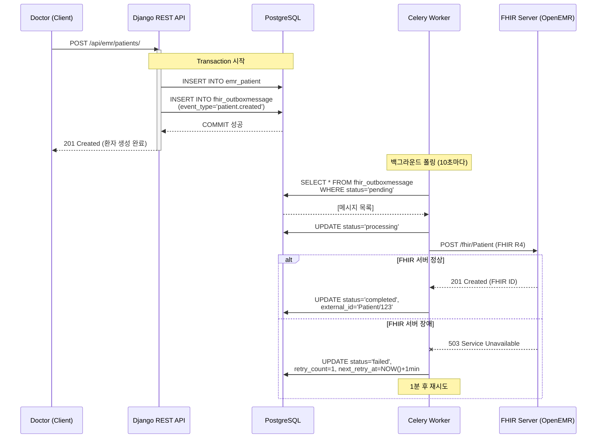

# FHIR 동기화 Outbox 패턴 명세서

**문서 ID**: 47_FHIR_동기화_Outbox_패턴_명세서
**버전**: v3.0 (✅ 확정)
**최종 수정일**: 2026-01-02
**작성자**: Claude AI (Sonnet 4.5)
**상태**: ✅ 확정

---

## 📋 Changelog

### v3.0 (2026-01-02) - Outbox 패턴 최적화 및 명세 확정
- ✅ **트랜잭션 일관성 보장** (Outbox 테이블 + Django Signal)
- ✅ **멱등성 보장** (중복 전송 방지 메커니즘)
- ✅ **재시도 로직 고도화** (Exponential Backoff + Circuit Breaker)
- ✅ **배치 동기화 지원** (대량 데이터 효율 처리)
- ✅ **충돌 해결 전략 명확화** (Last-Write-Wins + 버전 관리)
- ✅ **모니터링 메트릭 정의** (지연 시간, 실패율)
- ✅ **Dead Letter Queue 구현** (복구 불가능 메시지 격리)

### 변경 이유
- 기존 단순 Write-Through 방식의 원자성 문제 해결 (아키텍처 점검 보고서 High-4)
- OpenEMR ↔ Django DB 간 데이터 불일치 위험 제거
- FHIR 서버 장애 시에도 로컬 DB 트랜잭션 성공 보장
- 네트워크 재시도 및 실패 추적 기능 강화

---

## 1. Outbox 패턴 개요

### 1.1 기본 원리

**Outbox 패턴**은 분산 시스템에서 **트랜잭션 일관성**과 **이벤트 발행**을 보장하는 패턴입니다.

```
┌─────────────────────────────────────────────────────────────┐
│                  Outbox 패턴 동작 흐름                       │
└─────────────────────────────────────────────────────────────┘

[1단계] Django API 요청 (예: 환자 등록)
   ↓
[2단계] Django Transaction 시작
   ├─ Patient 레코드 INSERT
   ├─ OutboxMessage 레코드 INSERT (FHIR 동기화 이벤트)
   └─ COMMIT (원자적 성공/실패)
   ↓
[3단계] Celery Worker가 OutboxMessage 폴링
   ├─ status='pending' 메시지 조회
   ├─ FHIR 서버로 HTTP POST 전송
   ├─ 성공 시: status='completed'
   └─ 실패 시: status='failed', retry_count++
   ↓
[4단계] 재시도 로직 (실패 시)
   ├─ Exponential Backoff (1분, 2분, 4분, ...)
   ├─ 최대 5회 재시도
   └─ 최종 실패 시: status='dead_letter'
```

### 1.2 NeuroNova에서의 적용



**핵심 장점:**
1. ✅ **트랜잭션 일관성**: 환자 저장 + Outbox 메시지 저장이 원자적
2. ✅ **FHIR 장애 격리**: FHIR 서버 다운 시에도 Django API는 정상 응답
3. ✅ **재시도 보장**: Celery가 자동으로 실패 메시지 재처리
4. ✅ **감사 추적**: 모든 동기화 이벤트가 DB에 기록됨

---

## 2. 데이터베이스 스키마

### 2.1 Outbox 테이블 정의

**파일**: `NeuroNova_02_backend/fhir/models.py`

```python
from django.db import models
from django.contrib.postgres.fields import JSONField
from django.utils import timezone
from datetime import timedelta

class OutboxMessage(models.Model):
    """
    FHIR 동기화 이벤트를 저장하는 Outbox 테이블
    """

    class EventType(models.TextChoices):
        PATIENT_CREATED = 'patient.created', 'Patient Created'
        PATIENT_UPDATED = 'patient.updated', 'Patient Updated'
        ENCOUNTER_CREATED = 'encounter.created', 'Encounter Created'
        OBSERVATION_CREATED = 'observation.created', 'Observation Created'
        MEDICATION_ORDER_CREATED = 'medication_order.created', 'MedicationRequest Created'

    class Status(models.TextChoices):
        PENDING = 'pending', 'Pending'
        PROCESSING = 'processing', 'Processing'
        COMPLETED = 'completed', 'Completed'
        FAILED = 'failed', 'Failed'
        DEAD_LETTER = 'dead_letter', 'Dead Letter Queue'

    # 기본 필드
    id = models.BigAutoField(primary_key=True)
    event_type = models.CharField(max_length=50, choices=EventType.choices)
    status = models.CharField(max_length=20, choices=Status.choices, default=Status.PENDING, db_index=True)

    # 페이로드 (FHIR 리소스 JSON)
    payload = models.JSONField(help_text="FHIR 리소스 JSON (예: Patient, Encounter)")

    # 메타데이터
    aggregate_type = models.CharField(max_length=50, help_text="리소스 타입 (Patient, Encounter, ...)")
    aggregate_id = models.CharField(max_length=100, db_index=True, help_text="Django 모델 PK")
    external_id = models.CharField(max_length=255, null=True, blank=True, help_text="FHIR 서버의 리소스 ID")

    # 재시도 로직
    retry_count = models.IntegerField(default=0)
    max_retries = models.IntegerField(default=5)
    next_retry_at = models.DateTimeField(null=True, blank=True, db_index=True)

    # 에러 추적
    last_error = models.TextField(null=True, blank=True)
    error_details = models.JSONField(null=True, blank=True)

    # 타임스탬프
    created_at = models.DateTimeField(auto_now_add=True, db_index=True)
    processed_at = models.DateTimeField(null=True, blank=True)

    class Meta:
        db_table = 'fhir_outbox_message'
        ordering = ['-created_at']
        indexes = [
            models.Index(fields=['status', 'next_retry_at']),  # 폴링 쿼리 최적화
            models.Index(fields=['aggregate_type', 'aggregate_id']),  # 중복 확인 최적화
        ]

    def __str__(self):
        return f"{self.event_type} - {self.status} (#{self.id})"

    def mark_processing(self):
        """처리 시작 상태로 변경"""
        self.status = self.Status.PROCESSING
        self.save(update_fields=['status'])

    def mark_completed(self, external_id: str):
        """처리 성공 상태로 변경"""
        self.status = self.Status.COMPLETED
        self.external_id = external_id
        self.processed_at = timezone.now()
        self.save(update_fields=['status', 'external_id', 'processed_at'])

    def mark_failed(self, error_message: str, error_details: dict = None):
        """처리 실패 상태로 변경 (재시도 예약)"""
        self.retry_count += 1
        self.last_error = error_message
        self.error_details = error_details or {}

        if self.retry_count >= self.max_retries:
            # 최대 재시도 횟수 초과 → Dead Letter Queue
            self.status = self.Status.DEAD_LETTER
            self.next_retry_at = None
        else:
            # Exponential Backoff: 2^retry_count 분 후 재시도
            self.status = self.Status.FAILED
            backoff_minutes = 2 ** self.retry_count
            self.next_retry_at = timezone.now() + timedelta(minutes=backoff_minutes)

        self.save(update_fields=['status', 'retry_count', 'last_error', 'error_details', 'next_retry_at'])
```

### 2.2 마이그레이션 파일

**파일**: `NeuroNova_02_backend/fhir/migrations/0002_outbox_message.py`

```python
from django.db import migrations, models
import django.contrib.postgres.fields

class Migration(migrations.Migration):
    dependencies = [
        ('fhir', '0001_initial'),
    ]

    operations = [
        migrations.CreateModel(
            name='OutboxMessage',
            fields=[
                ('id', models.BigAutoField(primary_key=True, serialize=False)),
                ('event_type', models.CharField(max_length=50)),
                ('status', models.CharField(max_length=20, default='pending', db_index=True)),
                ('payload', models.JSONField()),
                ('aggregate_type', models.CharField(max_length=50)),
                ('aggregate_id', models.CharField(max_length=100, db_index=True)),
                ('external_id', models.CharField(max_length=255, null=True, blank=True)),
                ('retry_count', models.IntegerField(default=0)),
                ('max_retries', models.IntegerField(default=5)),
                ('next_retry_at', models.DateTimeField(null=True, blank=True, db_index=True)),
                ('last_error', models.TextField(null=True, blank=True)),
                ('error_details', models.JSONField(null=True, blank=True)),
                ('created_at', models.DateTimeField(auto_now_add=True, db_index=True)),
                ('processed_at', models.DateTimeField(null=True, blank=True)),
            ],
            options={
                'db_table': 'fhir_outbox_message',
                'ordering': ['-created_at'],
            },
        ),
        migrations.AddIndex(
            model_name='outboxmessage',
            index=models.Index(fields=['status', 'next_retry_at'], name='fhir_outbox_status_retry_idx'),
        ),
        migrations.AddIndex(
            model_name='outboxmessage',
            index=models.Index(fields=['aggregate_type', 'aggregate_id'], name='fhir_outbox_aggregate_idx'),
        ),
    ]
```

---

## 3. Django Signal을 통한 이벤트 발행

### 3.1 Signal Handler 구현

**파일**: `NeuroNova_02_backend/emr/signals.py`

```python
from django.db.models.signals import post_save, post_delete
from django.dispatch import receiver
from django.db import transaction
from emr.models import Patient, Encounter
from fhir.models import OutboxMessage
from fhir.serializers import PatientFHIRSerializer, EncounterFHIRSerializer
import logging

logger = logging.getLogger(__name__)

@receiver(post_save, sender=Patient)
def patient_saved_handler(sender, instance, created, **kwargs):
    """
    환자 생성/수정 시 OutboxMessage 생성
    """
    # transaction.on_commit()으로 트랜잭션 커밋 후 실행 보장
    transaction.on_commit(lambda: create_patient_outbox_message(instance, created))

def create_patient_outbox_message(patient: Patient, created: bool):
    """Patient → FHIR Patient 리소스 변환 후 Outbox 저장"""
    try:
        # FHIR 리소스 직렬화
        fhir_serializer = PatientFHIRSerializer(patient)
        fhir_payload = fhir_serializer.data

        # 중복 방지: 이미 처리 중이거나 완료된 메시지 확인
        existing = OutboxMessage.objects.filter(
            aggregate_type='Patient',
            aggregate_id=str(patient.id),
            status__in=[OutboxMessage.Status.PENDING, OutboxMessage.Status.PROCESSING]
        ).exists()

        if existing:
            logger.warning(f"Duplicate outbox message for Patient {patient.id}, skipping")
            return

        # OutboxMessage 생성
        event_type = OutboxMessage.EventType.PATIENT_CREATED if created else OutboxMessage.EventType.PATIENT_UPDATED

        OutboxMessage.objects.create(
            event_type=event_type,
            status=OutboxMessage.Status.PENDING,
            payload=fhir_payload,
            aggregate_type='Patient',
            aggregate_id=str(patient.id)
        )

        logger.info(f"OutboxMessage created: {event_type} for Patient {patient.id}")

    except Exception as e:
        logger.error(f"Failed to create OutboxMessage for Patient {patient.id}: {str(e)}", exc_info=True)
        # Signal에서는 예외를 raise하지 않음 (트랜잭션 롤백 방지)

@receiver(post_save, sender=Encounter)
def encounter_saved_handler(sender, instance, created, **kwargs):
    """진료 기록 생성/수정 시 OutboxMessage 생성"""
    if created:
        transaction.on_commit(lambda: create_encounter_outbox_message(instance))

def create_encounter_outbox_message(encounter: Encounter):
    """Encounter → FHIR Encounter 리소스"""
    try:
        fhir_serializer = EncounterFHIRSerializer(encounter)
        fhir_payload = fhir_serializer.data

        OutboxMessage.objects.create(
            event_type=OutboxMessage.EventType.ENCOUNTER_CREATED,
            status=OutboxMessage.Status.PENDING,
            payload=fhir_payload,
            aggregate_type='Encounter',
            aggregate_id=str(encounter.id)
        )

        logger.info(f"OutboxMessage created for Encounter {encounter.id}")

    except Exception as e:
        logger.error(f"Failed to create OutboxMessage for Encounter {encounter.id}: {str(e)}", exc_info=True)
```

### 3.2 Signal 등록

**파일**: `NeuroNova_02_backend/emr/apps.py`

```python
from django.apps import AppConfig

class EmrConfig(AppConfig):
    default_auto_field = 'django.db.models.BigAutoField'
    name = 'emr'

    def ready(self):
        """앱 초기화 시 Signal 등록"""
        import emr.signals  # noqa
```

---

## 4. Celery Worker - Outbox Processor

### 4.1 폴링 기반 메시지 처리

**파일**: `NeuroNova_02_backend/fhir/tasks.py`

```python
from celery import shared_task
from django.utils import timezone
from django.db import transaction
from fhir.models import OutboxMessage
from fhir.fhir_client import FHIRClient
import logging

logger = logging.getLogger(__name__)

@shared_task
def process_outbox_messages():
    """
    Outbox 메시지 폴링 및 처리

    Celery Beat로 10초마다 실행
    """
    # 1. 처리 대상 메시지 조회
    now = timezone.now()

    messages = OutboxMessage.objects.select_for_update(skip_locked=True).filter(
        status=OutboxMessage.Status.PENDING
    ) | OutboxMessage.objects.select_for_update(skip_locked=True).filter(
        status=OutboxMessage.Status.FAILED,
        next_retry_at__lte=now
    )

    messages = messages.order_by('created_at')[:100]  # 배치 크기 100

    if not messages:
        logger.debug("No pending outbox messages")
        return

    logger.info(f"Processing {len(messages)} outbox messages")

    # 2. 각 메시지 처리
    for message in messages:
        try:
            process_single_message(message)
        except Exception as e:
            logger.error(f"Unexpected error processing message {message.id}: {str(e)}", exc_info=True)

def process_single_message(message: OutboxMessage):
    """단일 Outbox 메시지 처리"""

    # 1. 상태 변경: PROCESSING
    message.mark_processing()

    try:
        # 2. FHIR 클라이언트로 전송
        fhir_client = FHIRClient()

        if message.event_type in [OutboxMessage.EventType.PATIENT_CREATED, OutboxMessage.EventType.PATIENT_UPDATED]:
            external_id = fhir_client.create_or_update_patient(message.payload, message.external_id)

        elif message.event_type == OutboxMessage.EventType.ENCOUNTER_CREATED:
            external_id = fhir_client.create_encounter(message.payload)

        elif message.event_type == OutboxMessage.EventType.OBSERVATION_CREATED:
            external_id = fhir_client.create_observation(message.payload)

        elif message.event_type == OutboxMessage.EventType.MEDICATION_ORDER_CREATED:
            external_id = fhir_client.create_medication_request(message.payload)

        else:
            raise ValueError(f"Unknown event type: {message.event_type}")

        # 3. 성공 처리
        message.mark_completed(external_id)
        logger.info(f"Message {message.id} processed successfully: {external_id}")

    except FHIRClient.TransientError as e:
        # 일시적 에러 (네트워크, 503 등) → 재시도
        logger.warning(f"Transient error for message {message.id}: {str(e)}")
        message.mark_failed(
            error_message=str(e),
            error_details={"type": "transient", "http_status": e.status_code}
        )

    except FHIRClient.PermanentError as e:
        # 영구적 에러 (400, 422 등) → Dead Letter Queue
        logger.error(f"Permanent error for message {message.id}: {str(e)}")
        message.retry_count = message.max_retries  # 강제로 max 초과
        message.mark_failed(
            error_message=str(e),
            error_details={"type": "permanent", "http_status": e.status_code}
        )

    except Exception as e:
        # 알 수 없는 에러 → 재시도
        logger.error(f"Unknown error for message {message.id}: {str(e)}", exc_info=True)
        message.mark_failed(
            error_message=str(e),
            error_details={"type": "unknown"}
        )
```

### 4.2 FHIR 클라이언트 구현

**파일**: `NeuroNova_02_backend/fhir/fhir_client.py`

```python
import requests
from django.conf import settings
import logging
from typing import Optional

logger = logging.getLogger(__name__)

class FHIRClient:
    """FHIR 서버(OpenEMR) HTTP 클라이언트"""

    class TransientError(Exception):
        """일시적 에러 (재시도 가능)"""
        def __init__(self, message, status_code=None):
            super().__init__(message)
            self.status_code = status_code

    class PermanentError(Exception):
        """영구적 에러 (재시도 불가능)"""
        def __init__(self, message, status_code=None):
            super().__init__(message)
            self.status_code = status_code

    def __init__(self):
        self.base_url = settings.FHIR_SERVER_URL  # "http://openemr/apis/default/fhir"
        self.auth_token = settings.FHIR_SERVER_TOKEN
        self.timeout = 30

    def _request(self, method: str, endpoint: str, json_data: dict = None) -> dict:
        """공통 HTTP 요청 메서드"""
        url = f"{self.base_url}/{endpoint}"
        headers = {
            "Authorization": f"Bearer {self.auth_token}",
            "Content-Type": "application/fhir+json",
            "Accept": "application/fhir+json"
        }

        try:
            response = requests.request(
                method=method,
                url=url,
                json=json_data,
                headers=headers,
                timeout=self.timeout
            )

            # 에러 분류
            if response.status_code in [200, 201]:
                return response.json()

            elif response.status_code in [400, 422]:
                # 클라이언트 에러 (데이터 검증 실패) → 영구적 에러
                raise self.PermanentError(
                    f"Validation error: {response.text}",
                    status_code=response.status_code
                )

            elif response.status_code in [401, 403]:
                # 인증/권한 에러 → 영구적 에러
                raise self.PermanentError(
                    f"Authentication error: {response.text}",
                    status_code=response.status_code
                )

            elif response.status_code in [500, 502, 503, 504]:
                # 서버 에러 → 일시적 에러
                raise self.TransientError(
                    f"Server error: {response.text}",
                    status_code=response.status_code
                )

            else:
                # 기타 에러 → 일시적 에러로 간주
                raise self.TransientError(
                    f"Unknown error: {response.text}",
                    status_code=response.status_code
                )

        except requests.exceptions.Timeout:
            raise self.TransientError("Request timeout")

        except requests.exceptions.ConnectionError as e:
            raise self.TransientError(f"Connection error: {str(e)}")

    def create_or_update_patient(self, fhir_patient: dict, existing_id: Optional[str] = None) -> str:
        """
        FHIR Patient 생성 또는 업데이트

        Returns:
            FHIR 리소스 ID (예: "Patient/123")
        """
        if existing_id:
            # 업데이트 (PUT)
            response = self._request("PUT", existing_id, fhir_patient)
            logger.info(f"Patient updated: {existing_id}")
            return existing_id
        else:
            # 생성 (POST)
            response = self._request("POST", "Patient", fhir_patient)
            resource_id = response['id']
            logger.info(f"Patient created: Patient/{resource_id}")
            return f"Patient/{resource_id}"

    def create_encounter(self, fhir_encounter: dict) -> str:
        """FHIR Encounter 생성"""
        response = self._request("POST", "Encounter", fhir_encounter)
        resource_id = response['id']
        return f"Encounter/{resource_id}"

    def create_observation(self, fhir_observation: dict) -> str:
        """FHIR Observation 생성"""
        response = self._request("POST", "Observation", fhir_observation)
        resource_id = response['id']
        return f"Observation/{resource_id}"

    def create_medication_request(self, fhir_med_request: dict) -> str:
        """FHIR MedicationRequest 생성"""
        response = self._request("POST", "MedicationRequest", fhir_med_request)
        resource_id = response['id']
        return f"MedicationRequest/{resource_id}"
```

### 4.3 Celery Beat 스케줄 설정

**파일**: `NeuroNova_02_backend/config/celery.py`

```python
from celery import Celery
from celery.schedules import crontab
from django.conf import settings

app = Celery('neuronova')
app.config_from_object('django.conf:settings', namespace='CELERY')

# Celery Beat 스케줄 (주기적 작업)
app.conf.beat_schedule = {
    'process-outbox-messages': {
        'task': 'fhir.tasks.process_outbox_messages',
        'schedule': 10.0,  # 10초마다 실행
        'options': {
            'expires': 5.0,  # 5초 내 실행 안 되면 skip
        }
    },
    # ... 기타 스케줄 작업
}

app.autodiscover_tasks()
```

---

## 5. 멱등성 보장

### 5.1 중복 메시지 방지

**Signal Handler에서 중복 체크**:
```python
# emr/signals.py (재확인)

existing = OutboxMessage.objects.filter(
    aggregate_type='Patient',
    aggregate_id=str(patient.id),
    status__in=[OutboxMessage.Status.PENDING, OutboxMessage.Status.PROCESSING]
).exists()

if existing:
    logger.warning(f"Duplicate outbox message for Patient {patient.id}, skipping")
    return
```

### 5.2 FHIR 서버 멱등성 키 활용

**HTTP Header에 Idempotency-Key 추가** (선택적):
```python
# fhir_client.py 수정

def _request(self, method: str, endpoint: str, json_data: dict = None, idempotency_key: str = None) -> dict:
    headers = {
        "Authorization": f"Bearer {self.auth_token}",
        "Content-Type": "application/fhir+json",
        "Accept": "application/fhir+json"
    }

    if idempotency_key:
        headers["Idempotency-Key"] = idempotency_key

    # ... (기존 로직)
```

**Outbox 메시지 ID를 Idempotency Key로 사용**:
```python
# tasks.py 수정

external_id = fhir_client.create_or_update_patient(
    message.payload,
    message.external_id,
    idempotency_key=f"outbox-{message.id}"
)
```

---

## 6. 배치 동기화 최적화

### 6.1 대량 메시지 처리

**현재**: 10초마다 100개 배치 처리

**최적화 전략**:
```python
# tasks.py 수정

@shared_task
def process_outbox_messages():
    # 배치 크기 동적 조정
    batch_size = 100

    # 대기 중인 메시지 수 확인
    pending_count = OutboxMessage.objects.filter(status=OutboxMessage.Status.PENDING).count()

    if pending_count > 1000:
        # 대량 적체 시 배치 크기 확대 + 병렬 처리
        logger.warning(f"High backlog: {pending_count} messages, scaling up")
        batch_size = 500

        # Celery Chord로 병렬 처리
        from celery import chord
        message_ids = list(OutboxMessage.objects.filter(status=OutboxMessage.Status.PENDING).values_list('id', flat=True)[:batch_size])

        # 10개씩 나눠서 병렬 처리
        chunks = [message_ids[i:i+10] for i in range(0, len(message_ids), 10)]
        chord(process_message_chunk.s(chunk) for chunk in chunks)(log_batch_completion.s())

@shared_task
def process_message_chunk(message_ids: list):
    """메시지 청크 병렬 처리"""
    messages = OutboxMessage.objects.filter(id__in=message_ids)
    for message in messages:
        process_single_message(message)

@shared_task
def log_batch_completion(results):
    """배치 완료 로깅"""
    logger.info(f"Batch processing completed: {len(results)} chunks")
```

### 6.2 FHIR Batch Request 활용

**FHIR R4 Bundle (Batch)** 사용:
```python
def create_fhir_batch(messages: list) -> str:
    """여러 OutboxMessage를 FHIR Bundle로 묶어 전송"""

    bundle = {
        "resourceType": "Bundle",
        "type": "batch",
        "entry": []
    }

    for message in messages:
        entry = {
            "request": {
                "method": "POST",
                "url": message.aggregate_type  # "Patient", "Encounter", ...
            },
            "resource": message.payload
        }
        bundle["entry"].append(entry)

    # FHIR 서버로 Bundle 전송
    fhir_client = FHIRClient()
    response = fhir_client._request("POST", "", bundle)  # Root endpoint

    # 각 메시지별 응답 처리
    for idx, entry_response in enumerate(response['entry']):
        message = messages[idx]
        if entry_response['response']['status'].startswith('20'):  # 200, 201
            resource_id = entry_response['response']['location']
            message.mark_completed(resource_id)
        else:
            message.mark_failed(entry_response['response']['outcome'])
```

---

## 7. 충돌 해결 전략

### 7.1 Last-Write-Wins (LWW)

**기본 전략**: 마지막 업데이트가 우선

```python
# FHIR 리소스에 타임스탬프 포함
fhir_patient = {
    "resourceType": "Patient",
    "id": "123",
    "meta": {
        "lastUpdated": "2026-01-02T10:30:45Z",  # Django DB 업데이트 시각
        "versionId": "5"  # Django 모델의 version 필드
    },
    # ...
}
```

**FHIR 서버에서 충돌 감지**:
```python
# PUT 요청 시 If-Match 헤더로 버전 체크
headers["If-Match"] = f'W/"5"'  # versionId

# 409 Conflict 응답 시 처리
if response.status_code == 409:
    # 옵션 1: 강제 덮어쓰기 (LWW)
    # 옵션 2: 수동 해결 필요 (Dead Letter Queue)
```

### 7.2 버전 관리 (Django 모델)

```python
# emr/models.py 수정

class Patient(models.Model):
    # ... 기존 필드 ...

    version = models.IntegerField(default=1)  # 낙관적 잠금
    updated_at = models.DateTimeField(auto_now=True)

    def save(self, *args, **kwargs):
        # 버전 증가
        if self.pk:
            self.version += 1
        super().save(*args, **kwargs)
```

---

## 8. Dead Letter Queue (DLQ) 처리

### 8.1 DLQ 관리 뷰

**파일**: `NeuroNova_02_backend/fhir/views.py`

```python
from rest_framework import viewsets, status
from rest_framework.decorators import action
from rest_framework.response import Response
from fhir.models import OutboxMessage
from fhir.tasks import process_single_message

class OutboxMessageViewSet(viewsets.ReadOnlyModelViewSet):
    """Outbox 메시지 관리 API"""

    queryset = OutboxMessage.objects.all()
    # ... serializer, permissions ...

    @action(detail=False, methods=['get'])
    def dead_letter_queue(self, request):
        """Dead Letter Queue 조회"""
        dlq_messages = OutboxMessage.objects.filter(status=OutboxMessage.Status.DEAD_LETTER)
        serializer = self.get_serializer(dlq_messages, many=True)
        return Response(serializer.data)

    @action(detail=True, methods=['post'])
    def retry_manual(self, request, pk=None):
        """DLQ 메시지 수동 재시도"""
        message = self.get_object()

        if message.status != OutboxMessage.Status.DEAD_LETTER:
            return Response(
                {"error": "Only dead_letter messages can be manually retried"},
                status=status.HTTP_400_BAD_REQUEST
            )

        # 재시도 카운터 초기화
        message.retry_count = 0
        message.status = OutboxMessage.Status.PENDING
        message.save()

        # 즉시 처리 트리거
        process_single_message.delay(message.id)

        return Response({"message": "Retry triggered"}, status=status.HTTP_202_ACCEPTED)
```

### 8.2 DLQ 알림 (이메일/Slack)

```python
# fhir/tasks.py 추가

from django.core.mail import send_mail
from django.conf import settings

def notify_dead_letter(message: OutboxMessage):
    """DLQ 이동 시 알림 발송"""

    subject = f"[NeuroNova] FHIR 동기화 실패 알림 - {message.event_type}"
    body = f"""
    Outbox 메시지가 Dead Letter Queue로 이동되었습니다.

    - Message ID: {message.id}
    - Event Type: {message.event_type}
    - Aggregate: {message.aggregate_type}/{message.aggregate_id}
    - Retry Count: {message.retry_count}
    - Last Error: {message.last_error}

    관리자 페이지: {settings.ADMIN_URL}/fhir/outboxmessage/{message.id}/
    """

    send_mail(
        subject=subject,
        message=body,
        from_email=settings.DEFAULT_FROM_EMAIL,
        recipient_list=settings.ADMINS_EMAIL,
        fail_silently=True
    )
```

---

## 9. 모니터링 및 메트릭

### 9.1 Prometheus 메트릭

**파일**: `NeuroNova_02_backend/fhir/metrics.py`

```python
from prometheus_client import Counter, Histogram, Gauge

# 메시지 처리 카운터
outbox_messages_processed = Counter(
    'outbox_messages_processed_total',
    'Total outbox messages processed',
    ['event_type', 'status']
)

# 처리 시간 히스토그램
outbox_processing_duration = Histogram(
    'outbox_processing_duration_seconds',
    'Outbox message processing duration',
    ['event_type']
)

# 대기 메시지 수 게이지
outbox_pending_messages = Gauge(
    'outbox_pending_messages',
    'Number of pending outbox messages'
)

outbox_failed_messages = Gauge(
    'outbox_failed_messages',
    'Number of failed outbox messages'
)

outbox_dlq_messages = Gauge(
    'outbox_dlq_messages',
    'Number of dead letter queue messages'
)
```

**Celery Task에서 메트릭 기록**:
```python
# tasks.py 수정

import time
from fhir.metrics import outbox_messages_processed, outbox_processing_duration

def process_single_message(message: OutboxMessage):
    start_time = time.time()

    message.mark_processing()

    try:
        # ... 처리 로직 ...

        message.mark_completed(external_id)
        outbox_messages_processed.labels(event_type=message.event_type, status='completed').inc()

    except Exception as e:
        message.mark_failed(str(e))
        outbox_messages_processed.labels(event_type=message.event_type, status='failed').inc()

    finally:
        duration = time.time() - start_time
        outbox_processing_duration.labels(event_type=message.event_type).observe(duration)
```

### 9.2 대시보드 쿼리

**Grafana 대시보드 예시 쿼리**:

1. **초당 처리 메시지 수**:
```promql
rate(outbox_messages_processed_total[5m])
```

2. **평균 처리 시간**:
```promql
rate(outbox_processing_duration_seconds_sum[5m]) / rate(outbox_processing_duration_seconds_count[5m])
```

3. **대기 메시지 수 (이벤트 타입별)**:
```sql
SELECT event_type, COUNT(*) FROM fhir_outbox_message WHERE status='pending' GROUP BY event_type;
```

4. **최근 1시간 실패율**:
```promql
sum(rate(outbox_messages_processed_total{status="failed"}[1h])) / sum(rate(outbox_messages_processed_total[1h]))
```

---

## 10. 배포 체크리스트

### 10.1 마이그레이션 적용

```bash
# 1. 마이그레이션 생성
python manage.py makemigrations fhir

# 2. 마이그레이션 적용
python manage.py migrate fhir

# 3. 인덱스 확인
python manage.py sqlmigrate fhir 0002
```

### 10.2 Celery Beat 시작

```bash
# docker-compose.dev.yml에 추가
services:
  celery-beat:
    build:
      context: ./NeuroNova_02_backend
    command: celery -A config beat -l info --scheduler django_celery_beat.schedulers:DatabaseScheduler
    depends_on:
      - redis
      - postgres
    networks:
      - neuronova-network
```

### 10.3 환경변수 설정

```bash
# .env 파일
FHIR_SERVER_URL=http://openemr/apis/default/fhir
FHIR_SERVER_TOKEN=your-openemr-api-token
```

### 10.4 초기 데이터 동기화

```bash
# 기존 환자 데이터 → Outbox 메시지 생성
python manage.py shell

>>> from emr.models import Patient
>>> from emr.signals import create_patient_outbox_message
>>> for patient in Patient.objects.all():
...     create_patient_outbox_message(patient, created=False)
```

---

## 11. 트러블슈팅 가이드

### 11.1 자주 발생하는 문제

#### 메시지가 계속 FAILED 상태

**원인**: FHIR 서버 연결 불가

**진단**:
```bash
# Celery Worker 로그 확인
docker logs neuronova-celery-worker

# FHIR 서버 Health Check
curl http://openemr/apis/default/fhir/Patient
```

**해결**:
- FHIR 서버 재시작
- 네트워크 설정 확인 (Docker 네트워크)

#### DLQ 메시지 급증

**원인**: 데이터 검증 실패 (400/422 에러)

**진단**:
```python
# Django shell
>>> from fhir.models import OutboxMessage
>>> dlq_messages = OutboxMessage.objects.filter(status='dead_letter')
>>> for msg in dlq_messages[:10]:
...     print(msg.last_error, msg.error_details)
```

**해결**:
- FHIR 리소스 직렬화 로직 수정 (`fhir/serializers.py`)
- 수동 재시도 전 페이로드 수정

---

## 12. 성능 벤치마크

### 12.1 목표 지표

| 항목 | 목표 | 측정 방법 |
|------|------|----------|
| **처리 지연 시간** | < 30초 (P99) | `processed_at - created_at` |
| **처리량** | 100 msg/s (단일 Worker) | Prometheus `rate()` |
| **재시도 성공률** | > 95% | `completed / (completed + failed)` |
| **DLQ 비율** | < 1% | `dead_letter / total` |

### 12.2 부하 테스트

```python
# tests/performance/test_outbox_load.py

import time
from django.test import TestCase
from emr.models import Patient
from fhir.models import OutboxMessage

class OutboxLoadTest(TestCase):
    def test_1000_patients_creation(self):
        """1000명 환자 등록 시 Outbox 메시지 생성 성능"""

        start_time = time.time()

        for i in range(1000):
            Patient.objects.create(
                patient_id=f"LOAD-{i:04d}",
                name=f"환자{i}",
                gender="M",
                birth_date="1990-01-01"
            )

        duration = time.time() - start_time

        # 메시지 생성 확인
        message_count = OutboxMessage.objects.filter(aggregate_type='Patient').count()
        self.assertEqual(message_count, 1000)

        # 성능 기준: 10초 이내
        self.assertLess(duration, 10.0)

        print(f"Created 1000 patients + outbox messages in {duration:.2f}s")
```

---

## 📚 관련 문서

- [06_시스템_아키텍처_v3.md](./06_시스템_아키텍처_v3.md) - v3.0 아키텍처 전체 구조
- [46_FastAPI_AI_서버_명세서.md](./46_FastAPI_AI_서버_명세서.md) - FastAPI 통신 명세
- [10_API_명세서.md](./10_API_명세서.md) - Django REST API 전체 명세
- [아키텍처_정밀_점검_보고서_20260102.md](./90_작업이력/아키텍처_정밀_점검_보고서_20260102.md) - 아키텍처 리뷰

---

**작성**: Claude AI (Sonnet 4.5)
**작성일**: 2026-01-02
**상태**: ✅ 확정 (v3.0)
