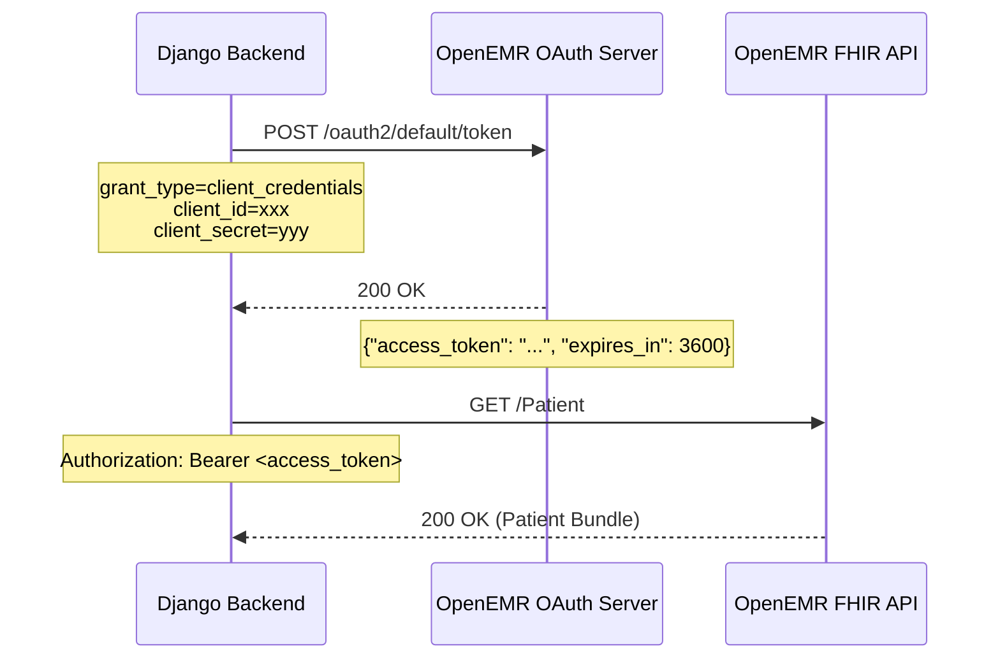

# OpenEMR OAuth2 설정 가이드

**작성일**: 2026-01-02
**대상 독자**: Backend 개발자, DevOps 엔지니어
**난이도**: 중급
**예상 소요 시간**: 15-30분

---

## 📋 목차

1. [개요](#1-개요)
2. [사전 준비](#2-사전-준비)
3. [OpenEMR Admin Panel 설정](#3-openemr-admin-panel-설정)
4. [Django 환경 설정](#4-django-환경-설정)
5. [인증 테스트](#5-인증-테스트)
6. [트러블슈팅](#6-트러블슈팅)
7. [FAQ](#7-faq)

---

## 1. 개요

### 1.1 OAuth2란?

OAuth2는 **권한 부여(Authorization) 프레임워크**로, 외부 애플리케이션이 사용자 대신 리소스에 접근할 수 있도록 허용합니다.

### 1.2 왜 OpenEMR OAuth2 설정이 필요한가?

OpenEMR 7.x는 FHIR R4 API 보안을 위해 **OAuth2 인증을 필수**로 요구합니다.

```
Django Backend → OpenEMR FHIR API
              ↓
         Access Token 필요
              ↓
         OAuth2 Client 등록 필수
```

### 1.3 NeuroNova에서 사용하는 Grant Type

**Client Credentials Flow** (Machine-to-Machine)

- Django 백엔드가 사용자 개입 없이 자동으로 토큰 발급
- Server-to-Server 통신에 적합
- Refresh Token 없음 (Access Token 만료 시 재발급)



---

## 2. 사전 준비

### 2.1 Docker 컨테이너 실행 확인

```bash
# OpenEMR 컨테이너 확인
docker ps | grep openemr

# 예상 출력:
# neuronova-openemr-dev   Up 2 hours   0.0.0.0:8081->80/tcp
```

### 2.2 OpenEMR Admin 계정 확인

| 항목 | 값 |
|------|-----|
| URL | http://localhost:8081 |
| Username | admin |
| Password | pass |

---

## 3. OpenEMR Admin Panel 설정

### 3.1 Step 1: Admin Panel 로그인

1. 브라우저에서 `http://localhost:8081` 접속
2. Username: `admin`, Password: `pass` 입력
3. [Login] 클릭


### 3.2 Step 2: API Clients 메뉴 이동

```
상단 메뉴: Administration
  ↓
좌측 메뉴: System
  ↓
하위 메뉴: API Clients
```


### 3.3 Step 3: New Client 등록

#### 3.3.1 [Register New Client] 버튼 클릭

화면 우측 상단의 파란색 버튼을 클릭합니다.

#### 3.3.2 Client 정보 입력

| 필드 | 값 | 설명 |
|------|-----|------|
| **Client Name** | `NeuroNova CDSS Internal` | 클라이언트 식별용 이름 |
| **Client Identifier (ID)** | `neuronova-cdss-internal` | Django에서 사용할 ID |
| **Client Secret** | [Generate] 버튼 클릭 | 자동 생성 (복사 필수) |
| **Redirect URI** | (비워둠) | Client Credentials는 불필요 |
| **Logout Redirect URI** | (비워둠) | Client Credentials는 불필요 |

#### 3.3.3 Grant Types 선택

**필수 체크**:
- ✅ `client_credentials`

**체크 해제** (사용 안 함):
- ❌ `authorization_code`
- ❌ `refresh_token`
- ❌ `password`

#### 3.3.4 Scopes 선택

**권장 Scopes** (시스템 레벨 접근):

| Scope | 설명 | 필수 여부 |
|-------|------|-----------|
| `system/Patient.read` | 환자 조회 | ✅ 필수 |
| `system/Patient.write` | 환자 생성/수정 | ✅ 필수 |
| `system/Encounter.read` | 진료 기록 조회 | ✅ 필수 |
| `system/Encounter.write` | 진료 기록 생성/수정 | ✅ 필수 |
| `system/Observation.read` | 관찰 데이터 조회 | ⭐ 권장 |
| `system/Observation.write` | 관찰 데이터 생성/수정 | ⭐ 권장 |
| `system/Condition.read` | 진단 조회 | ⭐ 권장 |
| `system/MedicationRequest.read` | 처방 조회 | ⭐ 권장 |

**주의**: `user/Patient.*` 같은 User 레벨 Scope는 **사용하지 않습니다** (Authorization Code Flow 전용).

#### 3.3.5 저장 및 Secret 복사

1. [Save] 버튼 클릭
2. **Client Secret이 화면에 표시됩니다** (단 1회만!)
3. **반드시 복사하여 안전한 곳에 보관하십시오**

```
Client Secret: a7f3e9d2c1b8f4e6a9d5c2b7f1e4a8d3
```

⚠️ **주의**: 이 Secret은 다시 볼 수 없으므로 반드시 저장하십시오. 분실 시 재생성 필요합니다.

---

## 4. Django 환경 설정

### 4.1 Step 1: .env 파일 수정

#### 4.1.1 파일 위치

```bash
cd d:\1222\NeuroNova_v1\NeuroNova_02_back_end\02_django_server
code .env  # 또는 notepad .env
```

#### 4.1.2 환경 변수 추가

```bash
# OpenEMR FHIR API 설정
OPENEMR_FHIR_URL=http://openemr:80/apis/default/fhir
OPENEMR_CLIENT_ID=neuronova-cdss-internal
OPENEMR_CLIENT_SECRET=a7f3e9d2c1b8f4e6a9d5c2b7f1e4a8d3
```

**주의**:
- `OPENEMR_FHIR_URL`은 **Docker 내부 네트워크 이름** `openemr` 사용
- `localhost`가 아닌 `openemr` (컨테이너 이름)

### 4.2 Step 2: settings.py 확인

#### 4.2.1 파일 열기

```bash
code cdss_backend/settings.py
```

#### 4.2.2 OpenEMR 설정 섹션 확인

다음 코드가 존재하는지 확인하십시오:

```python
# ========================
# OpenEMR FHIR API 설정
# ========================

OPENEMR_FHIR_URL = os.environ.get(
    'OPENEMR_FHIR_URL',
    'http://openemr:80/apis/default/fhir'
)
OPENEMR_CLIENT_ID = os.environ.get('OPENEMR_CLIENT_ID', '')
OPENEMR_CLIENT_SECRET = os.environ.get('OPENEMR_CLIENT_SECRET', '')

# 환경 변수 검증 (프로덕션)
if not DEBUG and (not OPENEMR_CLIENT_ID or not OPENEMR_CLIENT_SECRET):
    raise ImproperlyConfigured(
        "OpenEMR OAuth2 credentials not set. "
        "Please configure OPENEMR_CLIENT_ID and OPENEMR_CLIENT_SECRET."
    )
```

**없는 경우 추가**:

```python
# settings.py 하단에 추가
import os
from django.core.exceptions import ImproperlyConfigured

# OpenEMR FHIR API 설정
OPENEMR_FHIR_URL = os.environ.get('OPENEMR_FHIR_URL', 'http://openemr:80/apis/default/fhir')
OPENEMR_CLIENT_ID = os.environ.get('OPENEMR_CLIENT_ID', '')
OPENEMR_CLIENT_SECRET = os.environ.get('OPENEMR_CLIENT_SECRET', '')
```

### 4.3 Step 3: Docker Compose 환경 변수 전달 확인

#### 4.3.1 파일 열기

```bash
cd d:\1222\NeuroNova_v1
code docker-compose.dev.yml
```

#### 4.3.2 Django 서비스 설정 확인

```yaml
services:
  django:
    container_name: neuronova-django-dev
    build:
      context: ./NeuroNova_02_back_end/02_django_server
    env_file:
      - ./NeuroNova_02_back_end/02_django_server/.env
    environment:
      # OpenEMR 설정 (명시적 전달)
      - OPENEMR_FHIR_URL=${OPENEMR_FHIR_URL}
      - OPENEMR_CLIENT_ID=${OPENEMR_CLIENT_ID}
      - OPENEMR_CLIENT_SECRET=${OPENEMR_CLIENT_SECRET}
    networks:
      - neuronova-network
```

**주의**: `env_file`과 `environment` 모두 설정하여 우선순위를 명확히 합니다.

### 4.4 Step 4: Django 컨테이너 재시작

```bash
cd d:\1222\NeuroNova_v1

# Django 컨테이너만 재시작
docker-compose -f docker-compose.dev.yml restart django

# 로그 실시간 확인
docker-compose -f docker-compose.dev.yml logs -f django
```

**예상 로그**:
```
django_1  | Performing system checks...
django_1  | System check identified no issues (0 silenced).
django_1  | Django version 5.0.1, using settings 'cdss_backend.settings'
django_1  | Starting development server at http://0.0.0.0:8000/
```

---

## 5. 인증 테스트

### 5.1 Step 1: Django Shell 진입

```bash
docker-compose -f docker-compose.dev.yml exec django python manage.py shell
```

### 5.2 Step 2: OpenEMRClient 토큰 발급 테스트

```python
from emr.services.openemr_client import OpenEMRClient

# 클라이언트 초기화
client = OpenEMRClient()

# 환경 변수 확인
print(f"Base URL: {client.base_url}")
print(f"Client ID: {client.client_id}")
print(f"Client Secret: {client.client_secret[:10]}..." if client.client_secret else "None")

# Access Token 발급
token = client.get_access_token()

if token:
    print(f"\n[SUCCESS] Access Token: {token[:30]}...")
else:
    print("\n[FAILED] Token is None")
```

**예상 출력 (성공)**:
```
Base URL: http://openemr:80/apis/default/fhir
Client ID: neuronova-cdss-internal
Client Secret: a7f3e9d2c1...

INFO: Requesting OpenEMR Token from http://openemr:80/oauth2/default/token
INFO: Access Token retrieved successfully

[SUCCESS] Access Token: eyJ0eXAiOiJKV1QiLCJhbGciOiJSUzI1...
```

**예상 출력 (실패)**:
```
Base URL: http://openemr:80/apis/default/fhir
Client ID:
Client Secret: None

ERROR: Failed to retrieve OpenEMR Access Token: 400 Client Error
[FAILED] Token is None
```

→ 실패 시 [6. 트러블슈팅](#6-트러블슈팅) 참조

### 5.3 Step 3: FHIR API 호출 테스트

```python
# Patient 목록 조회
patients = client.get_patients()

if patients:
    print(f"\n[SUCCESS] Retrieved {len(patients)} patients")
    if patients:
        print(f"First Patient: {patients[0].get('id')} - {patients[0].get('name')}")
else:
    print("\n[WARNING] No patients found or API call failed")
```

**예상 출력**:
```
[SUCCESS] Retrieved 5 patients
First Patient: 1 - [{'family': 'Doe', 'given': ['John']}]
```

### 5.4 Step 4: E2E 테스트 스크립트 실행

```bash
# Django Shell 종료 (Ctrl+D 또는 exit())
exit()

# E2E 테스트 실행
cd d:\1222\NeuroNova_v1\tests\e2e
python test_uc02_emr.py
```

**예상 출력**:
```
================================================================================
테스트 시작: UC02 - EMR (OpenEMR 연동)
================================================================================

[PASS] UC02-1: 환자 등록 (OpenEMR + Django DB 병렬 저장)
  - persistence_status: {"django": "success", "openemr": "success"}

[PASS] UC02-2: 환자 목록 조회
  - Retrieved 6 patients

================================================================================
테스트 결과: 8개 중 8개 통과 (100%)
================================================================================
```

---

## 6. 트러블슈팅

### 6.1 문제: Client ID/Secret이 로드되지 않음

**증상**:
```python
Client ID:
Client Secret: None
```

**원인**: 환경 변수가 Django에 전달되지 않음

**해결**:

```bash
# 1. .env 파일 확인
cd NeuroNova_02_back_end/02_django_server
cat .env | grep OPENEMR

# 2. Docker 컨테이너 환경 변수 확인
docker-compose -f docker-compose.dev.yml exec django env | grep OPENEMR

# 3. 환경 변수가 없다면 컨테이너 재빌드
docker-compose -f docker-compose.dev.yml down
docker-compose -f docker-compose.dev.yml up -d --build
```

---

### 6.2 문제: 400 Bad Request (invalid_request)

**증상**:
```json
{
  "error": "invalid_request",
  "error_description": "The request is missing a required parameter...",
  "hint": "assertion type is not supported"
}
```

**원인**: OpenEMR에서 Grant Type이 활성화되지 않음

**해결**:

1. OpenEMR Admin Panel → API Clients
2. `neuronova-cdss-internal` 클라이언트 편집
3. Grant Types에서 `client_credentials` 체크
4. [Save] 클릭
5. Django 재시작

---

### 6.3 문제: 401 Unauthorized (invalid_client)

**증상**:
```json
{
  "error": "invalid_client",
  "error_description": "Client authentication failed"
}
```

**원인**: Client ID 또는 Secret이 잘못됨

**해결**:

```bash
# 1. Admin Panel에서 Client ID 확인
# Administration → API Clients → neuronova-cdss-internal

# 2. .env 파일의 OPENEMR_CLIENT_ID와 비교
cat .env | grep OPENEMR_CLIENT_ID

# 3. Secret 재생성
# Admin Panel → API Clients → Edit → Regenerate Secret
# 새 Secret을 .env에 업데이트

# 4. Django 재시작
docker-compose -f docker-compose.dev.yml restart django
```

---

### 6.4 문제: 403 Forbidden (insufficient_scope)

**증상**:
```json
{
  "error": "insufficient_scope",
  "error_description": "The request requires higher privileges than provided"
}
```

**원인**: Scope가 부족함

**해결**:

1. OpenEMR Admin Panel → API Clients
2. `neuronova-cdss-internal` 편집
3. Scopes 섹션에서 필요한 권한 체크:
   - ✅ `system/Patient.read`
   - ✅ `system/Patient.write`
   - ✅ `system/Encounter.read`
   - ✅ `system/Encounter.write`
4. [Save] 후 Django 재시작

---

### 6.5 문제: Connection Refused (openemr:80)

**증상**:
```
requests.exceptions.ConnectionError: ('Connection aborted.', ConnectionRefusedError(111, 'Connection refused'))
```

**원인**: OpenEMR 컨테이너가 실행 중이 아니거나, 네트워크 문제

**해결**:

```bash
# 1. OpenEMR 컨테이너 상태 확인
docker ps | grep openemr

# 2. 컨테이너가 없다면 시작
docker-compose -f docker-compose.dev.yml up -d openemr

# 3. 네트워크 확인
docker network ls | grep neuronova
docker network inspect neuronova-network | grep -A 5 openemr

# 4. Django 컨테이너가 같은 네트워크에 있는지 확인
docker inspect neuronova-django-dev | grep -A 10 Networks
```

---

## 7. FAQ

### Q1. Access Token 유효 기간은?

**A**: 기본 3600초 (1시간)입니다. `OpenEMRClient`는 토큰 만료 시 자동으로 재발급합니다.

```python
# openemr_client.py
def _request(self, method, endpoint, data=None, params=None):
    try:
        response = requests.request(...)
        response.raise_for_status()
        return response.json()
    except requests.exceptions.HTTPError as e:
        if e.response.status_code == 401:
            # 토큰 만료 시 재발급
            self._access_token = None
            self.get_access_token()
            # 재시도
            return self._request(method, endpoint, data, params)
```

---

### Q2. Refresh Token은 사용하지 않나요?

**A**: `client_credentials` Grant Type은 **Refresh Token을 지원하지 않습니다**. Access Token 만료 시 새로 발급받습니다.

---

### Q3. 개발 환경에서 OpenEMR 없이 테스트하려면?

**A**: `SKIP_OPENEMR_INTEGRATION=True` 옵션을 사용하십시오.

```bash
# .env
SKIP_OPENEMR_INTEGRATION=True
```

상세: [51_OpenEMR_인증_문제_해결_보고서.md](51_OpenEMR_인증_문제_해결_보고서.md#32-option-2-openemr-연동-임시-비활성화-개발용-)

---

### Q4. 프로덕션 환경에서는?

**A**: 반드시 다음을 준수하십시오:

1. **Client Secret을 환경 변수로 관리** (.env 파일을 Git에 커밋 금지)
2. **HTTPS 사용** (Cloudflare 또는 Let's Encrypt)
3. **Scope를 최소 권한으로 제한**
4. **Access Log 모니터링** (비정상적인 API 호출 감지)

---

### Q5. 여러 환경에서 각각 Client를 등록해야 하나요?

**A**: 예. 각 환경(개발/스테이징/프로덕션)마다 별도의 Client를 등록하십시오.

| 환경 | Client ID | 비고 |
|------|-----------|------|
| 개발 | `neuronova-cdss-dev` | 로컬 Docker |
| 스테이징 | `neuronova-cdss-staging` | GCP Staging |
| 프로덕션 | `neuronova-cdss-prod` | GCP Production |

---

## 8. 체크리스트

설정 완료 후 아래 항목을 모두 체크하십시오:

### OpenEMR Admin Panel
- [ ] http://localhost:8081 로그인 성공
- [ ] API Clients에서 `neuronova-cdss-internal` 확인
- [ ] Grant Types: `client_credentials` 체크
- [ ] Scopes: `system/Patient.*`, `system/Encounter.*` 체크
- [ ] Client Secret 복사 및 보관

### Django 설정
- [ ] `.env` 파일에 `OPENEMR_CLIENT_ID` 추가
- [ ] `.env` 파일에 `OPENEMR_CLIENT_SECRET` 추가
- [ ] `settings.py`에 OpenEMR 설정 섹션 존재
- [ ] Django 컨테이너 재시작 완료

### 테스트
- [ ] Django Shell에서 토큰 발급 성공
- [ ] `client.get_patients()` 호출 성공
- [ ] E2E 테스트 (`test_uc02_emr.py`) 통과
- [ ] `persistence_status`에서 `"openemr": "success"` 확인

---

## 9. 관련 문서

- [51_OpenEMR_인증_문제_해결_보고서.md](51_OpenEMR_인증_문제_해결_보고서.md) - 인증 문제 분석
- [15_OpenEMR_테스트_가이드.md](15_OpenEMR_테스트_가이드.md) - 유닛 테스트 가이드
- [19_Write_Through_패턴_가이드.md](19_Write_Through_패턴_가이드.md) - 병렬 저장 패턴
- [31_FHIR_통합_가이드.md](31_FHIR_통합_가이드.md) - FHIR 표준

---

**문서 버전**: 1.0
**최종 수정일**: 2026-01-02
**작성자**: NeuroNova Development Team
**검토 상태**: Ready for Use
