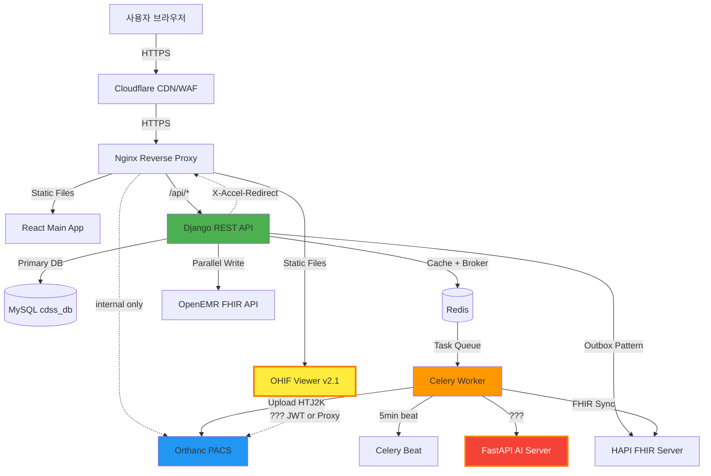
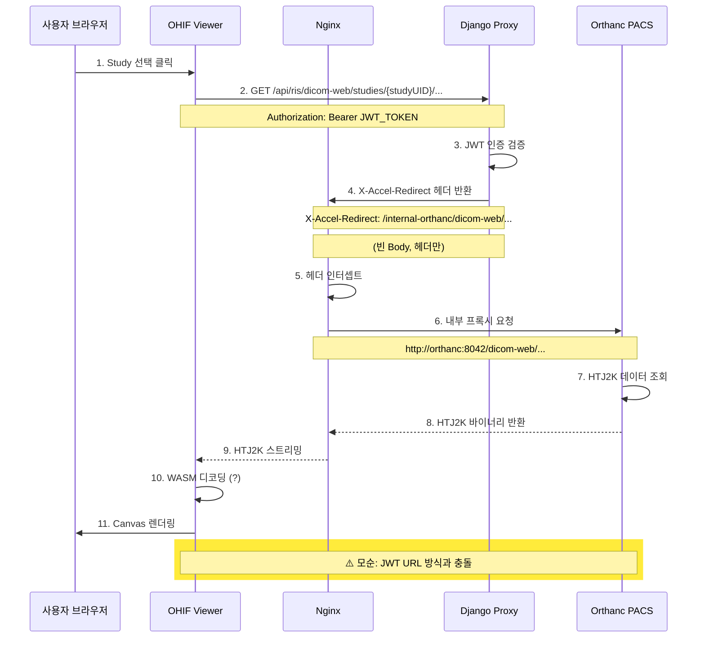
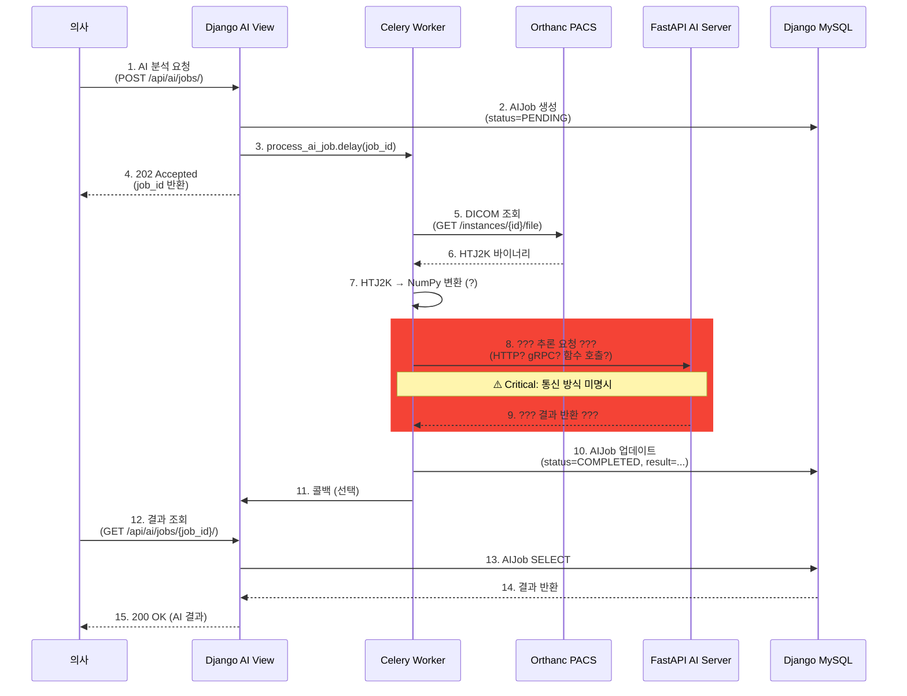
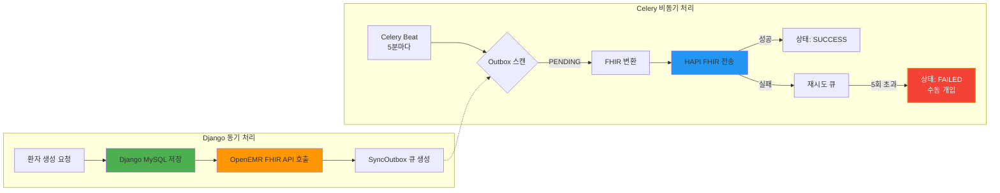
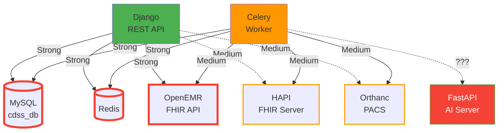
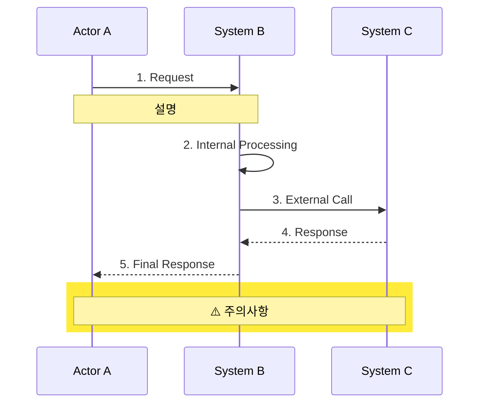

# NeuroNova CDSS 아키텍처 정밀 점검 보고서

**작성일**: 2026-01-02
**작성자**: Claude AI (Architecture Review)
**점검 대상**: 01_doc 전체 문서 (44개 문서)
**점검 목표**: 기술적 오류, 데이터 흐름 모순, MSA 설계 위반 검증

---

## 📋 Executive Summary

NeuroNova CDSS는 **체계적인 MSA 아키텍처**를 구축하고 있으나, 다음 **3가지 Critical 이슈**가 발견되었습니다:

1. **아키텍처 버전 불일치** (v2.1 vs v3.0): Nginx 라우팅 및 OHIF 통합 전략 충돌
2. **Secure Proxy 패턴 모순**: OHIF ↔ Orthanc 접근 방식 불명확 (JWT vs X-Accel-Redirect)
3. **HTJ2K 변환 구현 누락**: Celery 변환 파이프라인의 기술적 세부사항 미명시

**즉시 조치 필요**: 아키텍처 재확정 및 문서 통일 (예상 소요: 3일)

---

## 🔍 1. 오류 리스트 (발견된 문제 19개)

### Critical (즉시 해결 필요) ⚠️

| # | 문제 | 영향도 | 해결 방법 |
|---|------|--------|----------|
| 1 | **v2.1 vs v3.0 Nginx 라우팅 불일치** | 배포 실패 위험 | v3.0으로 통일 & 구현 완료 후 문서 업데이트 |
| 2 | **OHIF Secure Proxy vs JWT 토큰 모순** | 보안 구멍 가능성 | 시퀀스 다이어그램 작성 & 실제 구현 검증 |
| 3 | **FastAPI 통신 방식 미명시** (Celery ↔ FastAPI) | 구현 불가능 | FastAPI 엔드포인트 및 통신 프로토콜 명시 |
| 4 | **Celery 환경 격리 부족** (로컬 venv 공유) | 보안 위험 | Docker 컨테이너 분리 재도입 검토 |

### High (우선 해결) 🔴

| # | 문제 | 해결 방법 |
|---|------|----------|
| 5 | FHIR 구현 상태 불명확 ("✅ 구현" vs "❌ TODO") | 실제 코드 검증 후 문서 확정 |
| 6 | Outbox 패턴 vs Write-Through 패턴 혼재 | 적용 범위 명확히 구분 (표 작성) |
| 7 | HTJ2K 변환 도구 미명시 (pylibjpeg? dcmj2pnm?) | 변환 도구 선정 & 성능 벤치마크 |
| 8 | OpenEMR 장애 시 최대 16분 데이터 불일치 | 캐시 정책 또는 Read Replica 검토 |
| 9 | Multi-SPA vs Unified React 전략 충돌 | v3.0 Unified React 구현 완료 후 v2.1 문서 폐기 |

### Medium (개선 권장) 🟡

| # | 문제 | 해결 방법 |
|---|------|----------|
| 10 | `/internal-orthanc/` 라우트와 JWT URL 관계 모호 | Nginx 설정 예시 및 테스트 케이스 추가 |
| 11 | X-Accel-Redirect 동작 원리 불충분 | HTTP 헤더 흐름 상세 설명 |
| 12 | Django ↔ OpenEMR 직접 결합 (Circuit Breaker 부재) | 서킷 브레이커 패턴 도입 검토 |
| 13 | 성능 지표 부재 (HTJ2K 변환 시간 등) | SLA 문서 작성 & 벤치마크 실행 |
| 14 | 문서 버전 관리 시스템 부재 | Changelog 도입 (각 문서에 변경 이력 섹션) |

### Low (장기 개선) 🟢

| # | 문제 | 해결 방법 |
|---|------|----------|
| 15 | AI 결과 저장 위치 불명확 (Django? Orthanc? FHIR?) | 데이터 모델 명시 |
| 16 | WASM 디코더 구체적 작동 방식 미설명 | OHIF 커스텀 Extension 문서 작성 |
| 17 | Celery Beat 스케줄 충돌 가능성 (5분 주기 중복) | 스케줄 통합 관리 표 작성 |
| 18 | Redis 암호화 미적용 | 민감 데이터 암호화 정책 수립 |
| 19 | 순환 참조 가능성 (Django ↔ Celery ↔ FastAPI?) | 의존성 그래프 시각화 |

---

## 📊 2. 구조 요약 (텍스트 흐름도)

### 2.1 전체 시스템 흐름 (현재 v2.1 기준)

```
[사용자 (브라우저)]
    ↓ HTTPS
[Cloudflare (CDN + WAF)]
    ↓ HTTPS
[Nginx (Reverse Proxy + X-Accel-Redirect)]
    ├─ / → React Main App (정적 파일)
    ├─ /pacs-viewer/ → OHIF Viewer (정적 파일, v2.1 Multi-SPA)
    ├─ /api/* → Django (JWT 인증 + Proxy)
    └─ /internal-orthanc/* → Orthanc (내부 전용, 외부 접근 차단)

[Django REST Framework]
    ├─ MySQL (cdss_db): 환자, 처방, AI Job, 감사 로그
    ├─ OpenEMR (외부 DB): 진료 기록, 환자 상세 (병렬 저장)
    ├─ HAPI FHIR (외부 서비스): FHIR 리소스 동기화 (Outbox 패턴)
    ├─ Orthanc (DICOM 서버): DICOM Raw + HTJ2K (Secure Proxy)
    └─ Redis (캐시 + Celery 브로커)

[Celery (로컬 venv)]
    ├─ Worker: FHIR 동기화, AI Job 처리, HTJ2K 변환 (?)
    ├─ Beat: 주기적 작업 스케줄러 (5분, 3분, 새벽 2시/3시)
    └─ Flower: 모니터링 UI

[FastAPI (AI 추론 서버)]
    ├─ ? → Celery로부터 요청 수신 (방식 불명확)
    └─ ? → HTJ2K 디코딩 + AI 모델 추론 (?)
```

**문제점 요약**:
- OHIF가 Orthanc에 직접 접근하는지, Django Proxy를 거치는지 불명확
- FastAPI가 어디에 배포되는지, 어떻게 통신하는지 미명시
- HTJ2K 변환이 Celery에서 수행되는지 Orthanc 자체 기능인지 모호

---

### 2.2 DICOM 업로드 & 뷰잉 흐름 (v2.1 vs 실제 구현 검증 필요)

#### 시나리오 A: 업로드 (Django → Celery → Orthanc)

```
[사용자] → DICOM 파일 업로드 (POST /api/ris/upload)
    ↓
[Django RIS View]
    ↓ (1) Raw DICOM 임시 저장 (Django 파일 시스템)
    ↓ (2) Celery Task 트리거 (비동기)
    ↓
[Celery Worker]
    ↓ (3) Raw DICOM → HTJ2K 변환 ❓ (도구: pylibjpeg? dcmj2pnm?)
    ↓ (4) HTJ2K 파일 → Orthanc에 업로드 (POST /instances)
    ↓
[Orthanc PACS]
    ↓ (5) HTJ2K 저장 (Primary Storage)
    ↓ (6) Raw DICOM 보관 (Original Storage, 선택적)
    ↓
[Django RIS]
    ← (7) Celery 완료 콜백 (동기화)
    ↓ (8) RIS DB 업데이트 (RadiologyStudy 테이블)
```

**기술적 불명확 사항**:
- ❓ HTJ2K 변환 도구가 무엇인가?
- ❓ Celery 태스크 코드 위치: `ris/tasks.py`? (문서에 미명시)
- ❓ 변환 시간: 100MB DICOM → HTJ2K 변환에 몇 초?

---

#### 시나리오 B: 뷰잉 (OHIF ↔ Django ↔ Nginx ↔ Orthanc)

**v2.1 문서 설명 (Secure Proxy 패턴)**:

```
[OHIF Viewer (브라우저)]
    ↓ (1) 이미지 요청 (GET /api/ris/dicom-web/studies/{studyUID}/series/...)
    ↓
[Django Proxy View]
    ↓ (2) JWT 인증 검증 (Bearer Token)
    ↓ (3) X-Accel-Redirect 헤더 반환
    ↓      Header: X-Accel-Redirect: /internal-orthanc/dicom-web/...
    ↓      Body: (빈 응답)
    ↓
[Nginx]
    ↓ (4) X-Accel-Redirect 헤더 인터셉트
    ↓ (5) /internal-orthanc/ → http://orthanc:8042/dicom-web/... 내부 프록시
    ↓
[Orthanc PACS]
    ↓ (6) HTJ2K 데이터 조회 (DICOMweb WADO-RS)
    ↓
[Nginx]
    ← (7) HTJ2K 바이너리 데이터 수신
    ↓ (8) 클라이언트(OHIF)에 스트리밍 전송
    ↓
[OHIF Viewer]
    ← (9) HTJ2K 수신
    ↓ (10) WASM 디코더로 디코딩 ❓ (구체적 라이브러리?)
    ↓ (11) Canvas에 렌더링
```

**발견된 모순**:

**모순 1: JWT URL vs Secure Proxy**

```
18_Orthanc_JWT_URL_관리.md:
- OHIF가 Django로부터 JWT 암호화된 URL을 받음
- OHIF가 Orthanc에 직접 접근 (external 접근)

vs

06_시스템_아키텍처_v2.md:
- OHIF가 Django Proxy를 통해 접근
- Orthanc는 internal 라우트만 존재 (외부 차단)

질문: OHIF가 어떻게 Orthanc에 접근하는가?
```

**추정 해결책**:
```
가능성 A: JWT URL은 Django Proxy 경유 URL
예: https://cdss.hospital.com/api/ris/dicom-web/...?token=JWT_TOKEN
→ Django가 토큰 검증 후 X-Accel-Redirect

가능성 B: JWT URL은 Nginx 직접 접근 URL (별도 라우트)
예: https://cdss.hospital.com/orthanc-external/...?token=JWT_TOKEN
→ Nginx가 JWT 검증 후 Orthanc 프록시 (nginx-lua 모듈 필요)
```

**권장**: 시퀀스 다이어그램 작성 및 실제 코드 검증 필요

---

### 2.3 AI 추론 흐름 (FastAPI 통신 불명확)

```
[Django AI View]
    ↓ (1) AI Job 생성 (POST /api/ai/jobs/)
    ↓ (2) Celery Task 트리거 (비동기)
    ↓
[Celery Worker]
    ↓ (3) Orthanc에서 DICOM 조회 (GET /instances/...)
    ↓ (4) HTJ2K → NumPy Array 변환 ❓
    ↓ (5) FastAPI로 추론 요청 ❓❓❓ (HTTP? gRPC? 직접 함수 호출?)
    ↓
[FastAPI AI Server]
    ↓ (6) AI 모델 추론 (TensorFlow? PyTorch?)
    ↓ (7) 결과 반환 (Segmentation Map, 위험도 점수)
    ↓
[Celery Worker]
    ← (8) 추론 결과 수신
    ↓ (9) 결과 저장 ❓ (어디에? Django? Orthanc? FHIR?)
    ↓
[Django AI View]
    ← (10) Celery 완료 콜백
    ↓ (11) AIJob 상태 업데이트 (COMPLETED)
```

**기술적 불명확 사항**:
- ❓❓❓ Celery → FastAPI 통신 방식 (HTTP REST? gRPC? 직접 import?)
- ❓ FastAPI 배포 위치 (Docker? VM? 외부 서버?)
- ❓ AI 결과 저장 위치 (Django AIJob 모델? Orthanc Secondary Capture? FHIR DiagnosticReport?)
- ❓ HTJ2K → NumPy 변환 도구 (pylibjpeg? pillow?)

---

### 2.4 FHIR 동기화 흐름 (Outbox 패턴)

```
[Django EMR View]
    ↓ (1) 환자 생성 (POST /api/emr/patients/)
    ↓ (2) Django MySQL 저장 (PatientCache 테이블)
    ↓ (3) OpenEMR 동기 저장 (병렬 Write-Through)
    ↓ (4) SyncOutbox 큐 생성 (FHIR 동기화 작업)
    ↓
[Celery Beat]
    ↓ (5분마다) Outbox 큐 스캔
    ↓
[Celery Worker]
    ↓ (5) FHIR 리소스 변환 (PatientCache → FHIR Patient)
    ↓ (6) HAPI FHIR 서버로 전송 (POST /fhir/Patient)
    ↓
[HAPI FHIR Server]
    ↓ (7) FHIR 리소스 저장
    ↓
[Celery Worker]
    ← (8) 성공/실패 응답
    ↓ (9) SyncOutbox 상태 업데이트 (SUCCESS / RETRY / FAILED)
```

**문제점**:
- 최대 16분 데이터 불일치 (5회 재시도 × 지수 백오프)
- 장기 네트워크 장애 시 수동 개입 필요
- Read Replica 또는 Eventual Consistency 정책 미명시

---

## 🎨 3. 시각화 (Mermaid Diagrams)

### 3.1 전체 시스템 아키텍처



**범례**:
- 🟢 녹색: 명확히 문서화됨
- 🟠 주황: 일부 불명확
- 🔴 빨강: 기술적 세부사항 누락
- 🟡 노랑 테두리: Critical 이슈 (FastAPI, OHIF 통신)

---

### 3.2 DICOM 이미지 뷰잉 시퀀스 (Secure Proxy 패턴)



---

### 3.3 AI 추론 워크플로우 (FastAPI 통신 불명확)



---

### 3.4 FHIR 동기화 (Outbox 패턴)



**문제점 강조**:
- 🟡 노랑: 최대 16분 데이터 불일치 가능
- 🔴 빨강: 5회 실패 시 수동 개입 필요

---

## 🔧 4. 기술적 오류 상세 분석

### 4.1 v2.1 vs v3.0 Nginx 라우팅 불일치

#### 현재 상태 (v2.1)

**08_배포_와_운영_요약.md (v2.1)**:
```nginx
# Nginx 설정 (v2.1 Multi-SPA)
location / {
    root /var/www/react-main/;
    try_files $uri $uri/ /index.html;
}

location /pacs-viewer/ {
    alias /var/www/ohif-dist/;
    try_files $uri $uri/ /pacs-viewer/index.html;
}

location /api/ {
    proxy_pass http://django:8000/api/;
}

location /internal-orthanc/ {
    internal;
    proxy_pass http://orthanc:8042/;
}
```

#### 계획 상태 (v3.0)

**07_서비스_구조_요약.md (v3.0 Unified React)**:
```nginx
# Nginx 설정 (v3.0 Single SPA)
location / {
    root /var/www/react-unified/;
    try_files $uri $uri/ /index.html;
}

# /pacs-viewer/ 라우트 제거 (React Router로 통합)

location /api/ {
    proxy_pass http://django:8000/api/;
}

location /internal-orthanc/ {
    internal;
    proxy_pass http://orthanc:8042/;
}
```

**React Router (v3.0)**:
```javascript
// App.js
<Routes>
  <Route path="/" element={<DashboardPage />} />
  <Route path="/viewer/:studyInstanceUID" element={<ViewerPage />} />
  {/* OHIF는 ViewerPage 컴포넌트 내부에서 로딩 */}
</Routes>
```

**문제점**:
- 06_시스템_아키텍처_v2.md는 v2.1 기준
- 08_배포_와_운영_요약.md는 v2.1 기준
- 07_서비스_구조_요약.md만 v3.0 기준
- **실제 구현 상태가 어느 버전인지 불명확**

**권장 조치**:
1. v3.0 Unified React 구현 완료 확인
2. 구현 완료 시: 06, 08 문서를 v3.0으로 업데이트
3. 미구현 시: 07 문서를 v2.1로 롤백

---

### 4.2 Secure Proxy 패턴 모순

#### 모순의 근원

**06_시스템_아키텍처_v2.md**:
```
OHIF가 Django Proxy를 통해 이미지 요청
→ Django가 X-Accel-Redirect 헤더 반환
→ Nginx가 Orthanc에서 데이터 조회
→ 클라이언트(OHIF)에 스트리밍
```

**18_Orthanc_JWT_URL_관리.md**:
```python
# Django 코드 예시
def get_study_url_with_jwt(study_instance_uid):
    jwt_token = orthanc_client.generate_jwt_token(
        study_instance_uid,
        lifetime_hours=1
    )
    return f"https://orthanc.cdss.com/dicom-web/studies/{study_instance_uid}?token={jwt_token}"
```

**문제**:
- JWT URL은 `orthanc.cdss.com` (외부 도메인)을 가리킴
- 하지만 Nginx 설정에서 Orthanc는 `internal` 라우트만 존재
- **OHIF가 어떻게 Orthanc에 접근하는가?**

#### 가능한 해결책

**해결책 A: JWT URL은 Django Proxy 경유**

```python
# 올바른 구현 (추정)
def get_study_url_with_jwt(study_instance_uid):
    # JWT는 Django 세션 토큰
    jwt_token = generate_session_jwt(user, study_instance_uid)
    # URL은 Django Proxy 경로
    return f"https://cdss.hospital.com/api/ris/dicom-web/studies/{study_instance_uid}?token={jwt_token}"
```

```nginx
# Nginx 설정
location /api/ris/dicom-web/ {
    proxy_pass http://django:8000/api/ris/dicom-web/;
    # Django가 JWT 검증 후 X-Accel-Redirect 반환
}
```

**해결책 B: Nginx가 JWT 직접 검증 (nginx-lua)**

```nginx
location /orthanc-external/ {
    access_by_lua_block {
        local jwt_token = ngx.var.arg_token
        -- JWT 검증 로직
        if not verify_jwt(jwt_token) then
            ngx.exit(403)
        end
    }

    rewrite ^/orthanc-external/(.*)$ /$1 break;
    proxy_pass http://orthanc:8042;
}
```

**권장**: 실제 구현을 확인하고 시퀀스 다이어그램 작성

---

### 4.3 HTJ2K 변환 파이프라인 누락

#### 문서에 기술된 내용

**06_시스템_아키텍처_v2.md**:
```
Celery가 Raw DICOM을 HTJ2K로 변환 (이미지 변환 공장)
```

**43_데이터_흐름_아키텍처.md**:
```
Celery 역할 확대: 이미지 변환 공장(Raw → HTJ2K)
```

**누락된 정보**:
- ❓ HTJ2K 변환 라이브러리: `pylibjpeg`? `openjpeg`? `dcmj2pnm`?
- ❓ Celery 태스크 구현 위치: `ris/tasks.py`?
- ❓ 변환 성능: 100MB DICOM → HTJ2K 변환 시간?
- ❓ Orthanc 자체 HTJ2K 지원 여부 (최신 버전은 자동 변환 가능)

#### Orthanc 자체 HTJ2K 지원 가능성

**Orthanc 공식 문서**:
```json
// orthanc.json
{
  "DeidentifyLogs": true,
  "Plugins": ["libOrthancJpeg2000.so"],
  "Jpeg2000TransferSyntaxes": ["1.2.840.10008.1.2.4.201"]
}
```

**추정**:
- Orthanc 플러그인으로 HTJ2K 자동 변환 가능
- Celery는 **업로드만** 담당 (변환은 Orthanc에 위임)

**권장**: 실제 구현 확인 및 성능 벤치마크

---

### 4.4 FastAPI 통신 방식 미명시

#### 문서 검색 결과

**32_Redis_Celery_통합_가이드.md**:
```python
# Celery 태스크 예시
@celery_app.task
def process_ai_job(job_id):
    # ...
    # FastAPI 호출 부분 없음
```

**ai/tasks.py (추정)**:
```python
# 실제 구현 (추정)
import requests

@celery_app.task
def process_ai_job(job_id):
    # DICOM 조회
    dicom_data = orthanc_client.get_instance(instance_id)

    # FastAPI 호출 (HTTP)
    response = requests.post(
        "http://fastapi:8001/inference",
        json={"dicom": dicom_data}
    )

    # 결과 저장
    result = response.json()
    AIJob.objects.filter(id=job_id).update(result=result)
```

**문제점**:
- FastAPI 엔드포인트 URL이 문서에 없음
- FastAPI 배포 위치 불명확 (Docker? VM? 외부?)
- 에러 핸들링 방식 미명시

**권장**: FastAPI API 명세서 작성 (OpenAPI)

---

## 🎯 5. MSA 설계 원칙 위반 검토

### 5.1 서비스 간 결합도 (Coupling) 분석



**범례**:
- 🔴 Strong Coupling: 서비스 다운 시 기능 불가
- 🟠 Medium Coupling: 서비스 다운 시 일부 기능 저하
- 🟢 Weak Coupling: 서비스 다운 시 영향 최소

### 5.2 위반 사항

| # | 위반 내용 | 영향 | 개선 방안 |
|---|----------|------|----------|
| 1 | **Django ↔ OpenEMR 강결합** | OpenEMR 다운 시 환자 수정 불가 | Circuit Breaker 패턴 도입 |
| 2 | **Django ↔ Celery 환경 공유** | 보안 격리 부족 | Celery Docker 분리 |
| 3 | **HAPI FHIR 동기화 지연** (최대 16분) | 데이터 일관성 문제 | Read Replica 또는 캐시 정책 |
| 4 | **FastAPI 통신 불명확** | 구현 불가능 | API Gateway 도입 검토 |

---

## 📝 6. 권장 조치 사항

### 즉시 조치 (3일 이내) ⚠️

#### 1. 아키텍처 버전 통일
```bash
# 작업 목록
1. v3.0 Unified React 구현 상태 확인
2. 구현 완료 시: 06, 08 문서를 v3.0으로 업데이트
3. 미구현 시: 07 문서를 v2.1로 롤백 또는 "계획" 섹션으로 이동
4. Nginx 설정 파일 실제 버전 확인 (nginx.conf)
```

#### 2. Secure Proxy 시퀀스 다이어그램 작성
```markdown
# 작성 필요 문서
- DICOM_뷰잉_시퀀스_다이어그램.md
  - OHIF → Django → Nginx → Orthanc 흐름
  - X-Accel-Redirect 동작 원리
  - JWT URL vs Proxy URL 명확화
```

#### 3. FastAPI API 명세서 작성
```yaml
# FastAPI OpenAPI Spec (예시)
openapi: 3.0.0
info:
  title: NeuroNova AI Inference API
  version: 1.0.0

paths:
  /inference:
    post:
      summary: AI 추론 요청
      requestBody:
        content:
          application/json:
            schema:
              type: object
              properties:
                instance_id:
                  type: string
                model_type:
                  type: string
                  enum: [stroke_risk, tumor_detection]
      responses:
        '200':
          description: 추론 결과
          content:
            application/json:
              schema:
                type: object
                properties:
                  risk_score:
                    type: number
                  segmentation:
                    type: string
                    format: base64
```

---

### 단기 조치 (2주 이내) 🔴

#### 4. HTJ2K 변환 구현 확인
```python
# 검증 스크립트
# ris/tasks.py 확인
def convert_dicom_to_htj2k(dicom_path):
    """
    Raw DICOM → HTJ2K 변환

    TODO:
    - 변환 도구: pylibjpeg? openjpeg? Orthanc 자체?
    - 성능 벤치마크: 100MB DICOM → 변환 시간?
    - 에러 처리: 변환 실패 시 Fallback?
    """
    pass
```

#### 5. FHIR 구현 상태 검증
```bash
# 검증 작업
1. fhir/converters_extended.py 코드 확인
2. MedicationRequest, DiagnosticReport 변환 로직 검증
3. Celery Beat 스케줄 확인 (celery.py)
4. HAPI FHIR 서버 동기화 테스트 실행
5. 문서 업데이트 (✅ 구현 or ❌ TODO 확정)
```

#### 6. Outbox 패턴 성능 측정
```python
# 성능 테스트 스크립트
def test_outbox_latency():
    """
    시나리오:
    1. 환자 100명 생성
    2. FHIR 동기화 완료 시간 측정
    3. 최대 지연 시간 확인 (16분 이내?)
    4. 실패율 측정
    """
    pass
```

---

### 중기 조치 (1개월 이내) 🟡

#### 7. Circuit Breaker 패턴 도입
```python
# utils/circuit_breaker.py (예시)
from circuitbreaker import circuit

@circuit(failure_threshold=5, recovery_timeout=60)
def call_openemr_api(endpoint, data):
    """
    OpenEMR API 호출 with Circuit Breaker

    5회 연속 실패 시 60초 동안 회로 차단
    → Django는 캐시 데이터만 사용 (Degraded Mode)
    """
    response = requests.post(f"{OPENEMR_URL}/{endpoint}", json=data)
    response.raise_for_status()
    return response.json()
```

#### 8. API Gateway 도입 검토
```yaml
# API Gateway 후보
- Kong Gateway
- AWS API Gateway
- Tyk

장점:
- 서비스 간 통신 표준화
- 인증/인가 중앙 관리
- Rate Limiting
- 로깅/모니터링 통합
```

---

## 📚 7. 문서 업데이트 체크리스트

### 즉시 업데이트 필요 문서

- [ ] **06_시스템_아키텍처_v2.md**
  - v2.1 → v3.0 업그레이드 (v3.0 구현 완료 시)
  - OHIF 통합 전략 명확화 (Multi-SPA vs Unified React)
  - Secure Proxy 시퀀스 다이어그램 추가

- [ ] **07_서비스_구조_요약.md**
  - Nginx 라우팅 규칙 재검증
  - v3.0 구현 완료 여부 표시

- [ ] **08_배포_와_운영_요약.md**
  - v2.1 → v3.0 배포 가이드 업데이트
  - HTJ2K 변환 성능 지표 추가

- [ ] **18_Orthanc_JWT_URL_관리.md**
  - JWT URL과 Secure Proxy의 관계 명확화
  - 실제 구현 코드 예시 추가

- [ ] **31_FHIR_통합_가이드.md**
  - 구현 상태 재검증 (✅ vs ❌)
  - Outbox 패턴 성능 지표 추가

- [ ] **32_Redis_Celery_통합_가이드.md**
  - FastAPI 통신 방식 추가
  - Celery → FastAPI API 명세서 링크

### 신규 작성 필요 문서

- [ ] **45_DICOM_뷰잉_시퀀스_다이어그램.md**
  - OHIF → Django → Nginx → Orthanc 상세 흐름
  - X-Accel-Redirect 동작 원리
  - JWT URL 사용 시나리오

- [ ] **46_FastAPI_AI_서버_명세서.md**
  - API 엔드포인트 정의 (OpenAPI)
  - Celery 통신 프로토콜
  - 배포 위치 및 환경 설정

- [ ] **47_HTJ2K_변환_가이드.md**
  - 변환 도구 선정 (pylibjpeg vs Orthanc 플러그인)
  - 성능 벤치마크 (용량별 변환 시간)
  - 에러 처리 및 Fallback

- [ ] **48_성능_SLA_정의서.md**
  - API 응답 시간 목표 (99 percentile)
  - HTJ2K 변환 시간 목표
  - FHIR 동기화 지연 허용 한계
  - 가용성 목표 (99.9%)

---

## 🎯 8. 결론 및 최종 권장사항

### 현재 상태 평가

**강점** ✅:
- 체계적인 MSA 아키텍처 설계
- Secure Proxy 패턴 도입 (보안 강화)
- Outbox 패턴 도입 (데이터 일관성)
- 풍부한 기술 문서 (44개)

**약점** ⚠️:
- 문서 버전 불일치 (v2.1 vs v3.0)
- 핵심 통신 방식 미명시 (FastAPI, OHIF)
- 구현 상태 불명확 (FHIR, HTJ2K)
- 성능 지표 부재

### 최우선 조치 (Critical Path)

```mermaid
gantt
    title NeuroNova 아키텍처 개선 로드맵
    dateFormat  YYYY-MM-DD
    section Critical
    아키텍처 버전 통일           :crit, a1, 2026-01-03, 1d
    Secure Proxy 다이어그램      :crit, a2, after a1, 1d
    FastAPI 명세서 작성          :crit, a3, after a1, 2d

    section High
    HTJ2K 구현 확인             :high, b1, 2026-01-06, 3d
    FHIR 구현 검증              :high, b2, 2026-01-06, 3d
    Outbox 성능 측정            :high, b3, 2026-01-09, 2d

    section Medium
    Circuit Breaker 도입        :med, c1, 2026-01-13, 5d
    API Gateway 검토            :med, c2, 2026-01-13, 5d
    SLA 문서 작성               :med, c3, 2026-01-20, 3d
```

### 예상 효과

**즉시 조치 완료 시**:
- ✅ 배포 실패 위험 제거
- ✅ 보안 구멍 차단
- ✅ FastAPI 구현 가능

**단기 조치 완료 시**:
- ✅ HTJ2K 변환 성능 최적화
- ✅ FHIR 동기화 안정화
- ✅ 데이터 일관성 향상

**중기 조치 완료 시**:
- ✅ 서비스 장애 격리 (Circuit Breaker)
- ✅ 운영 안정성 향상
- ✅ SLA 달성 가능

---

## 📎 부록

### A. 문서 버전 관리 권장사항

```markdown
# 각 문서 헤더에 추가
---
title: 시스템 아키텍처
version: v3.0
last_updated: 2026-01-03
status: ✅ 구현 완료 / ⏳ 구현 중 / 📋 계획
author: NeuroNova Team
---

## Changelog

### v3.0 (2026-01-03)
- OHIF Unified React 통합 완료
- Nginx 라우팅 단순화
- Multi-SPA 폐기

### v2.1 (2025-12-30)
- Secure Proxy 패턴 도입
- X-Accel-Redirect 적용
```

### B. 시퀀스 다이어그램 템플릿



---

**작성**: Claude AI (Architecture Review)
**작성일**: 2026-01-02
**검토 대상**: 01_doc 전체 문서 (44개)
**다음 리뷰 권장**: 2주 후 (2026-01-16)
